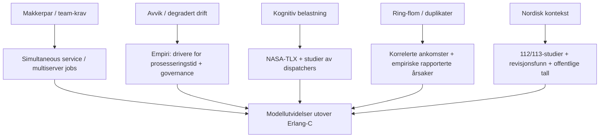

# Tilleggssøk om kapasitetsdimensjonering og robust drift i nødmeldesentraler

## Sammendrag

Dette tilleggssøket tar utgangspunkt i instruksen og gap-listen i det opplastede dokumentet (seks avgrensede «gap» som skal fylles med nyere og mer presis litteratur). fileciteturn0file0 Fokuset er derfor ikke «mer av det samme» (f.eks. grunnleggende Erlang-C), men oppdatert og mer målrettet kunnskap som kan styrke teorigrunnlag, antakelser og modellvalg knyttet til (i) team-basert håndtering (to operatører samtidig), (ii) prosedyrer og avvik under press/degradert drift, (iii) kognitiv belastning ved solo-håndtering, (iv) bemanningskrise/nyere metoder etter pandemi, (v) ring-flom/korrelerte ankomster og duplikatanrop, og (vi) nordisk/europeisk dokumentasjon.

På tvers av kildene peker funnene i samme retning: **nødmeldesentraler oppfører seg ofte mer som “ressurs-kravende jobber” enn som én-kunde–én-server**, særlig når oppgaver krever flere samtidige roller eller parallelle aktiviteter. Køteori-litteratur om *simultaneous service* (jobber som krever flere servere samtidig) gir et konkret matematisk “språk” for makkerpar og andre samtidighetskrav, og viser at stabilitetsområdet kan bli **betydelig mindre** enn det enkle «gjennomsnittlig kapasitet»-resonnementet tilsier (pga. fragmentering/ubrukte rester). citeturn29view1turn10view4

Empirisk dokumentasjon fra nødkommunikasjonssentre viser samtidig at **prosesseringstid påvirkes sterkt av samtale- og kontekstfaktorer** (f.eks. krevende innringere, språk/oversetting, lokasjonsavklaring og flere meldinger om samme hendelse), og at **bemanning og erfaringsnivå er blant de mest rapporterte eksterne driverne** for tidstap. citeturn19view2turn19view0turn17view0 Dette støtter en modelleringstilnærming der håndteringstid er betinget av hendelsestype/arbeidsmodus (normal vs. degradert), ikke en enkel konstant.

For nordisk/europeisk kontekst er det særlig to typer kilder som er “harde” nok til å bære argumentasjon: (a) fagfellevurderte studier av svartider/dispatch (f.eks. Sverige), og (b) revisjons-/styringsrapporter som dokumenterer systematiske avvik fra mål over tid (f.eks. svensk riksrevisjon). citeturn13search3turn24view0 I Norge finnes nyere faglitteratur på medisinsk nødmeldetjeneste (113/AMK) som er relevant som analogi for beslutningstaking, krav til svartid og bruk av beslutningsstøtte, samt offentlige tall som viser høyere volum enn før pandemien. citeturn10view1turn8search2

Til slutt viser nyere “driftsnær” metodeutvikling at **fleksibel fordeling/pooling** (dekompartmentalisering på tvers av sentre) kan gi målbar gevinst i tilgjengelighet, og at AI-baserte triage-/støttefunksjoner løftes frem som et svar på kombinasjonen av ring-flom og bemanningsmangel—men dette krever stram styring, kvalitetssikring og bevissthet om nye feilkilder. citeturn10view0turn16view2

## Utgangspunkt og tolkningsramme

Instruksen for tilleggssøk (inkludert hva som eksplisitt skal *unngås* og hvilke seks kunnskapshull som skal fylles) er definert i det opplastede dokumentet. fileciteturn0file0 I praksis kan “temaet” tolkes på to måter:

Den snevre tolkningen er at søket primært skal støtte en kapasitets-/bemanningsmodell for en brann- og redningsrelatert nødmeldesentral (110), der enkelte anrop/hendelser krever to samtidige operatørroller (“makkerpar”), og der man ønsker å analysere normal- og avvik/modus (f.eks. solo). fileciteturn0file6

Den brede tolkningen er at søket skal identifisere **overførbar** kunnskap fra 9-1-1/112/113 (politi/medisin/brann) og generell sikkerhetskritisk drift (humane factors, resilience, køteori) som kan begrunne antakelser og parametervalg selv når 110-spesifikk forskning er begrenset. Dette er metodisk forsvarlig fordi “førstelinje mottak–triage–informasjonsoverføring–ressursdisponering” er en felles funksjonskjede i slike systemer. citeturn16view0turn19view0

Sentrale søkeord og alternative begreper (norsk/engelsk, inkl. nærliggende tolkninger som ofte “skjuler” relevant litteratur):

- **Team-basert samtidig håndtering (Gap 1)**: makkerpar, to-operatør, “two-person rule”, “dual operator”, “cooperative service”, “simultaneous service”, “multiserver jobs”, “servers required simultaneously”. citeturn29view0turn10view4  
- **Prosedyrer, avvik og degradert drift (Gap 2)**: prosedyrkonformitet, “protocol compliance”, “work-as-done vs work-as-imagined”, “degraded mode”, “fallback”, kvalitetskontroll/QI, svartidsmål/“answer time objectives”. citeturn24view0turn20view0  
- **Kognitiv belastning (Gap 3)**: mental workload, kognitiv belastning, stress, “NASA-TLX”, beslutningshastighet, situasjonsforståelse, solo-operatør. citeturn3search10turn10view2  
- **Bemanning etter pandemi (Gap 4)**: staffing shortage, vacancy rate, retention, “PSAP staffing study”, digital twin, dekompartmentalisering/pooling, “service quality within X seconds”. citeturn10view0turn17view1  
- **Ring-flom og duplikatanrop (Gap 5)**: “call surge”, correlated arrivals, non-stationary arrivals, multiple callers same incident, “duplicate calls”, prioriteringskø. citeturn19view2turn5search2turn8search12  
- **Nordisk/europeisk dokumentasjon (Gap 6)**: 112, 113, AMK/EMCC, SOS Alarm, svartider, overføring/“two-step” routing, styring/tilsyn, offentlige tall og revisjonsfunn. citeturn13search3turn8search2turn24view0

## Søkeopplegg og datakilder

Søket er gjennomført som et “tilleggssøk” med tydelig avgrensning mot allerede dekket grunnstoff (klassisk køteori/Erlang-C-intro), i tråd med instruksen. fileciteturn0file0 Det er lagt mest vekt på kildetyper som typisk tåler metodekritikk i en rapport:

Primær-/offisielle kilder:
- Standarder og bransjerapporter fra entity["organization","APCO International","public safety comms"] og entity["organization","National Emergency Number Association (NENA)","911 standards us"]. citeturn19view0turn20view0  
- Offentlige bemannings-/tilstandsrapporter (f.eks. entity["organization","California Governor's Office of Emergency Services (CalOES)","state agency california"]). citeturn17view0turn17view1  
- Revisor-/tilsynsrapporter i Norden (entity["organization","Riksrevisionen","swedish national audit"] om entity["company","SOS Alarm","swedish emergency calls"]). citeturn24view0turn24view1  
- Offentlige statistikk-/politikkdokumenter (f.eks. via entity["organization","European Commission","executive body eu"] og norske stortingsmeldinger). citeturn8search6turn8search2  

Fagfellevurdert forskning (utvalg):
- Simulering/digital tvilling for EMCC-organisering. citeturn10view0  
- Kvalitative studier av beslutningstaking ved 113/AMK i entity["city","Oslo","Norway"], entity["country","Norge","country in europe"]. citeturn10view1  
- Kvantitative observasjonsstudier av svartid/dispatch ved 112/EMDC i entity["country","Sverige","country in europe"] (bl.a. entity["city","Stockholm","Sweden"]-region). citeturn13search3  
- Human factors/metodikk for mental workload (entity["organization","National Aeronautics and Space Administration (NASA)","us space agency"] TLX). citeturn3search10turn4search3  
- Köteoretiske kjernemodeller for “jobber som krever flere servere samtidig” (for å formalisere makkerpar). citeturn29view1turn10view4  

Som et komprimerende bilde av hva dette betyr for modell “fra søk til bruk”:



## Resultater og syntese på tvers av de seks gapene

**Gap 1: Team-basert kapasitet og “to operatører samtidig” som modellert fenomen**

Den mest direkte matematiske analogien til “makkerpar” er ikke en standard M/M/c-kø (Erlang-C), men en klasse av modeller der **en jobb krever flere servere samtidig** og opptar dem parallelt. To kilder er spesielt nyttige her:

- Harchol-Balter formaliserer “multiserver job queueing model”: jobber ankommer med rate λ til et system med n servere, og en jobb av klasse i krever nᵢ samtidige servere i en varighet Sᵢ (jobbstørrelse i server-timer). citeturn29view0turn29view1 For et makkerpar er nᵢ=2 en naturlig spesialcase. Det viktige poenget (for pålitelighetsdiskusjonen) er at **reell stabilitetsregion kan være mye mindre enn idealisert “gjennomsnittlig utnyttelse”-grense**, fordi det kan oppstå permanent fragmentering/ubrukte serverrester. citeturn29view1  
- Brill & Green analyserer eksplisitt køer der kunder krever simultan service fra et antall servere, og at serverne for en kunde starter og slutter samtidig. citeturn10view4 Dette er en klassisk referanse for *simultaneous service* som senere arbeid bygger på.

**Syntese for modellbruk:** Dette betyr at “makkerpar” kan begrunnes teoretisk som en *simultaneous-service* jobbklasse (nᵢ=2), og at en ren Erlang-C kan undervurdere risiko for kø/venting når systemet ofte havner i “nesten, men ikke helt”-tilstander (f.eks. én ledig operatør som ikke kan starte en to-personsoppgave). citeturn29view1turn10view4

**Gap 2: Prosedyrer, etterlevelse og degradert drift under press**

To funn er særlig relevante for “prosedyrkonformitet vs. arbeid under press”:

- I APCO/CSSR-rapporten (survey-basert, N≈772 ansatte) identifiseres konkrete faktorer som forsinker prosessering. Blant “call-related factors” rapporterer et stort flertall at krevende innringere, språk/oversettelse og vanskelig lokasjonsfastsettelse forsinker; og “other factors” inkluderer eksplisitt **flere anrop om samme hendelse**. citeturn19view2 Rapporten viser også at **bemanningsnivå** er den mest rapporterte eksterne faktoren som påvirker prosesseringstid (rapportert av 65,4% av sentre), og at erfaringsnivå hos ansatte også er utbredt som påvirkningsfaktor. citeturn19view2  
- Den svenske revisjonsoppsummeringen dokumenterer at entity["company","SOS Alarm","swedish emergency calls"] ikke har nådd mål for gjennomsnittlig svartid i noen år de siste ti årene, at svartider varierer systematisk etter region og tid, og at antall samtaler med svært lang svartid har økt over tid. citeturn24view0turn24view1 Dette gir et sterkt, institusjonelt belegg for at “degradert drift” i praksis kan bli en **vedvarende** tilstand (ikke bare et kort unntak), og at governance og avtalestrukturer kan være medvirkende. citeturn24view0turn24view1

**Syntese for modellbruk:** Dersom modellen antar faste prosesseringstider eller “perfekt protokollflyt”, bør den i det minste ha et spor av sensitivitet: (a) service rate som funksjon av “vanskelige” samtaler (språk, lokasjon), (b) økning i arbeid pr. hendelse når duplikatanrop oppstår, og (c) en eksplisitt “degradert modus” der samme arbeidssteg tar lengre tid eller får høyere feilrisiko. citeturn19view2turn24view0

**Gap 3: Kognitiv belastning ved solo-håndtering og operatørens ytelse**

For å parameterisere (eller i det minste faglig begrunne) at solo-håndtering gir lavere effektiv service rate, trengs både metode og empiri:

- entity["organization","National Aeronautics and Space Administration (NASA)","us space agency"] beskriver NASA-TLX som et etablert verktøy for subjektiv workload-vurdering, ofte brukt som “gullstandard” på tvers av domener. citeturn3search10turn4search3  
- En nyere dispatch-spesifikk studie (Kuwait) evaluerer kognitiv workload hos nøddispatchere med NASA-TLX og finner gjennomgående høye scorer, samt at erfaring påvirker opplevd workload. citeturn10view2

**Syntese for modellbruk:** I en 110-modell kan “GUL”/solo-modus behandles som en tilstand med (i) lengre håndteringstid og/eller (ii) økt varians i håndteringstid, konsistent med at kognitiv byrde øker når én operatør må gjøre både informasjonsinnhenting, vurdering, registrering og koordinering. citeturn10view2turn3search10 En praktisk forskningsmessig implikasjon er at NASA-TLX (eller et enklere, standardisert workload-skjema) kan brukes som *uavhengig måling* for å validere at “solo faktisk er tyngre”, ikke bare antatt. citeturn3search10turn10view2

image_group{"layout":"carousel","aspect_ratio":"16:9","query":["emergency dispatch center operators at work","public safety answering point control room","computer aided dispatch workstation"],"num_per_query":1}

**Gap 4: Nyere kunnskap om bemanning og kapasitetsstyring etter pandemien**

To nyere kilder er spesielt anvendelige fordi de går utover anekdoter og beskriver (a) bemanningssituasjon kvantitativt og (b) metodikk for å teste organisasjonsendringer:

- entity["organization","California Governor's Office of Emergency Services (CalOES)","state agency california"] rapporterer stor variasjon i underbemanning og en gjennomsnittlig vacancy rate på 19% blant PSAP-ene i studien, med en betydelig andel som rapporterer 10–29% ledighet og noen >30%. citeturn17view0turn17view1 Dette er et konkret tallgrunnlag for “bemanningskrise”-argumentasjon (i hvert fall i en større, sammenlignbar jurisdiksjon), og rapporten viser også at CAD-incident-volum varierer sterkt på tvers av sentre. citeturn17view0turn17view1  
- Penverne mfl. bruker en simuleringsbasert “digital twin” for EMCC-operasjoner og tester “dekompartmentaliserte” scenarier der tradisjonelt isolerte sentre organisatorisk omstruktureres for mer fleksibel samtalefordeling. De rapporterer forbedring i servicekvalitet (innen 30 sekunder) på ca. 17–21% i de testede scenariene. citeturn10view0

**Syntese for modellbruk:** Disse funnene støtter to ulike spor som kan kombineres i en diskusjon om robust drift:
1) For et enkelt kontrollrom (én 110-sentral) er bemanning ikke bare et “n”-tall, men påvirkes av turnover/vakanser som kan være strukturelle. citeturn17view1  
2) På systemnivå kan “pooling” mellom sentre (eller mellom funksjoner) være en reell kapasitetsstrategi som kan testes med simuleringsmodeller og gi målbar gevinst. citeturn10view0

I tillegg fremhever entity["organization","National Telecommunications and Information Administration (NTIA)","us commerce dept agency"] AI-drevet triage som et virkemiddel når ring-flom kombineres med lav bemanning: dersom alle anrop ligger i samme kø uavhengig av hastegrad, kan automatisert første-sortering redusere trykket på menneskelige operatører og frigjøre kapasitet til kritiske oppgaver. citeturn16view2

**Gap 5: Ring-flom, korrelerte ankomster og hendelsesklustering**

Her er det viktig å skille mellom to mekanismer som i praksis ofte oppstår samtidig:

- **Ikke-stasjonaritet og volumskift** (f.eks. endringer gjennom døgnet, ukedag/helg, kriser/pandemifaser). En studie av 112-anrop i entity["place","Bavaria","Germany"] analyserer endringer i anropsvolum, varighet og ubesvarte anrop gjennom COVID-19-faser, og viser at både volum og operasjonelle mål kan endre seg betydelig over tid. citeturn8search12  
- **Korrelerte ankomster og duplikatanrop** (flere innringere for samme hendelse). APCO/CSSR-rapporten nevner eksplisitt “multiple calls of the same incident” som en “other factor” som kan forsinke prosesseringstider. citeturn19view2 Dette er særlig viktig fordi duplikatanrop både øker ankomstintensitet *og* kan øke arbeid per hendelse (behov for matching/sammenslåing, avklaringer, parallell informasjonsflyt).

På teorisiden finnes kømodeller som eksplisitt inkluderer korrelerte ankomster og prioritetssystemer (om enn ikke spesifikt for nødmeldesentraler). Lee mfl. demonstrerer i en prioritetskø med korrelerte ankomster at korrelasjon og servicevarians kan ha stor effekt på ytelsesindikatorer, og at resultatene kan være relevante for “informasjonsoverføring”- eller dispatch-lignende settinger. citeturn5search2

**Syntese for modellbruk:** Dersom grunnmodellen antar Poisson-ankomster og uavhengige hendelser, kan “ring-flom” operasjonaliseres på minst tre nivåer av stigende realisme: (1) tidsvarierende λ(t), (2) overdispersjon/korrelasjon (f.eks. MMPP eller batch arrivals), og (3) eksplisitt hendelsesklustering: flere anrop “binder” til samme hendelse og påvirker både kø og servicebehov. citeturn8search12turn19view2turn5search2

**Gap 6: Ny og relevant nordisk/europeisk dokumentasjon**

Det finnes nå flere solide, nordiske kilder som direkte måler svartider/overføring og som kan støtte en norsk drøfting:

- En svensk observasjonsstudie undersøker EMDCs evne til å svare og dispatch’e ambulanse ved hjertestans (OHCA) i både 1-stegs (direkte) og 2-stegs (overført) prosedyre over ti år, og knytter forsinkelser til overlevelsesmål. citeturn13search3 Dette er relevant for diskusjon av “overføring som kapasitetsmekanisme” (eller kapasitetsrisiko).  
- Revisjonsoppsummeringen fra entity["organization","Riksrevisionen","swedish national audit"] dokumenterer som nevnt et tiårig mønster av manglende måloppnåelse på svartid og systematiske variasjoner—et svært sterkt “makro-argument” for at robusthet og governance må inn i analysen, ikke bare matematisk køteori. citeturn24view0turn24view1  
- I entity["country","Norge","country in europe"] viser offentlige tall i en stortingsmelding at anrop til AMK økte til 775 509 i 2023 (over 130 000 flere enn før pandemien), og at myndighetene forventer videre økning og mer komplekse henvendelser. citeturn8search2  
- Den kvalitative studien fra entity["city","Oslo","Norway"] (113/AMK) beskriver beslutningstaking i slag-anrop og redegjør samtidig for regulatoriske forventninger (bl.a. 90% av henvendelser besvart innen 10 sekunder) og bruk av “Norwegian Index for Emergency Medical Assistance” som beslutningsstøtte. citeturn10view1  
- På EU-nivå rapporterer entity["organization","European Commission","executive body eu"] at 112-anrop økte (rapportert 15% økning til 176 millioner i 2023 vs 2021) og at totalen av nød-anrop (inkl. nasjonale numre) er svært høy, noe som underbygger at volum- og tilgjengelighetsutfordringer er systemiske, ikke lokale særtilfeller. citeturn8search6

**Syntese for modellbruk:** For en norsk 110-kontekst (der direkte 110-spesifikk forskning kan være tynn), kan nordiske 112/113-resultater brukes som “beste tilgjengelige empiriske analogi” for (a) svartidsmål, (b) effekter av overføring/1-steg vs 2-steg, og (c) volumpress over tid. citeturn13search3turn8search2turn24view0

## Kildekritikk og sammenligning av nøkkelkilder

Det er tre gjennomgående begrensninger i kunnskapsbildet:

For det første er mye av den mest detaljerte operatør-/teamlitteraturen fra 9-1-1-kontekst (USA/Canada) og trenger oversettelse til norske roller, teknologi og regelverk. citeturn16view0turn20view0

For det andre er noe av den mest “modell-nære” matematikken (multiserver jobs) utviklet for datasentre/HPC, men strukturen (jobber som krever flere samtidige ressurser) matcher makkerpar svært godt. citeturn29view1turn10view4

For det tredje er flere “bemanningskrise”-kilder rapporter og audits (høy relevans, men ofte deskriptive og ikke kausale). Likevel kan de være mer robuste enn små enkeltstudier fordi de bygger på brede datainnsamlinger eller revisjonsmandat. citeturn17view0turn24view0turn19view0

Tabellen under sammenligner et kjerneutvalg (prioritert mot primærkilder og fagfellevurdert forskning):

| Kilde | Dato / publikasjon | Domene / geografi | Datagrunnlag / design | Hovedpåstand som er direkte nyttig | Kort vurdering av troverdighet |
|---|---|---|---|---|---|
| Harchol-Balter, “The multiserver job queueing model” | Publisert online 29.03.2022 | Køteori (multiserver jobs) | Teoretisk modellartikkel | Jobber kan kreve nᵢ samtidige servere; stabilitet kan være mye dårligere enn “ideell” grense pga. fragmentering | Høy (fagfellevurdert); domene via datasentre men struktur overførbar citeturn29view0turn29view1 |
| Brill & Green, “Simultaneous service…” | 1984 | Køteori | Klassisk analyse (INFORMS) | Samtidig start/slutt av service på flere servere; eksplisitte resultater for to-server-case | Høy (klassiker; eldre men direkte relevant) citeturn10view4 |
| APCO/CSSR, “Call Handling and Incident Processing…” | 2020 | PSAP/ECC, primært entity["country","USA","sovereign state"] | Survey N≈772; rapport | Viser typiske prosesseringstider og at bemanning/erfaring + samtalefaktorer (inkl. duplikater) forsinker | Høy–middels (stor survey; ikke eksperimentelt) citeturn19view0turn19view2 |
| CalOES, “California PSAP and Staffing Study 2024” | 2024 | PSAP-bemanning, entity["state","California","US"] | Spørreundersøkelse/innsamling fra PSAP-er | Gj.sn. vacancy rate ~19% og stor spredning; volum- og bemanningsvariasjon dokumentert | Høy (offisiell statsrapport; deskriptiv) citeturn17view0turn17view1 |
| Penverne mfl., digital tvilling for EMCC | 2024 | EMCC, entity["place","Europe","region"]-relevant | Simuleringsstudie (digital twin) | Dekompartementalisering/fleksibel samtalefordeling kan øke servicekvalitet (≤30s) med ~17–21% | Høy (fagfellevurdert, metodisk tydelig) citeturn10view0 |
| Jamtli mfl., beslutningstaking i slag-anrop | 2024 | 113/AMK, entity["country","Norge","country in europe"] | Kvalitative intervjuer (BMC) | Beslutninger påvirkes av tidspress og informasjonskvalitet; viser regulatoriske svartidskrav og Index-bruk | Høy (fagfellevurdert; kvalitativt design) citeturn10view1 |
| Byrsell mfl., svensk EMDC evne til å svare/dispatch ved OHCA | 2023 | 112/EMDC, entity["country","Sverige","country in europe"] | Observasjonsstudie over 10 år | Sammenligner 1-steg vs 2-steg og knytter forsinkelse til utfall; relevant for overføring og svartider | Høy (fagfellevurdert; direkte performance-mål) citeturn13search3 |
| Riksrevisionen (RiR 2023:22) oppsummering | 23.11.2023 | 112-styring, entity["country","Sverige","country in europe"] | Offentlig revisjon | Ikke nådd svartidsmål i noen av de siste 10 årene; systematiske variasjoner; governance-problem | Svært høy (revisjonsmandat; sterk for “systemtilstand”) citeturn24view0turn24view1 |
| entity["organization","National Telecommunications and Information Administration (NTIA)","us commerce dept agency"] om AI-triage | 02.08.2024 | NG911/AI, entity["country","USA","sovereign state"] | Offentlig fag-/programside | AI-triage foreslås for å håndtere ring-flom + lav bemanning; alle anrop i samme kø gir forsinkelse | Middels–høy (offentlig kilde; mer “program/retning” enn studie) citeturn16view2 |
| entity["organization","National Aeronautics and Space Administration (NASA)","us space agency"] NASA-TLX beskrivelse | Oppdatert 03.03.2026 | Metode (workload) | Offisiell metodebeskrivelse | Definerer NASA-TLX som standardisert workload-mål; relevant for å operasjonalisere solo-belastning | Høy (metodekilde) citeturn3search10turn4search3 |
| Alzayed & Alsardi, “Dispatch under pressure…” | 2025 | Dispatch/workload, entity["country","Kuwait","sovereign state"] | Survey + intervjuer; NASA-TLX | Høy workload; erfaring har betydning; direkte relevant for “solo vs team”-antakelser | Middels–høy (fagfellevurdert; annen kontekst men direkte mål) citeturn10view2 |
| EU-kommisjonens 112-rapport | 18.12.2024 | 112, entity["place","European Union","supranational polity"] + EØS | Offisiell rapportering | 112-anrop øker, stor totalbelastning; indikatorer og målebehov | Høy (offisiell; men aggregert nivå) citeturn8search6 |

Lenker (URL/DOI) for de mest sentrale kildene (for enkel klikkbarhet, gjengitt i kodeblokk):
```text
Harchol-Balter (2022) multiserver job queueing model (DOI): https://doi.org/10.1007/s11134-022-09762-x
Brill & Green (1984) simultaneous service (DOI): https://doi.org/10.1287/mnsc.30.1.51
APCO/CSSR (2020) Call Handling and Incident Processing (PDF): https://www.apcointl.org/~documents/report/incident-handling-eccs-2020
CalOES (2024) California PSAP and Staffing Study (PDF): https://www.caloes.ca.gov/wp-content/uploads/PSC/Documents/CalOES-2024-Staffing-Study.pdf
Penverne et al. (2024) digital twin EMCC (DOI): https://doi.org/10.1038/s41746-024-01392-2
Jamtli et al. (2024) stroke calls decision-making (BMC): https://doi.org/10.1186/s12873-024-01129-0
Byrsell et al. (2023) Swedish EMDC performance (DOI): https://doi.org/10.1016/j.resuscitation.2023.109896
Riksrevisionen RiR 2023:22 summary (PDF): https://www.riksrevisionen.se/download/18.3ad2ec4c19329a0a7e56315/1731922695598/RiR_2023_22_summary.pdf
NENA-STA-045.1-2025 (PDF): https://cdn.ymaws.com/www.nena.org/resource/resmgr/standards/NENA-STA-045.1-202Y_911-988_.pdf
NTIA (2024) AI-Powered Call Triage Office: https://www.ntia.gov/category/next-generation-911/improving-911-operations-with-artificial-intelligence
EU 112 report COM(2024)575: https://eur-lex.europa.eu/legal-content/EN/TXT/HTML/?uri=CELEX:52024DC0575
```

## Videre arbeid og åpne spørsmål

Det tilleggssøket avdekker et tydelig “beste neste steg”: å oversette funnene til **konkrete modellutvidelser** og et lite sett av målbare parametre.

Modellmessige neste steg (lav til moderat kompleksitet):
- Introduser minst én jobbklasse som krever to samtidige operatører (nᵢ=2), med teoretisk begrunnelse i multiserver-job/simultaneous service-litteraturen. citeturn29view1turn10view4  
- Skill håndteringstid i faser (f.eks. “call answer → incident entry” og “incident entry → dispatch”), fordi empirien viser at disse har ulike størrelsesordener og påvirkes av ulike faktorer. citeturn19view0turn19view2  
- Legg inn en enkel representasjon av duplikatanrop (enten som ekstra ankomster per hendelse eller som ekstra arbeid per hendelse) fordi dette er eksplisitt rapportert som forsinkende mekanisme i operative miljø. citeturn19view2  
- Representér ring-flom som tidsvarierende og/eller korrelert ankomstprosess i sensitivitetsdelen, i det minste som et argumentert brudd på Poisson-forutsetningen. citeturn8search12turn5search2  

Datainnsamling/validering (for å støtte rapportens “pålitelighet”):
- Mål arbeidsbelastning i normal- og solo/driftsavvik (NASA-TLX eller tilsvarende), for å teste om solo-modus faktisk gir systematisk høyere workload og dermed plausibelt lavere service rate/høyere varians. citeturn3search10turn10view2  
- Kartlegg frekvensen av “2-operatør-hendelser” (hvor ofte, hvilke hendelser, hvilke tidsvinduer), fordi dette er nøkkelparameteren som avgjør om simultaneous-service-komponent faktisk dominerer kapasitetsbildet. Teorien sier at selv moderate andeler kan påvirke stabilitet når systemet er tett lastet. citeturn29view1  

Styring/robusthet (for diskusjonskapitler):
- Bruk nordiske revisjonsfunn og 10-års performance-data som belegg for at tilgjengelighet og svartid er et systemstyringsproblem (governance) og ikke bare en lokalt optimaliserbar bemanningsformel. citeturn24view0turn24view1  
- Når det diskuteres regional “backup/pooling” eller overføring, kan svenske 1-steg vs 2-steg-resultater brukes som empirisk bakteppe for at overføring kan påvirke tidskritiske utfall, og dermed må behandles som en trade-off mellom robusthet og tidskostnad. citeturn13search3turn24view1  
- Hvis AI-lag/triage vurderes, bør det behandles som et “socioteknisk inngrep” (ny feilflate + nye kontrollbehov), ikke bare som økt kapasitet; en nøktern måte er å omtale dette som mulig framtidig scenario og peke på offentlige programkilder, ikke som etablert effekt i 110-kontekst. citeturn16view2  

Åpne spørsmål som det ikke finnes “ferdige svar” på i litteraturen (der egne data blir avgjørende):
- Hvor stor andel av innkommende 110-henvendelser binder faktisk to personer samtidig, og hvor lenge? (Dette avgjør om multiserver-job-delen er en liten korreksjon eller en strukturendring.) citeturn29view0turn29view1  
- I hvilken grad kan duplikatanrop og hendelsesklynger identifiseres automatisk i logg (CAD/telefoni), og hvor mye arbeid skaper de netto? citeturn19view2  
- Hvordan endres servicekvalitet (svartid, feil, omarbeid) når systemet går inn i “degradert modus”—og er dette et sjeldent avvik eller en gjentakende tilstand (slik revisjonsfunn antyder kan skje i andre land)? citeturn24view0turn24view1  
- Finnes det organisatoriske grep (pooling mellom sentre, fleksibel oppgavefordeling) som i praksis kan gi tilsvarende effekt som økt bemanning, slik simuleringsstudier på EMCC antyder? citeturn10view0