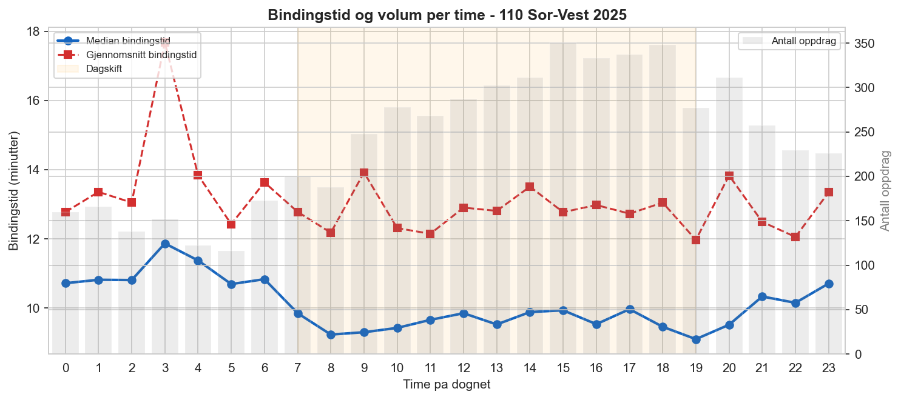

# 4. Casebeskrivelse

Denne casebeskrivelsen presenterer konteksten for kapasitetsanalysen: de norske 110-sentralenes organisering, primærcaset 110 Sør-Vest, og de operative forholdene som påvirker operatørkapasiteten. Kapitlet beskriver situasjonen og historiske fakta — analyseresultater presenteres i kapittel 7.

## 4.1 Norske 110-sentraler — oversikt

Norge har tolv 110-sentraler som mottar nødmeldinger og koordinerer brann- og redningsinnsats døgnet rundt. Sentralene dekker definerte geografiske områder og betjener til sammen hele landets befolkning. Fra høsten 2024 benytter alle sentralene det felles oppdragshåndteringssystemet LEO, noe som for første gang muliggjør sammenlignbare hendelsesdata på tvers av sentraler. Selv om felles oppdragshåndteringssystem gir bedre sammenlignbarhet enn tidligere, innebærer ikke dette at alle belastningsmål er direkte sammenlignbare mellom sentraler. Særlig gjelder dette hvordan flere anrop til samme hendelse registreres og sammenstilles.

**Tabell 4.1: Norske 110-sentraler**

| Sentral | Dekningsområde |
|---|---|
| Finnmark 110 | Finnmark |
| Troms 110 | Troms |
| Nordland 110 | Nordland |
| Trøndelag 110 | Trøndelag |
| Møre og Romsdal 110 | Møre og Romsdal |
| Vest 110 | Vestland |
| Sør-Vest 110 | Rogaland og deler av Agder |
| Agder 110 | Agder |
| Sør-Øst 110 | Vestfold og Telemark |
| Oslo 110 | Oslo |
| Øst 110 | Viken øst |
| Innlandet 110 | Innlandet |

Bemanningsdimensjonering av 110-operatører reguleres av brann- og redningsvesenforskriften, som pålegger minimum to operatører i vaktrommet. Fastsettelse av bemanning utover dette overlates til lokale risiko- og beredskapsanalyser (ROS). I kontrast gir dimensjoneringsforskriften (FOR-2023-01-06-23) ferdige, etterprøvbare bemanningskrav for kasernert og deltidsbrannvesen basert på innbyggertall og responstid. En tilsvarende kvantitativ standard mangler for 110-operatører — dette kunnskapsgapet er utgangspunktet for denne rapporten.

## 4.2 110 Sør-Vest — primærcase

110 Sør-Vest dekker 29 kommuner i Rogaland og tilgrensende områder i Vestland og Agder, og betjente per 1. januar 2026 et samlet befolkningsgrunnlag på 555 758 innbyggere (SSB, 2026). Sentralen er organisert under Rogaland brann og redning IKS og koordinerer brann- og redningsinnsats for både heltids- og deltidsbrannvesen i dekningsområdet. Sentralen er lokalisert i Stavanger.

### 4.2.1 Skiftstruktur og bemanning

Sentralen opererer med tolv-timers skift og er organisert i seks vaktlag à fire personer (inkludert vaktleder). Planlagt normalbemanning er dermed fire operatører på alle skift. Sentralen benytter årsturnus der alle vakter planlegges for hele året. Hvert vaktlag har overskuddstimer som må plasseres ut i turnusen for å fylle årsverket. I praksis fører dette til at dagtidsvakter på hverdag kan bemannes med fem eller seks personer. Natt- og helgeskift er i turnusplanen bemannet med fire personer, men siden minimumsbemanningen er tre, blir sykdom, avspasering og annet ikke-planlagt fravær ikke erstattet. Resultatet er at natt og helg ofte bemannes med tre — minimumsbemanningen.

**Tabell 4.2: Minimumsbemanning 110 Sør-Vest**

| Skifttype | Periode | Min. bemanning | Operatører | VL | c_eff |
|---|---|---|---|---|---|
| Dag hverdag | 07:00–19:00 man–fre | 4 | 3 | 1 | 3 |
| Dag helg | 07:00–19:00 lør–søn | 3 | 2 | 1 | 2 |
| Natt hverdag | 19:00–07:00 man–fre | 3 | 2 | 1 | 2 |
| Natt helg | 19:00–07:00 lør–søn | 3 | 2 | 1 | 2 |

Kapasitetsanalysen i denne rapporten bygger gjennomgående på minimumsbemanningen, ikke planlagt normalbemanning. Begrunnelsen er todelt: for det første er minimumsbemanning det nivået som i praksis hyppig forekommer, særlig på natt og helg. For det andre er dette nivået det som ROS- og beredskapsanalysen for 110 Sør-Vest vurderer som tilstrekkelig bemanning. Analysen tester dermed om det bemanningsnivået som anses som akseptabelt faktisk samsvarer med den operative belastningen.

Vaktleder (VL) besvarer som hovedregel ikke nødanrop direkte, men ivaretar oversikt, prioritering, pressehåndtering og innkalling av ekstra ressurser. Effektiv operatørkapasitet er derfor c_eff = c_total − 1 for alle skifttyper. Denne forutsetningen er bekreftet gjennom prosedyredokumentasjon og operative intervjuer.

### 4.2.2 Operativ arbeidsmetodikk

Den operative arbeidsmetodikken ved 110 Sør-Vest er formalisert i prosedyre for arbeidsmetodikk, utalarmering og loggføring (Rogaland brann og redning IKS, 2024, versjon 4). Prosedyren definerer tre operative funksjoner som roterer dynamisk mellom operatørene:

**Rød funksjon** er operatøren som besvarer nødtelefonen. RØD oppretter hendelse i LEO, gjennomfører intervju med innringer og innhenter kritisk informasjon om hendelsen. Binder én operatør fullt ut i den aktive samtalefasen.

**Gul funksjon** aktiveres samtidig med RØD. GUL-operatøren går umiddelbart i medlytt når RØD besvarer anropet, for å bygge situasjonsforståelse og avhjelpe med lokalisering. Etter den innledende medlyttfasen utalarmerer GUL ressurser, håndterer samband og gir tidskritisk informasjon til mannskap underveis. GUL forblir bundet frem til vindusmelding mottas om at første ressurs er fremme på stedet, pluss kvittering og loggføring.

**Grønn funksjon** betyr ledig — klar for neste nødanrop. Prosedyren definerer eksplisitt som målsetning at «én operatør til enhver tid er ledig og kan ta nødtelefoner».

Den normale driftsformen er et **makkerpar**: én rød og én gul operatør samarbeider om én hendelse, mens øvrige operatører er grønne. Prosedyren understreker at «tiden to operatører er involvert i samme hendelse gjøres så kort som mulig, for å raskt frigjøre kapasitet til neste hendelse». Makkerpar-prinsippet innebærer dermed at to operatører normalt aktiveres fra starten av et nødanrop og forblir bundet gjennom akuttfasen av hendelsen.

### 4.2.3 Operative særtrekk og kapasitetsgrenser

Flere forhold ved driften har direkte betydning for kapasitetsanalysen:

**Overløp til Agder.** Dersom 10 anrop står i kø, overføres neste anrop automatisk til Agder 110. I tillegg overføres ubesvarte anrop automatisk etter 30 sekunder. Disse mekanismene utgjør en de facto servicegrense for sentralen, men innebærer tap av regionalkunnskap ved overløp.

**Aktivt hendelsebilde.** Pågående hendelser binder operatørkapasitet utover selve samtaletiden. En operatør som håndterer en aktiv hendelse er ikke tilgjengelig for neste anrop selv om telefonsamtalen er avsluttet — bindingen varer gjennom hele akuttfasen frem til vindusmelding er mottatt og kvittert.

**Sammenstilte anrop.** Når flere innringere melder om samme hendelse, skal anropene sammenstilles med det eksisterende oppdraget i LEO. Disse tilleggsanropene forsvinner da fra statistikken som egne oppdrag, men binder likevel en operatør i den tiden samtalen pågår. Under høyt press hender det imidlertid at slike anrop ikke blir sammenstilt, men i stedet lukkes som egne saker med en annen hendelsestype (f.eks. service eller feilringing). Anropene er likevel kritiske telefoner som må besvares og som beslaglegger operatørkapasitet. For 2025 er det gjennom sekvensgapanalyse estimert minst 18 901 sammenstilte anrop — 23,4 % av totalvolumet — som ikke er synlige i årsrapport eller eksportdata (se avsnitt 7.2). For kapasitetsanalyse innebærer dette at synlig oppdragsvolum undervurderer faktisk operatørbinding.

**Ring-flom (call surge).** Enkelte hendelser — typisk synlige branner eller trafikkulykker — genererer et stort antall samtidige anrop fra publikum. Dette bryter med Poisson-antagelsen om uavhengige ankomster og kan overbelaste sentralen i korte perioder.

### 4.2.4 Bemanningsreduksjon på helg

Et sentralt strukturelt trekk ved bemanningsordningen er at dagskiftet på helg har redusert bemanning (c_eff = 2) sammenlignet med hverdager (c_eff = 3). Bemanningsreduksjonen synes historisk å være begrunnet i lavere samlet telefonvolum på helg, særlig færre service- og administrative henvendelser. Et sentralt spørsmål i denne rapporten er om denne reduksjonen også samsvarer med den beredskapsrelevante belastningen.

## 4.3 Hendelsesvolum og belastningsmønster

For 2025 registrerte 110 Sør-Vest 61 964 synlige oppdrag i BRIS/LEO. Av disse er 7 555 (12,2 %) beredskapsoppdrag med ressursvarsling (kategori D). Figuren under viser hvordan anropsvolumet fordeler seg over døgnet.

  
  
<small><i>Figur 4.1: Døgnprofil for anropsvolum og bindingstid per time ved 110 Sør-Vest (2025).</i></small>

Belastningsmønsteret viser en tydelig døgnprofil med høyest samlet volum på dagtid og lavest volum nattestid. Figuren illustrerer døgnprofilen i anropsvolumet og viser samtidig at bindingstiden per beredskapsoppdrag varierer mindre over døgnet enn totalvolumet. Hvordan dette volumet fordeler seg mellom ulike hendelsestyper og hvorvidt det representerer beredskapsdimensjonerende belastning, analyseres i kapittel 7.

## 4.4 Konsekvenser av utilstrekkelig kapasitet

Når operatørkapasiteten er utilstrekkelig for å opprettholde makkerpar-drift, oppstår en kjede av operative konsekvenser:

**Økt kognitiv belastning.** En operatør som håndterer en hendelse alene (solo) må ivareta både RØD- og GUL-funksjonen samtidig. Dette øker risikoen for feil i kritiske faser som adressefangst, utalarmering og informasjonsformidling til mannskap.

**Tap av kvalitetssikring.** Makkerpar-prinsippet eksisterer nettopp fordi to par øyne fanger feil som én operatør kan overse. Uten makker forsvinner denne innebyggede kontrollen.

**Forsinkelse i utalarmering.** Dersom operatøren må veksle mellom å snakke med innringer og utalarmere ressurser, kan det oppstå forsinkelser i utalarmering. Forskriften krever utalarmering innen 90 sekunder fra anrop mottas — et dispatchkrav som blir vanskeligere å overholde under solo-drift.

**Overløp til annen sentral.** Dersom ingen operatør er tilgjengelig, overføres anropet til Agder 110 etter 30 sekunder. Agder mangler lokalkunnskap om hendelsesstedet, noe som kan påvirke kvaliteten på koordineringen.

Disse konsekvensene er ikke bare teoretiske. De representerer operative forhold som håndteres gjennom daglige tilpasninger i sentralen, blant annet ved solo-drift når makkerpar ikke kan opprettholdes. Kapasitetsmodellen i denne rapporten søker å kvantifisere hvor ofte slike tilpasninger er nødvendige.

## 4.5 ROS- og beredskapsanalysegrunnlag

Bemanningsnivået ved 110 Sør-Vest er formelt begrunnet i sentralens risiko- og beredskapsanalyse (ROS) og tilhørende beredskapsanalyse. Disse dokumentene vurderer kvalitativt hvilke risikoer sentralen er eksponert for og hvilken bemanning som anses nødvendig. 110 Sør-Vest brukes i denne rapporten som primærcase for å utvikle og teste en kvantitativ analysemodell som prinsipielt kan anvendes på andre 110-sentraler. En nærmere gjennomgang av disse analysenes metodiske grunnlag opp mot kvantitative funn i denne rapporten inngår i diskusjonen (kapittel 8).

Det er viktig å understreke at ROS-analysene er kvalitative og vanskelige å etterprøve kvantitativt på tvers av sentraler. Prosjektets ambisjon er å supplere — ikke erstatte — disse analysene med et kvantitativt referansepunkt for operatørbemanning.

---

*Kap 4 — Versjon 1.1 | Sist oppdatert: 2026-04-04*
