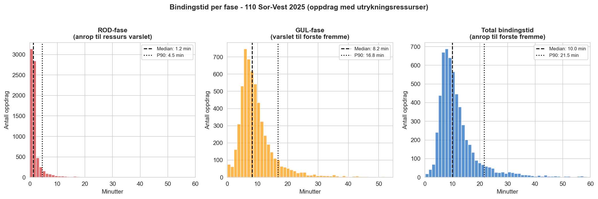
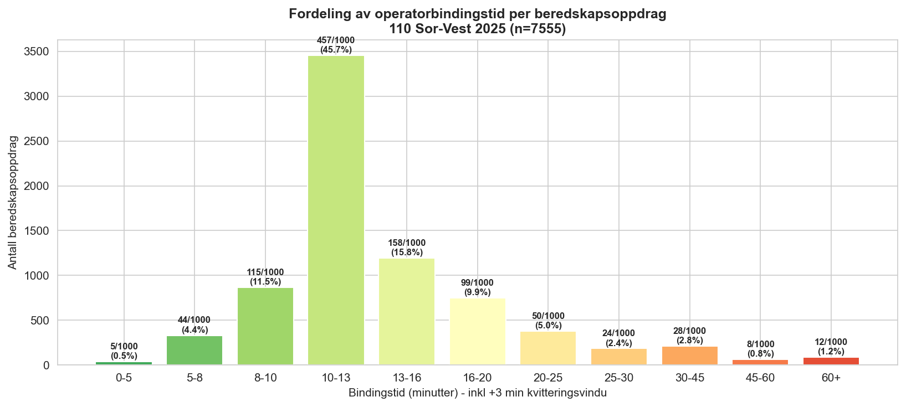
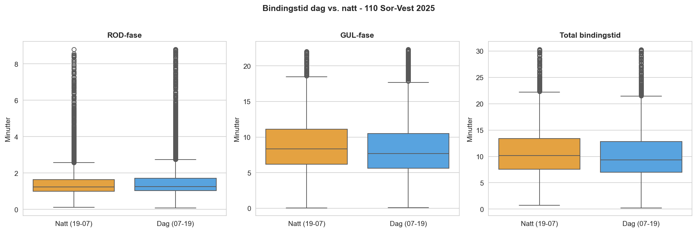
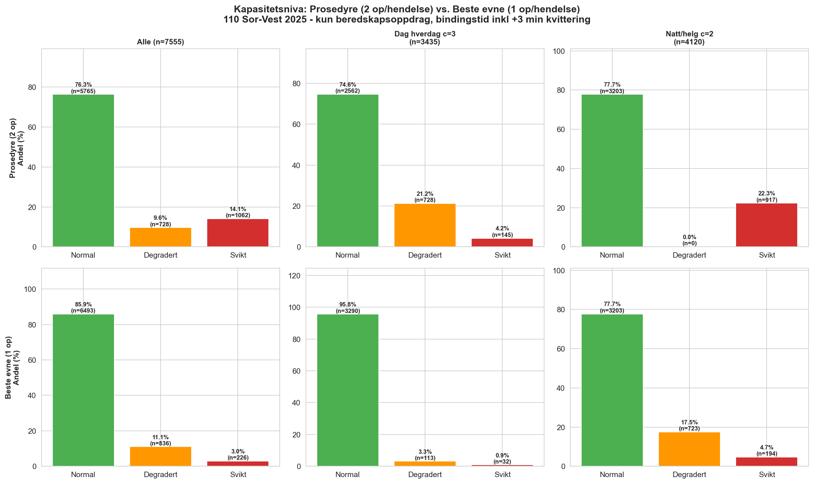
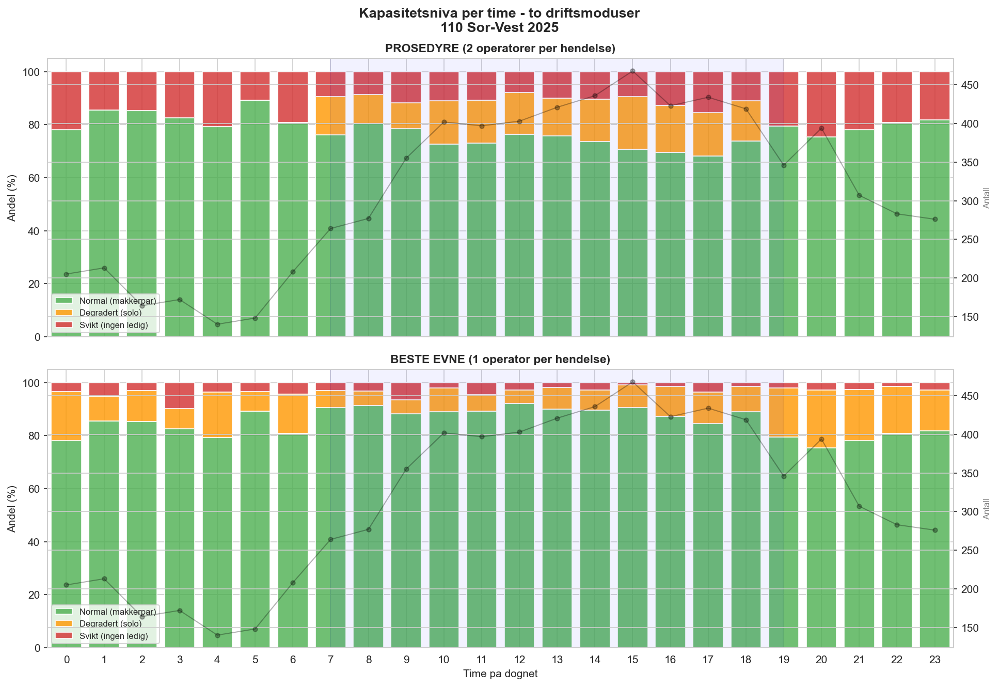
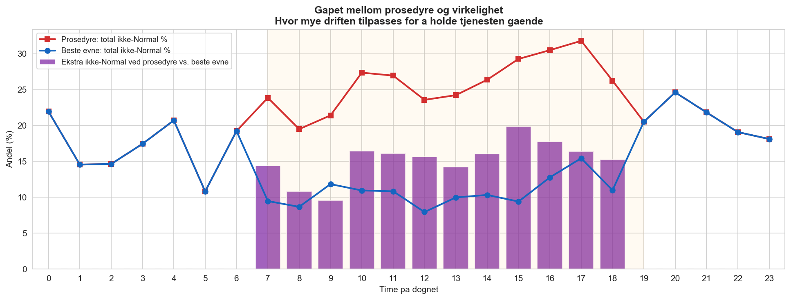
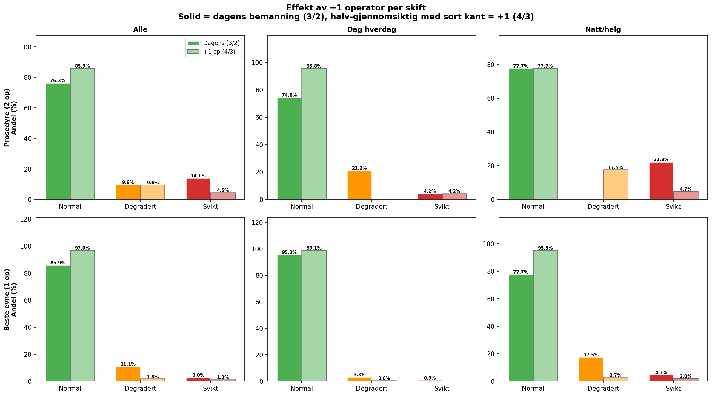

# 7. Analyse og resultater

## 7.1 Metodisk tilnærming: fra køteori til prosedyrbasert kapasitetsmodell

Prosjektet startet med Erlang-C (M/M/c) som primærmodell for kapasitetsanalyse. Erlang-C estimerer sannsynligheten for at et innkommende anrop må vente, gitt ankomstrate (λ), gjennomsnittlig servicetid (μ⁻¹) og antall servere (c). En innledende analyse med Erlang-C viste imidlertid svært lav systemutnyttelse (ρ < 10 %) for alle skifttyper, noe som isolert sett kunne tyde på at bemanningsnivået er komfortabelt (se Tabell 7.1).

**Tabell 7.1: Erlang-C resultater — beredskapsoppdrag, 110 Sør-Vest 2025**

| Skifttype | λ (anrop/t) | c_eff | ρ = λ/(c·μ) | P(vente) | P(W > 30s) |
|---|---|---|---|---|---|
| Dag / Hverdag | 2,57 | 3 | 4,9 % | 0,05 % | 0,02 % |
| Dag / Helg | 2,06 | 2 | 5,9 % | 0,66 % | 0,38 % |
| Natt / Hverdag | 1,18 | 2 | 3,4 % | 0,22 % | 0,13 % |
| Natt / Helg | 1,30 | 2 | 3,7 % | 0,27 % | 0,15 % |

*Bindingstid (μ⁻¹): vektet gjennomsnitt 3,44 min basert på intervjudata (Anette, 2026). λ inkluderer kun synlige beredskapsoppdrag fra BRIS/LEO — faktisk innkommende volum er høyere (se avsnitt 7.2). P(W > 30s): sannsynlighet for ventetid over 30 sekunder — terskelen for automatisk overføring til Agder ved ubesvart anrop (beredskapsanalyse J03 s. 25).*

Resultatene fra Erlang-C er formelt korrekte gitt inputparametrene, men metodisk utilstrekkelige for 110-konteksten. Årsaken er tredelt: modellen forutsetter at servere er *uavhengige* og *parallelle*, den behandler kapasitetsbinding utover samtaletid som null, og den baserer seg på en ankomstrate som undervurderer faktisk innkommende volum (se avsnitt 7.2). Gjennomgang av den operative prosedyren (Rogaland brann og redning IKS, 2024) avslørte at forutsetningen om én uavhengig server per anrop ikke stemmer med faktisk arbeidsmetodikk.

---

## 7.2 Synlig oppdragsvolum versus faktisk anropsvolum

En viktig begrensning ved BRIS/LEO-data er at statistikken viser synlige oppdrag, ikke nødvendigvis alle innkommende anrop. Når flere personer ringer om samme hendelse, blir tilleggsanropene sammenstilt med det eksisterende oppdraget og forsvinner som egne observasjoner i årsrapport og eksportdata.

For 2025 viser datasettet 61 964 synlige oppdrag, mens sekvensnummerlogikken i LEO indikerer et estimert faktisk anropsvolum på minst 80 865 anrop.

**Tabell 7.1b: Synlig versus faktisk anropsvolum — 110 Sør-Vest 2025**

| | Antall |
|---|---|
| Synlige oppdrag (BRIS/LEO) | 61 964 |
| Estimert faktisk anropsvolum | 80 865 |
| Skjulte/sammenstilte anrop | 18 901 |
| Korreksjonsfaktor | 1,305x |

Differansen på 18 901 anrop, tilsvarende 23,4 %, representerer ikke valgbare eller trivielle henvendelser, men faktiske innkommende anrop som beslaglegger operatørkapasitet. Korreksjonsfaktoren varierer mellom måneder (størst i januar: 1,438x) og er generelt høyest ved dagtid på hverdager — nettopp der kapasitetspresset allerede er høyest.

Dette har tre konsekvenser for analysen:

1. **Ankomstraten λ i Erlang-C er for lav.** En modell som bruker synlige oppdrag som grunnlag for λ vil systematisk undervurdere faktisk arbeidsbelastning. Selv en perfekt M/M/c-modell ville derfor vært basert på et ufullstendig inputgrunnlag.

2. **Kapasitetsanalysen er konservativ.** Ankomstkonfliktmodellen (avsnitt 7.5) er basert på synlige oppdrag med ressursvarsling. De sammenstilte tilleggsanropene opptar en operatør som ellers kunne vært ledig for neste hendelse, men er ikke modellert som egne belastningsenheter. Modellen gir dermed et minimumsanslag på faktisk operativ belastning.

3. **Skjult belastning påvirker dimensjonering direkte.** Sammenstilte tilleggsanrop påvirker ikke bare ankomstraten i køteoretisk forstand, men også den operative bindingen i den prosedyrbaserte modellen. Når flere innringere melder om samme hendelse, kan disse anropene oppta en operatør som ellers ville vært ledig for neste hendelse, eller forsterke belastningen i en allerede aktiv hendelse. For dimensjonering betyr dette at analyser basert på oppdragsteller alene kan undervurdere både arbeidsbelastning, samtidighetskonflikt og behovet for bufferkapasitet.

Skillet mellom synlig oppdragsvolum og faktisk anropsvolum viser at kapasitetsanalyse ikke kan ta utgangspunkt i registrerte saker alene. Det neste spørsmålet blir derfor ikke bare hvor mange oppdrag som finnes, men hvordan sentralens arbeidsmetodikk gjør at disse anropene binder operatører over tid.

---

## 7.3 Den operative arbeidsmetodikken som kapasitetsramme

Prosedyren definerer tre operative funksjoner som roterer dynamisk mellom operatørene:

- **Rød funksjon:** Operatøren som besvarer nødtelefonen, oppretter hendelse i LEO og gjennomfører intervju med innringer. Binder én operatør fullt ut i den aktive samtalefasen.
- **Gul funksjon:** Den nærmeste ledige operatøren overtar koordinering: utalarmerer ressurser, håndterer samband, loggfører skadestedsfaktorer og følger opp hendelsen til den er lukket. Én gul operatør kan håndtere flere gule hendelser parallelt i oppfølgingsfasen.
- **Grønn funksjon:** Ledig — klar for neste nødanrop. Prosedyren definerer eksplisitt som målsetning at *«én operatør til enhver tid er ledig og kan ta nødtelefoner»*.
- **Vaktleder (VL):** Overordnet funksjon — oversikt, prioritering, pressehåndtering og innkalling. Prosedyren slår fast at *«vaktleder skal som et utgangspunkt ikke besvare nødanrop»*.

Den normale driftsformen er dermed et **makkerpar**: én rød og én gul operatør samarbeider om én hendelse, mens øvrige operatører er grønne og klare for neste anrop. Prosedyren definerer dette som normalstandarden, og understreker at *«tiden to operatører er involvert i samme hendelse gjøres så kort som mulig, for å raskt frigjøre kapasitet til neste hendelse»*.

### Kapasitetsnivåer utledet av prosedyren

Med utgangspunkt i prosedyrens rolledefinisjon etableres tre kapasitetsnivåer, som danner grunnlaget for den kvantitative analysen:

**Tabell 7.2: Kapasitetsnivåer definert av arbeidsmetodikken**

| Nivå | Definisjon | c_eff = 2 (natt/helg) | c_eff = 3 (dag/hverdag) |
|---|---|---|---|
| **Normal** | Makkerpar mulig, prosedyrkonform drift | 0 aktive hendelser | 0 aktive hendelser |
| **Brudd på driftsstandard** | Nytt anrop uten ledig, dedikert makker. Operatørene jobber «etter beste evne». | ≥ 1 aktiv | ≥ 1 aktiv |
| **Svikt** | VL må bryte vaktlederfunksjon *eller* anrop overføres til Agder | ≥ 2 aktive | ≥ 3 aktive |

*Svikt er et deltilfelle av brudd på driftsstandard (enhver svikt er også brudd). For c_eff = 2 med n = 1 aktiv er begge operatørene bundet, og ingen kan ta neste anrop uten å bryte sin pågående rolle. For c_eff = 3 med n = 1 aktiv kan GRØNN-operatøren besvare anropet, men uten dedikert GUL-makker — prosedyrens makkerpar-krav er likevel brutt.*

Den kritiske innsikten er at **makkerpar-prinsippet brytes allerede ved første aktive hendelse**: enten er begge operatørene (c=2) bundet i rød og gul funksjon, eller GRØNN (c=3) må håndtere hendelsen uten dedikert makker. Svikt (anrop til VL eller Agder) oppstår når alle operatørene allerede er aktive.

---

## 7.4 Bindingstidsestimat

Bindingstid defineres som den perioden operatørene er aktivt bundet til en hendelse — fra anropets ankomsttidspunkt til operatørene er frigjort for neste hendelse. Bindingstidene er beregnet direkte fra BRIS-data for hendelser med ressursvarsling (kategori D, jf. avsnitt 6.2).

### 7.4.1 Avgrensning og datagrunnlag

Av 61 964 synlige hendelser i datasettet har 7 555 (12,2 %) registrert tidspunkt for ressursvarsling, noe som identifiserer dem som kategori D — beredskapsoppdrag med utrykningsbeslutning. Hovedanalysen avgrenser seg til disse hendelsene fordi de kan observeres robust gjennom ressursvarsling og tidspunkt for første ressurs fremme. Denne avgrensningen er valgt av hensyn til målepresisjon, ikke fordi andre hendelseskategorier er uviktige. Den kvantitative analysen prioriterer dermed robust observerbarhet fremfor fullstendighet.

Hendelser uten ressursvarsling er ikke nødvendigvis irrelevante for dimensjonering. En del av disse representerer reelle hendelser løst av 110 uten utrykning (kategori B), tidskritiske avklaringer som ABA (kategori C), og i tillegg kommer sammenstilte tilleggsanrop knyttet til eksisterende hendelser (avsnitt 7.2). Disse belaster operatørkapasitet, men lar seg ikke modellere like robust som kategori D med det foreliggende datasettet. De kvantitative hovedresultatene i denne studien beskriver dermed den best observerbare og mest tydelig beredskapsdimensjonerende delen av operatørbindingen. De utgjør ikke en fullstendig modellering av all operativ belastning i sentralen.

### 7.4.2 Beregning

Bindingstiden per hendelse er beregnet som:

> **Bindingstid = (Dato/tid anrop → Første ressurs fremme) + 3 minutter kvitteringsvindu**

De tre minuttene reflekterer vindusmelding som må kvitteres og logges av GUL-operatør etter at første ressurs er på plass. Av de 7 555 beredskapsoppdragene har 5 777 (76,5 %) registrert tidspunkt for første ressurs fremme. De resterende 1 778 (23,5 %) er tildelt median bindingstid fra de observerte verdiene.

### 7.4.3 Observert bindingstidsfordeling

**Tabell 7.3: Bindingstid per beredskapsoppdrag — 110 Sør-Vest 2025 (inkl. +3 min kvittering)**

| Persentil | Bindingstid (min) |
|---|---|
| P10 | 9,1 |
| P25 | 11,1 |
| **Median** | **13,0** |
| P75 | 15,4 |
| P90 | 21,6 |
| P95 | 29,2 |

Bindingstiden er delt opp i to faser. RØD-fasen (anrop → ressurs varslet) har median 1,2 minutter — dette er den akutte samtale- og varslingsfasen. GUL-fasen (ressurs varslet → første ressurs fremme) har median 8,2 minutter — dette er oppfølgingsperioden der operatøren koordinerer, logger og gir tidskritisk informasjon til mannskap underveis. GUL-fasen utgjør dermed hoveddelen av kapasitetsbindingen.

*Figur 7.1a: Fordeling av bindingstid per fase (RØD, GUL, Total) for beredskapsoppdrag med utrykningsressurser.*

**Tabell 7.3b: Bindingstid-fordeling (per 1000 beredskapsoppdrag)**

| Bindingstid | Antall | Andel | Kumulativ | Per 1000 |
|---|---|---|---|---|
| 0–5 min | 38 | 0,5 % | 0,5 % | 5 |
| 5–8 min | 331 | 4,4 % | 4,9 % | 44 |
| 8–10 min | 866 | 11,5 % | 16,3 % | 115 |
| **10–13 min** | **3 456** | **45,7 %** | **62,1 %** | **457** |
| 13–16 min | 1 194 | 15,8 % | 77,9 % | 158 |
| 16–20 min | 749 | 9,9 % | 87,8 % | 99 |
| 20–25 min | 378 | 5,0 % | 92,8 % | 50 |
| 25–30 min | 183 | 2,4 % | 95,2 % | 24 |
| 30–45 min | 211 | 2,8 % | 98,0 % | 28 |
| 45–60 min | 61 | 0,8 % | 98,8 % | 8 |
| 60+ min | 88 | 1,2 % | 100 % | 12 |

*Figur 7.1b: Fordeling av operatørbindingstid per beredskapsoppdrag. Nesten halvparten (457/1000) binder operatørene i 10–13 minutter.*

Dag- og nattskift viser tilnærmet lik bindingstid (median 9,6 vs 10,4 min før kvitteringsvindu), noe som indikerer at bindingstiden primært drives av hendelsestype og geografi, ikke av tidspunkt på døgnet.

*Figur 7.1c: Bindingstid per fase fordelt på dag- og nattskift. Forskjellene er marginale.*

---

## 7.5 Kapasitetsanalyse: to driftsmoduser

### Metode

For hvert beredskapsanrop (kategori D) beregnes antall samtidige aktive hendelser ved ankomsttidspunktet. En hendelse er «aktiv» i perioden fra anrop til bindingstiden er utløpt (faktisk observert tid fra BRIS + 3 min kvittering). Kapasitetsnivå klassifiseres basert på antall ledige operatører.

Den sentrale analysen differensierer mellom to driftsmoduser som eksisterer parallelt i praksis:

- **Prosedyre (2 operatører per hendelse):** Makkerpar iht. driftsstandarden — én RØD og én GUL bundet per aktiv hendelse. Ledige operatører = c_eff − 2 × n_aktive.
- **Beste evne (1 operatør per hendelse):** Solo-drift — operatøren håndterer alt alene. Ledige operatører = c_eff − 1 × n_aktive.

Kapasitetsnivå for begge moduser:
- **Normal:** ≥ 2 ledige operatører (makkerpar mulig for neste hendelse)
- **Degradert:** 1 ledig operatør (kun solo mulig)
- **Svikt:** 0 ledige (VL må overta eller overløp til Agder)

### Resultater

**Tabell 7.4: Kapasitetsnivå — prosedyre vs. beste evne (n = 7 555 beredskapsoppdrag, kategori D)**

| | **Prosedyre (2 op/hendelse)** | | | **Beste evne (1 op/hendelse)** | | |
|---|---|---|---|---|---|---|
| Skifttype | Normal | Degradert | Svikt | Normal | Degradert | Svikt |
| **Dag hverdag (c=3)** | 74,6 % | 21,2 % | 4,2 % | 95,8 % | 3,3 % | 0,9 % |
| **Natt/helg (c=2)** | 77,7 % | 0,0 % | 22,3 % | 77,7 % | 17,5 % | 4,7 % |
| **Alle** | 76,3 % | 9,6 % | 14,1 % | 85,9 % | 11,1 % | 3,0 % |

*Figur 7.2: Kapasitetsnivå ved ankomst under prosedyre (2 op, øvre rad) og beste evne (1 op, nedre rad). Forskjellen mellom øvre og nedre rad er den tilpasningen operatørene gjør daglig for å holde tjenesten gående.*

Tre observasjoner:

**1. Natt/helg med prosedyre er binært.** Med c_eff = 2 og 2 operatører per hendelse finnes ingen degradert mellomsone — man går direkte fra Normal (77,7 %) til Svikt (22,3 %). Enten er begge operatørene ledige, eller ingen er det. Dette betyr at **hvert 4,5. beredskapsoppdrag på natt/helg medfører svikt** under prosedyrekrav.

**2. Solo-drift absorberer kapasitetspresset.** Forskjellen mellom prosedyre (14,1 % svikt) og beste evne (3,0 % svikt) viser at operatørene daglig absorberer ~11 prosentpoeng kapasitetspress gjennom solo-håndtering. Dette er den «usynlige tilpasningen» alle i bransjen kjenner, men som ingen måler systematisk.

**3. Dag hverdag er komfortabel under solo-drift.** Med c_eff = 3 og 1 operatør per hendelse er 95,8 % Normal. Bemanningen er tilstrekkelig for solo-drift på dagtid — men utilstrekkelig for prosedyrekonform drift (kun 74,6 % Normal).

De rapporterte andelene for normal, degradert og svikt beskriver et nedre estimat for kapasitetskonflikt i sentralen, fordi de kun reflekterer kategori D-hendelser. Reell konfliktfrekvens kan være høyere når kategori B, kategori C og sammenstilte tilleggsanrop (avsnitt 7.2) tas med. Begrensningene i datagrunnlaget trekker i hovedsak i én retning: mot undervurdering. Resultatene bør derfor leses som et minimumsanslag på brudd- og sviktrisiko, ikke som et maksimumsanslag.

*Figur 7.3: Kapasitetsnivå per time på døgnet under begge driftsmoduser. Øverst: prosedyre, nederst: beste evne. Skiftvekslingen kl. 19 (c=3 → c=2) er tydelig synlig som økt degradert/svikt-andel.*

*Figur 7.4: Forskjellen i ikke-normal drift mellom prosedyrekrav og beste-evne-drift per time. De lilla stolpene kvantifiserer hvor mye operatørene «strekker seg» gjennom solo-håndtering. Gapet er størst kl. 15–17 (dagskift) og kl. 19–21 (etter skiftveksling).*

---

## 7.6 Scenarioanalyse: effekt av +1 operatør per skift

Scenarioet med én ekstra operatør per skift skal ikke forstås som en prognose, men som en strukturtest av robusthet. Hensikten er å undersøke hvilken effekt en ekstra bufferressurs har på sannsynligheten for at første aktive hendelse umiddelbart bringer skiftet over i brudd på driftsstandard eller svikt. Scenarioet øker c_eff fra 3 → 4 på dag hverdag og fra 2 → 3 på natt/helg.

**Tabell 7.5: Effekt av +1 operatør — prosedyre (2 op/hendelse)**

| Skifttype | | Dagens bemanning | | +1 operatør | | |
|---|---|---|---|---|---|---|
| | Normal | Deg. | Svikt | Normal | Deg. | Svikt |
| **Dag hverdag** (3→4) | 74,6 % | 21,2 % | 4,2 % | **95,8 %** | **0,0 %** | 4,2 % |
| **Natt/helg** (2→3) | 77,7 % | 0,0 % | 22,3 % | 77,7 % | **17,5 %** | **4,7 %** |

**Tabell 7.5b: Effekt av +1 operatør — beste evne (1 op/hendelse)**

| Skifttype | | Dagens bemanning | | +1 operatør | | |
|---|---|---|---|---|---|---|
| | Normal | Deg. | Svikt | Normal | Deg. | Svikt |
| **Dag hverdag** (3→4) | 95,8 % | 3,3 % | 0,9 % | **99,1 %** | 0,6 % | 0,3 % |
| **Natt/helg** (2→3) | 77,7 % | 17,5 % | 4,7 % | **95,3 %** | **2,7 %** | **2,0 %** |

*Figur 7.5: Sammenligning av dagens bemanning (solid) og +1 operatør (halv-gjennomsiktig, sort kant) under begge driftsmoduser. Effekten er størst på natt/helg.*

Tre funn:

**1. Natt/helg under prosedyre: det binære problemet forsvinner.** Med c_eff = 2 er det ingen degradert mellomsone (0 % → 22,3 % svikt). Med c_eff = 3 oppstår en degradert buffer (17,5 %), og svikt faller dramatisk fra 22,3 % til 4,7 % — en reduksjon på 79 %.

**2. Dag hverdag under prosedyre: degradert elimineres.** Med c_eff = 4 og 2 operatører per hendelse er det alltid nok til makkerpar (Normal 74,6 % → 95,8 %). Degradert (solo-drift iht. prosedyre) faller fra 21,2 % til 0 %.

**3. Natt/helg under beste evne: nær full dekning.** Normal øker fra 77,7 % til 95,3 % — tilnærmet likt dagens dag-hverdag-nivå. Svikt halveres fra 4,7 % til 2,0 %.

---

## 7.7 Generaliserbarhet

Den konkrete analysen er gjennomført på data fra 110 Sør-Vest, men modellrammeverket er utviklet for å kunne anvendes sentralsvis på alle norske 110-sentraler. Det sentrale er ikke de eksakte prosentverdiene i denne studien, men metoden for å identifisere hvor ofte en ny hendelse ankommer i en tilstand der tilgjengelig operatørkapasitet allerede er bundet.

Andre sentraler kan bruke samme analyseopplegg dersom de har tilgang til:
- Ankomsttidspunkt for hendelser
- Tidspunkt for ressursvarsling (identifiserer kategori D)
- En proxy for akuttfasens varighet (første ressurs fremme eller tilsvarende)
- Eventuelt indikatorer på sammenstilte tilleggsanrop for korreksjon av ankomstrate

Modellen kan dermed danne grunnlag for en nasjonal, etterprøvbar dimensjoneringsstandard for 110-operatører — analogt med dimensjoneringsforskriftens rolle for brannstasjoner, men basert på operatørbinding fremfor responstid.

---

## 7.8 Sammenstilling og tolkning

Analysen dokumenterer fire hovedfunn:

**Funn 1: Erlang-C alene er utilstrekkelig for 110-dimensjonering.**
Den tradisjonelle køteoretiske modellen gir svært lav systemutnyttelse (ρ < 10 %) og P(W > 30s) < 0,5 % for alle skifttyper. Modellen behandler operatører som uavhengige servere, fanger ikke kapasitetstapet ved makkerpar-kravet, og baserer seg på en ankomstrate fra synlige oppdrag som undervurderer faktisk innkommende volum med anslagsvis 23 %.

**Funn 2: Faktisk bindingstid er lengre enn samtaletid — og databasert.**
Bindingstiden (anrop → første ressurs fremme + 3 min kvittering) har median 13,0 minutter basert på 7 555 beredskapsoppdrag. Nesten halvparten (45,7 %) av oppdragene binder operatørene i 10–13 minutter, mens 12,2 % tar over 20 minutter. RØD-fasen (median 1,2 min) er kort; det er GUL-fasen (median 8,2 min) som dominerer kapasitetsbindingen.

**Funn 3: Gapet mellom prosedyre og virkelighet kvantifiserer den daglige tilpasningen.**
Under prosedyrekrav (2 operatører per hendelse) er 14,1 % av alle beredskapsanrop i svikt. Under beste-evne-drift (1 operatør) er svikt 3,0 %. Differansen — 11 prosentpoeng — er den «usynlige tilpasningen» der operatørene absorberer kapasitetspress gjennom solo-håndtering. På natt/helg med c_eff = 2 er prosedyresituasjonen binær: 77,7 % Normal, 22,3 % direkte Svikt, uten mellomsone. Disse tallene er et minimumsanslag: kategori B- og C-hendelser samt sammenstilte tilleggsanrop er ikke inkludert som egne belastningsenheter.

**Funn 4: +1 operatør per skift har størst effekt på natt/helg.**
Én ekstra operatør (c_eff 2→3 natt/helg, 3→4 dag) reduserer svikt under prosedyre fra 22,3 % til 4,7 % på natt/helg og eliminerer degradert drift helt på dag hverdag. Under beste evne bringes natt/helg til 95,3 % Normal — tilnærmet likt dagens dag-hverdag-nivå. Analysen indikerer at bemanningsstrukturen er en mer direkte driver for observerte kapasitetsforskjeller enn samlet synlig oppdragsvolum alene.

Funnene har direkte parallell til dimensjoneringslogikken i brannstasjonsforskriften: S1-stasjoner dimensjoneres med to kjøretøy ikke fordi begge alltid er i bruk, men fordi konsekvensen av utilstrekkelig kapasitet ved simultane hendelser er uakseptabel. Det samme prinsippet — dimensjonering for beredskapstopper, ikke for gjennomsnittsbelastning — bør ligge til grunn for 110-operatørkapasitet.

---

*Skript for analyser og figurer: `analyse/scripts/konflikt_beredskap_v3.py`, `analyse/scripts/scenario_pluss1.py`, `analyse/scripts/bindingstid_analyse.py`*
*Data: `004 data/110 SØR VEST TESTDATASETT.xlsx` (BRIS 2025, 61 964 synlige oppdrag, 7 555 beredskapsoppdrag kategori D)*
*Prosedyreferanse: Rogaland brann og redning IKS (2024). Prosedyre arbeidsmetodikk, utalarmering og loggføring, versjon 4, 16.12.2024.*
