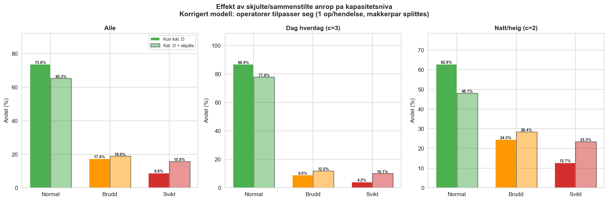
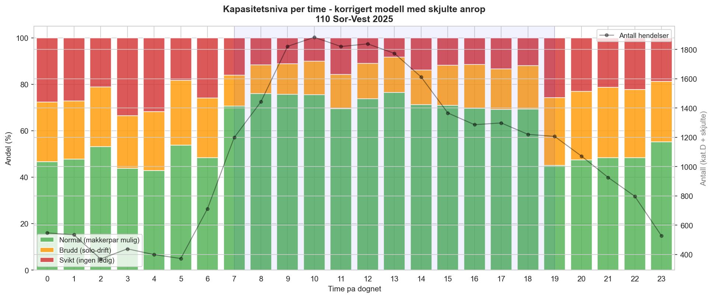

# 7. Analyse og resultater

## 7.1 Metodisk tilnærming: fra køteori til prosedyrbasert kapasitetsmodell

Prosjektet startet med Erlang-C (M/M/c) som primærmodell for kapasitetsanalyse. Erlang-C estimerer sannsynligheten for at et innkommende anrop må vente, gitt ankomstrate (λ), gjennomsnittlig servicetid (μ⁻¹) og antall servere (c). En innledende analyse med Erlang-C viste imidlertid svært lav systemutnyttelse (ρ < 10 %) for alle skifttyper, noe som isolert sett kunne tyde på at bemanningsnivået er komfortabelt (se Tabell 7.1).

**Tabell 7.1: Erlang-C resultater — beredskapsoppdrag, 110 Sør-Vest 2025**

| Skifttype | λ (anrop/t) | c_eff | ρ = λ/(c·μ) | P(vente) | P(W > 30s) |
|---|---|---|---|---|---|
| Dag / Hverdag | 2,57 | 3 | 4,9 % | 0,05 % | 0,02 % |
| Dag / Helg | 2,06 | 2 | 5,9 % | 0,66 % | 0,38 % |
| Natt / Hverdag | 1,18 | 2 | 3,4 % | 0,22 % | 0,13 % |
| Natt / Helg | 1,30 | 2 | 3,7 % | 0,27 % | 0,15 % |

*Bindingstid (μ⁻¹): vektet gjennomsnitt 3,44 min basert på intervjudata (Anette, 2026). λ inkluderer kun synlige beredskapsoppdrag fra BRIS/LEO — faktisk innkommende volum er høyere (se avsnitt 7.2). P(W > 30s): sannsynlighet for ventetid over 30 sekunder — terskelen for automatisk overføring til Agder ved ubesvart anrop (beredskapsanalyse J03 s. 25).*

Resultatene fra Erlang-C er formelt korrekte gitt inputparametrene, men metodisk utilstrekkelige for 110-konteksten. Årsaken er tredelt: modellen forutsetter at servere er *uavhengige* og *parallelle*, den behandler kapasitetsbinding utover samtaletid som null, og den baserer seg på en ankomstrate som undervurderer faktisk innkommende volum (se avsnitt 7.2). Gjennomgang av den operative prosedyren (Rogaland brann og redning IKS, 2024) avslørte at forutsetningen om én uavhengig server per anrop ikke stemmer med faktisk arbeidsmetodikk.

---

## 7.2 Synlig oppdragsvolum versus faktisk anropsvolum

En viktig begrensning ved BRIS/LEO-data er at statistikken viser synlige oppdrag, ikke nødvendigvis alle innkommende anrop. Når flere personer ringer om samme hendelse, blir tilleggsanropene sammenstilt med det eksisterende oppdraget og forsvinner som egne observasjoner i årsrapport og eksportdata.

For 2025 viser datasettet 61 964 synlige oppdrag, mens sekvensnummerlogikken i LEO indikerer et estimert faktisk anropsvolum på minst 80 865 anrop.

**Tabell 7.1b: Synlig versus faktisk anropsvolum — 110 Sør-Vest 2025**

| | Antall |
|---|---|
| Synlige oppdrag (BRIS/LEO) | 61 964 |
| Estimert faktisk anropsvolum | 80 865 |
| Skjulte/sammenstilte anrop | 18 901 |
| Korreksjonsfaktor | 1,305x |

Differansen på 18 901 anrop, tilsvarende 23,4 %, representerer ikke valgbare eller trivielle henvendelser, men faktiske innkommende anrop som beslaglegger operatørkapasitet. Korreksjonsfaktoren varierer mellom måneder (størst i januar: 1,438x) og er generelt høyest ved dagtid på hverdager — nettopp der kapasitetspresset allerede er høyest.

Dette har tre konsekvenser for analysen:

1. **Ankomstraten λ i Erlang-C er for lav.** En modell som bruker synlige oppdrag som grunnlag for λ vil systematisk undervurdere faktisk arbeidsbelastning. Selv en perfekt M/M/c-modell ville derfor vært basert på et ufullstendig inputgrunnlag.

2. **Kapasitetsanalysen er konservativ.** Ankomstkonfliktmodellen (avsnitt 7.5) er basert på synlige oppdrag med ressursvarsling. De sammenstilte tilleggsanropene opptar en operatør som ellers kunne vært ledig for neste hendelse, men er ikke modellert som egne belastningsenheter. Modellen gir dermed et minimumsanslag på faktisk operativ belastning.

3. **Skjult belastning påvirker dimensjonering direkte.** Sammenstilte tilleggsanrop påvirker ikke bare ankomstraten i køteoretisk forstand, men også den operative bindingen i den prosedyrbaserte modellen. Når flere innringere melder om samme hendelse, kan disse anropene oppta en operatør som ellers ville vært ledig for neste hendelse, eller forsterke belastningen i en allerede aktiv hendelse. For dimensjonering betyr dette at analyser basert på oppdragsteller alene kan undervurdere både arbeidsbelastning, samtidighetskonflikt og behovet for bufferkapasitet.

Skillet mellom synlig oppdragsvolum og faktisk anropsvolum viser at kapasitetsanalyse ikke kan ta utgangspunkt i registrerte saker alene. Det neste spørsmålet blir derfor ikke bare hvor mange oppdrag som finnes, men hvordan sentralens arbeidsmetodikk gjør at disse anropene binder operatører over tid.

---

## 7.3 Den operative arbeidsmetodikken som kapasitetsramme

Prosedyren definerer tre operative funksjoner som roterer dynamisk mellom operatørene:

- **Rød funksjon:** Operatøren som besvarer nødtelefonen, oppretter hendelse i LEO og gjennomfører intervju med innringer. Binder én operatør fullt ut i den aktive samtalefasen.
- **Gul funksjon:** Aktiveres samtidig med RØD — GUL-operatøren går umiddelbart i medlytt når RØD besvarer anropet, for å bygge situasjonsforståelse og avhjelpe med lokalisering. Etter den innledende medlyttfasen utalarmerer GUL ressurser, håndterer samband og gir tidskritisk informasjon til mannskap underveis, delvis fortsatt på medlytt. GUL forblir bundet frem til vindusmelding mottas om at første ressurs er fremme, pluss kvittering og loggføring (anslagsvis 3 minutter). Først etter dette er GUL delvis frigjort og kan håndtere flere gule hendelser parallelt i en mer sporadisk oppfølgingsfase.
- **Grønn funksjon:** Ledig — klar for neste nødanrop. Prosedyren definerer eksplisitt som målsetning at *«én operatør til enhver tid er ledig og kan ta nødtelefoner»*.
- **Vaktleder (VL):** Overordnet funksjon — oversikt, prioritering, pressehåndtering og innkalling. Prosedyren slår fast at *«vaktleder skal som et utgangspunkt ikke besvare nødanrop»*.

Den normale driftsformen er dermed et **makkerpar**: én rød og én gul operatør samarbeider om én hendelse, mens øvrige operatører er grønne og klare for neste anrop. Prosedyren definerer dette som normalstandarden, og understreker at *«tiden to operatører er involvert i samme hendelse gjøres så kort som mulig, for å raskt frigjøre kapasitet til neste hendelse»*.

### Kapasitetsnivåer utledet av prosedyren

Med utgangspunkt i prosedyrens rolledefinisjon etableres tre kapasitetsnivåer, som danner grunnlaget for den kvantitative analysen:

**Tabell 7.2: Kapasitetsnivåer definert av arbeidsmetodikken**

| Nivå | Definisjon | c_eff = 2 (natt/helg) | c_eff = 3 (dag/hverdag) |
|---|---|---|---|
| **Normal** | Makkerpar mulig, prosedyrkonform drift | 0 aktive hendelser | 0 aktive hendelser |
| **Brudd på driftsstandard** | Nytt anrop uten ledig, dedikert makker. Operatørene jobber «etter beste evne». | ≥ 1 aktiv | ≥ 1 aktiv |
| **Svikt** | VL må bryte vaktlederfunksjon *eller* anrop overføres til Agder | ≥ 2 aktive | ≥ 3 aktive |

*Svikt er et deltilfelle av brudd på driftsstandard (enhver svikt er også brudd). For c_eff = 2 med n = 1 aktiv er begge operatørene bundet, og ingen kan ta neste anrop uten å bryte sin pågående rolle. For c_eff = 3 med n = 1 aktiv kan GRØNN-operatøren besvare anropet, men uten dedikert GUL-makker — prosedyrens makkerpar-krav er likevel brutt.*

Den kritiske innsikten er at **makkerpar-prinsippet brytes allerede ved første aktive hendelse**: enten er begge operatørene (c=2) bundet i rød og gul funksjon, eller GRØNN (c=3) må håndtere hendelsen uten dedikert makker. Svikt (anrop til VL eller Agder) oppstår når alle operatørene allerede er aktive.

---

## 7.4 Bindingstidsestimat

Bindingstid defineres som den perioden operatørene er aktivt bundet til en hendelse — fra anropets ankomsttidspunkt til operatørene er frigjort for neste hendelse. Bindingstidene er beregnet direkte fra BRIS-data for hendelser med ressursvarsling (kategori D, jf. avsnitt 6.2).

### 7.4.1 Avgrensning og datagrunnlag

Av 61 964 synlige hendelser i datasettet har 7 555 (12,2 %) registrert tidspunkt for ressursvarsling, noe som identifiserer dem som kategori D — beredskapsoppdrag med utrykningsbeslutning. Hovedanalysen avgrenser seg til disse hendelsene fordi de kan observeres robust gjennom ressursvarsling og tidspunkt for første ressurs fremme. Denne avgrensningen er valgt av hensyn til målepresisjon, ikke fordi andre hendelseskategorier er uviktige. Den kvantitative analysen prioriterer dermed robust observerbarhet fremfor fullstendighet.

Hendelser uten ressursvarsling er ikke nødvendigvis irrelevante for dimensjonering. En del av disse representerer reelle hendelser løst av 110 uten utrykning (kategori B), tidskritiske avklaringer som ABA (kategori C), og i tillegg kommer sammenstilte tilleggsanrop knyttet til eksisterende hendelser (avsnitt 7.2). Disse belaster operatørkapasitet, men lar seg ikke modellere like robust som kategori D med det foreliggende datasettet. De kvantitative hovedresultatene i denne studien beskriver dermed den best observerbare og mest tydelig beredskapsdimensjonerende delen av operatørbindingen. De utgjør ikke en fullstendig modellering av all operativ belastning i sentralen.

### 7.4.2 Beregning

Bindingstiden per hendelse er beregnet som:

> **Bindingstid = (Dato/tid anrop → Første ressurs fremme) + 3 minutter kvitteringsvindu**

De tre minuttene reflekterer vindusmelding som må kvitteres og logges av GUL-operatør etter at første ressurs er på plass. Av de 7 555 beredskapsoppdragene har 5 777 (76,5 %) registrert tidspunkt for første ressurs fremme. De resterende 1 778 (23,5 %) er tildelt median bindingstid fra de observerte verdiene.

### 7.4.3 Observert bindingstidsfordeling

**Tabell 7.3: Bindingstid per beredskapsoppdrag — 110 Sør-Vest 2025 (inkl. +3 min kvittering)**

| Persentil | Bindingstid (min) |
|---|---|
| P10 | 9,1 |
| P25 | 11,1 |
| **Median** | **13,0** |
| P75 | 15,4 |
| P90 | 21,6 |
| P95 | 29,2 |

Bindingstiden kan belyses gjennom to tidspunkter i BRIS-data. Tid fra anrop til ressurs varslet (median 1,2 minutter) måler hvor raskt GUL-operatøren får utalarmert ressurser — men dette er ikke det samme som at RØD-operatøren er frigjort. Både RØD og GUL er bundet parallelt gjennom hele akuttfasen:

- **0 – ~1 min:** RØD i samtale med innringer, GUL i medlytt og lokalisering
- **~1 – ~2 min:** GUL utalarmerer ressurser (ressurs varslet), RØD fortsetter samtalen
- **~2 – ~10 min:** RØD kan fortsatt være i telefon med innringer, GUL koordinerer samband og gir tidskritisk informasjon til mannskap underveis
- **~10 min:** Første ressurs fremme → vindusmelding
- **+3 min:** Kvittering og loggføring → GUL delvis frigjort

Både RØD og GUL er dermed bundet i hele perioden fra anrop til første ressurs er fremme. Bindingstiden på median 13,0 minutter representerer perioden der to operatører er opptatt med én hendelse. Etter at innringer legger på kan RØD frigjøres før GUL, men det eksakte tidspunktet varierer og er ikke registrert i BRIS.

*Figur 7.1a: Tidsintervaller i beredskapsoppdrag. Venstre: tid til utalarmering (median 1,2 min). Midten: utrykningstid (median 8,2 min). Høyre: total bindingstid (median 10,0 min, uten kvittering). Merk: RØD og GUL er bundet parallelt gjennom hele forløpet.*

**Tabell 7.3b: Bindingstid-fordeling (per 1000 beredskapsoppdrag)**

| Bindingstid | Antall | Andel | Kumulativ | Per 1000 |
|---|---|---|---|---|
| 0–5 min | 38 | 0,5 % | 0,5 % | 5 |
| 5–8 min | 331 | 4,4 % | 4,9 % | 44 |
| 8–10 min | 866 | 11,5 % | 16,3 % | 115 |
| **10–13 min** | **3 456** | **45,7 %** | **62,1 %** | **457** |
| 13–16 min | 1 194 | 15,8 % | 77,9 % | 158 |
| 16–20 min | 749 | 9,9 % | 87,8 % | 99 |
| 20–25 min | 378 | 5,0 % | 92,8 % | 50 |
| 25–30 min | 183 | 2,4 % | 95,2 % | 24 |
| 30–45 min | 211 | 2,8 % | 98,0 % | 28 |
| 45–60 min | 61 | 0,8 % | 98,8 % | 8 |
| 60+ min | 88 | 1,2 % | 100 % | 12 |

*Figur 7.1b: Fordeling av operatørbindingstid per beredskapsoppdrag. Nesten halvparten (457/1000) binder operatørene i 10–13 minutter.*

Dag- og nattskift viser tilnærmet lik bindingstid (median 9,6 vs 10,4 min før kvitteringsvindu), noe som indikerer at bindingstiden primært drives av hendelsestype og geografi, ikke av tidspunkt på døgnet.

*Figur 7.1c: Bindingstid per fase fordelt på dag- og nattskift. Forskjellene er marginale.*

---

## 7.5 Kapasitetsanalyse: korrigert modell med skjulte anrop

### Metode

For hvert innkommende anrop (beredskapsoppdrag kategori D + sammenstilte tilleggsanrop) beregnes antall samtidige aktive hendelser ved ankomsttidspunktet. En hendelse er "aktiv" i perioden fra anrop til bindingstiden er utlopt. Kapasitetsniva klassifiseres basert pa antall ledige operatorer (se avsnitt 6.4.3).

Modellen speiler den operative virkeligheten: operatorene tilpasser seg alltid ved a splitte makkerparet nar det trengs. Hver aktiv hendelse binder 1 operator. Antall ledige = c_eff minus n_aktive.

Analysen gjennomfores i to varianter for a vise effekten av skjult anropsvolum:
- **Kun kategori D:** 7 555 beredskapsoppdrag med ressursvarsling (bindingstid: median 13,0 min)
- **Kategori D + skjulte anrop:** 7 555 + 18 901 = 26 456 belastningsenheter (skjulte anrop: 1 min bindingstid)

### Hovedresultater

**Tabell 7.4: Kapasitetsniva -- kun kategori D vs. med skjulte anrop**

| | **Kun kategori D** (n = 7 555) | | | **Med skjulte anrop** (n = 26 456) | | |
|---|---|---|---|---|---|---|
| Skifttype | Normal | Brudd | Svikt | Normal | Brudd | Svikt |
| **Dag hverdag (c=3)** | 86,9 % | 9,0 % | 4,2 % | 77,9 % | 12,0 % | 10,1 % |
| **Natt/helg (c=2)** | 62,8 % | 24,5 % | 12,7 % | 48,1 % | 28,4 % | 23,5 % |
| **Alle** | 73,8 % | 17,4 % | 8,8 % | 65,3 % | 19,0 % | 15,8 % |

*Figur 7.2: Kapasitetsniva med og uten skjulte/sammenstilte anrop. Heltrukne soylene viser kun kategori D; halvgjennomsiktige soyler viser effekten av a inkludere 18 901 sammenstilte anrop. Effekten er storst pa natt/helg der Normal faller fra 62,8 % til 48,1 %.*

### Effekten av skjulte anrop

De sammenstilte tilleggsanropene forsterker kapasitetspresset betydelig:

- **Normal faller med 8,5 prosentpoeng totalt** (73,8 % til 65,3 %)
- **Svikt nesten dobles** (8,8 % til 15,8 %)
- **Natt/helg rammes hardest:** Normal faller under halvparten (48,1 %), og nesten hvert 4. anrop medforer svikt (23,5 %)

Dette bekrefter at de skjulte anropene -- til tross for kort varighet (~1 min) -- er det som vipper kapasiteten i perioder der presset allerede er hoyt. En operator som tar et sammenstilt anrop er utilgjengelig for neste hendelse i akkurat det kritiske vinduet.

De rapporterte andelene for normal, brudd og svikt beskriver et nedre estimat for kapasitetskonflikt i sentralen, fordi kategori B og C ikke er inkludert. Reell konfliktfrekvens kan vaere hoyere. Begrensningene i datagrunnlaget trekker i hovedsak i en retning: mot undervurdering. Resultatene bor leses som et minimumsanslag pa brudd- og sviktrisiko, ikke som et maksimumsanslag.

### Kapasitetsniva per time

*Figur 7.3: Kapasitetsniva per time pa dognet (kategori D + skjulte anrop). Nattetimene (c=2) har gjennomgaende hoy svikt-andel (20-34 %). Skiftvekslingen kl. 19 (c=3 til c=2) er tydelig synlig. Dagskiftet (kl. 07-18) har markant bedre kapasitetsbilde takket vaere c=3.*

Tre tidsperioder skiller seg ut:
- **Kl. 03-04:** Over 30 % svikt -- lavt volum, men nar det treffer med c=2 er det svarbart
- **Kl. 19-20:** Skiftveksling fra c=3 til c=2 mens volumet fortsatt er hoyt -- 25 % svikt
- **Kl. 09-10:** Dagtidstoppen med ca. 1 900 hendelser/time -- selv med c=3 er 10-11 % svikt

---

## 7.6 Scenarioanalyse: effekt av +1 operator per skift

Scenarioet med en ekstra operator per skift er en strukturtest av robusthet: hvilken effekt har en ekstra bufferressurs pa sannsynligheten for brudd og svikt? Scenarioet oker c_eff fra 3 til 4 pa dag hverdag og fra 2 til 3 pa natt/helg.

**Tabell 7.5: Effekt av +1 operator (kategori D + skjulte anrop)**

| Skifttype | | Dagens bemanning | | +1 operator | | |
|---|---|---|---|---|---|---|
| | Normal | Brudd | Svikt | Normal | Brudd | Svikt |
| **Dag hverdag** (3 til 4) | 77,9 % | 12,0 % | 10,1 % | **89,9 %** | **4,8 %** | **5,3 %** |
| **Natt/helg** (2 til 3) | 48,1 % | 28,4 % | 23,5 % | **76,5 %** | **11,5 %** | **12,0 %** |
| **Alle** | 65,3 % | 19,0 % | 15,8 % | **84,2 %** | **7,6 %** | **8,2 %** |

Tre funn:

**1. Natt/helg: fra under halvparten til tre fjerdedeler Normal.** Med +1 operator oker Normal fra 48,1 % til 76,5 % (+28,4 pp). Svikt halveres fra 23,5 % til 12,0 %. Den ekstra operatoren gir den buffersonen som c=2 mangler -- operatorene kan jobbe solo for det gar til svikt.

**2. Dag hverdag: solid forbedring.** Normal oker fra 77,9 % til 89,9 %. Svikt halveres fra 10,1 % til 5,3 %. Med c=4 kan to samtidige hendelser handteres med makkerpar pa den forste og solo pa den andre for svikt inntreffer.

**3. Selv med +1 er sviktraten ikke null.** 8,2 % samlet svikt viser at kapasitetsproblemer ikke elimineres med en ekstra operator -- de reduseres vesentlig. Dette skyldes perioder med tre eller flere samtidige hendelser, forsterket av skjulte anrop.

---

## 7.7 Generaliserbarhet

Den konkrete analysen er gjennomført på data fra 110 Sør-Vest, men modellrammeverket er utviklet for å kunne anvendes sentralsvis på alle norske 110-sentraler. Det sentrale er ikke de eksakte prosentverdiene i denne studien, men metoden for å identifisere hvor ofte en ny hendelse ankommer i en tilstand der tilgjengelig operatørkapasitet allerede er bundet.

Andre sentraler kan bruke samme analyseopplegg dersom de har tilgang til:
- Ankomsttidspunkt for hendelser
- Tidspunkt for ressursvarsling (identifiserer kategori D)
- En proxy for akuttfasens varighet (første ressurs fremme eller tilsvarende)
- Eventuelt indikatorer på sammenstilte tilleggsanrop for korreksjon av ankomstrate

Modellen kan dermed danne grunnlag for en nasjonal, etterprøvbar dimensjoneringsstandard for 110-operatører — analogt med dimensjoneringsforskriftens rolle for brannstasjoner, men basert på operatørbinding fremfor responstid.

---

## 7.8 Sammenstilling og tolkning

Analysen dokumenterer fire hovedfunn:

**Funn 1: Erlang-C alene er utilstrekkelig for 110-dimensjonering.**
Den tradisjonelle køteoretiske modellen gir svært lav systemutnyttelse (ρ < 10 %) og P(W > 30s) < 0,5 % for alle skifttyper. Modellen behandler operatører som uavhengige servere, fanger ikke kapasitetstapet ved makkerpar-kravet, og baserer seg på en ankomstrate fra synlige oppdrag som undervurderer faktisk innkommende volum med anslagsvis 23 %.

**Funn 2: Faktisk bindingstid er lengre enn samtaletid — og databasert.**
Bindingstiden (anrop → første ressurs fremme + 3 min kvittering) har median 13,0 minutter basert på 7 555 beredskapsoppdrag. Nesten halvparten (45,7 %) av oppdragene binder operatørene i 10–13 minutter, mens 12,2 % tar over 20 minutter. Tiden til utalarmering (median 1,2 min) viser at GUL handler raskt, men både RØD og GUL er bundet parallelt gjennom hele akuttfasen.

**Funn 3: Skjulte anrop er det som knekker kapasiteten.**
Med den korrigerte modellen (operativ tilpasning + skjulte anrop) er 15,8 % av alle anrop i svikt og 19,0 % i brudd på driftsstandard. Uten de skjulte anropene er svikt 8,8 % — differansen på 7 prosentpoeng viser at de sammenstilte tilleggsanropene, til tross for kort varighet (~1 min), er det som vipper kapasiteten i perioder der presset allerede er høyt. På natt/helg (c=2) er under halvparten av anropene i normal drift (48,1 %), og nesten hvert 4. anrop medfører svikt (23,5 %). Disse tallene er fortsatt et minimumsanslag fordi kategori B og C ikke er inkludert.

**Funn 4: +1 operatør per skift har størst effekt på natt/helg.**
Én ekstra operatør (c_eff 2→3 natt/helg, 3→4 dag) øker Normal fra 48,1 % til 76,5 % på natt/helg (+28,4 pp) og reduserer svikt fra 23,5 % til 12,0 %. På dag hverdag øker Normal fra 77,9 % til 89,9 %. Den ekstra operatøren gir den buffersonen som c=2 mangler — operatørene kan jobbe solo før det går til svikt. Analysen indikerer at bemanningsstrukturen er en mer direkte driver for observerte kapasitetsforskjeller enn samlet synlig oppdragsvolum alene.

Funnene har direkte parallell til dimensjoneringslogikken i brannstasjonsforskriften: S1-stasjoner dimensjoneres med to kjøretøy ikke fordi begge alltid er i bruk, men fordi konsekvensen av utilstrekkelig kapasitet ved simultane hendelser er uakseptabel. Det samme prinsippet — dimensjonering for beredskapstopper, ikke for gjennomsnittsbelastning — bør ligge til grunn for 110-operatørkapasitet.

---

*Skript for analyser og figurer: `analyse/scripts/konflikt_v4_korrigert.py`, `analyse/scripts/scenario_pluss1.py`, `analyse/scripts/bindingstid_analyse.py`*
*Data: `004 data/110 SØR VEST TESTDATASETT.xlsx` (BRIS 2025, 61 964 synlige oppdrag, 7 555 beredskapsoppdrag kategori D)*
*Prosedyreferanse: Rogaland brann og redning IKS (2024). Prosedyre arbeidsmetodikk, utalarmering og loggføring, versjon 4, 16.12.2024.*
