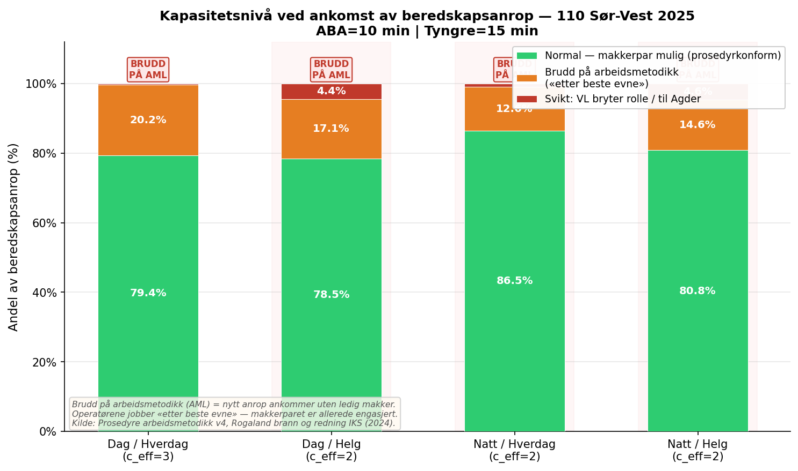
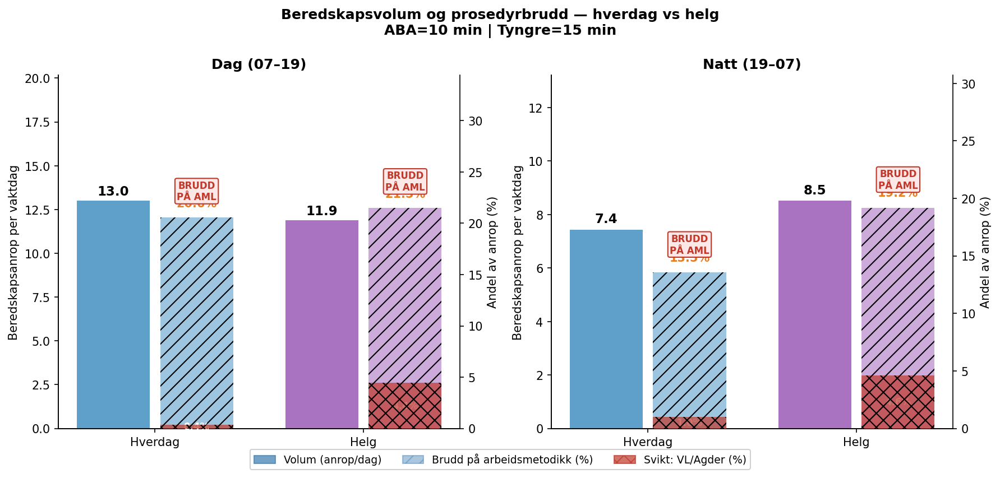
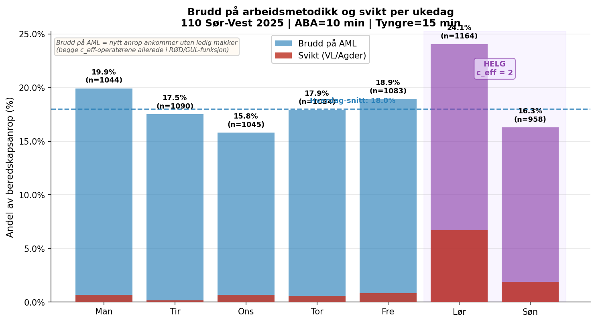
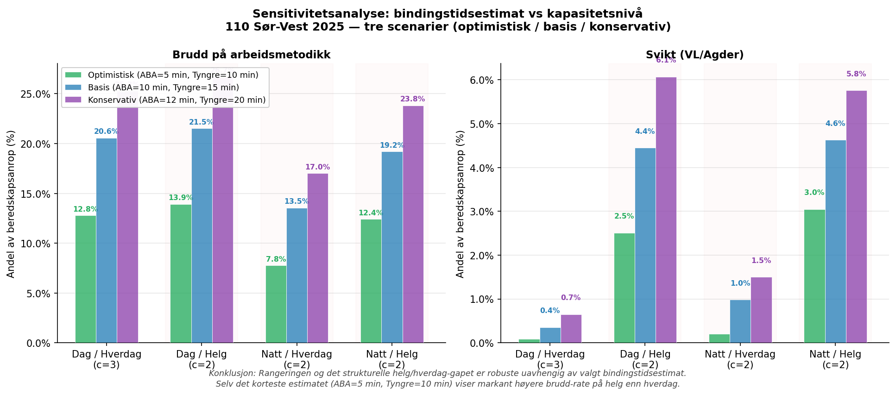
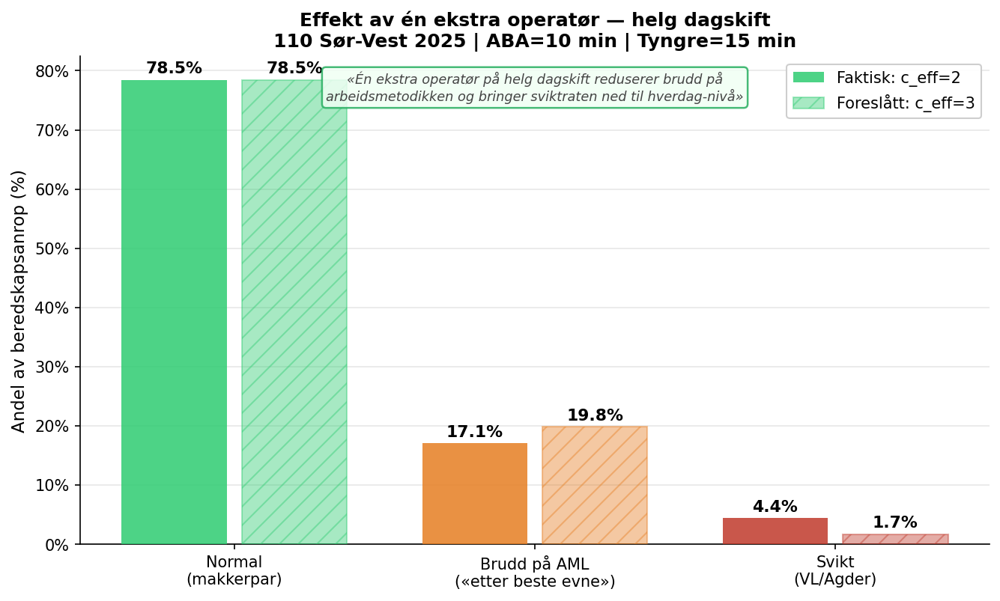

# 7. Analyse og resultater

## 7.1 Metodisk tilnærming: fra køteori til prosedyrbasert kapasitetsmodell

Prosjektet startet med Erlang-C (M/M/c) som primærmodell for kapasitetsanalyse. Erlang-C estimerer sannsynligheten for at et innkommende anrop må vente, gitt ankomstrate (λ), gjennomsnittlig servicetid (μ⁻¹) og antall servere (c). En innledende analyse med Erlang-C viste imidlertid svært lav systemutnyttelse (ρ < 10 %) for alle skifttyper, noe som isolert sett kunne tyde på at bemanningsnivået er komfortabelt (se Tabell 7.1).

**Tabell 7.1: Erlang-C resultater — beredskapsoppdrag, 110 Sør-Vest 2025**

| Skifttype | λ (anrop/t) | c_eff | ρ = λ/(c·μ) | P(vente) | P(W > 60s) |
|---|---|---|---|---|---|
| Dag / Hverdag | 2,57 | 3 | 4,9 % | 0,05 % | 0,02 % |
| Dag / Helg | 2,06 | 2 | 5,9 % | 0,66 % | 0,38 % |
| Natt / Hverdag | 1,18 | 2 | 3,4 % | 0,22 % | 0,13 % |
| Natt / Helg | 1,30 | 2 | 3,7 % | 0,27 % | 0,15 % |

*Bindingstid (μ⁻¹): vektet gjennomsnitt 3,44 min basert på intervjudata (Anette, 2026). λ inkluderer kun beredskapsoppdrag (non-T1). P(W > 60s): sannsynlighet for ventetid over 60 sekunder.*

Resultatene fra Erlang-C er formelt korrekte, men metodisk utilstrekkelige for 110-konteksten. Årsaken er at modellen forutsetter at servere (operatører) er *uavhengige* og *parallelle* — det vil si at én server per anrop er tilstrekkelig. Gjennomgang av den operative prosedyren for arbeidsmetodikk og utalarmering (Rogaland brann og redning IKS, 2024) avslørte at dette ikke stemmer med faktisk arbeidsmetodikk.

---

## 7.2 Den operative arbeidsmetodikken som kapasitetsramme

Prosedyren definerer tre operative funksjoner som roterer dynamisk mellom operatørene:

- **Rød funksjon:** Operatøren som besvarer nødtelefonen, oppretter hendelse i LEO og gjennomfører intervju med innringer. Binder én operatør fullt ut i den aktive samtalefasen.
- **Gul funksjon:** Den nærmeste ledige operatøren overtar koordinering: utalarmerer ressurser, håndterer samband, loggfører skadestedsfaktorer og følger opp hendelsen til den er lukket. Én gul operatør kan håndtere flere gule hendelser parallelt i oppfølgingsfasen.
- **Grønn funksjon:** Ledig — klar for neste nødanrop. Prosedyren definerer eksplisitt som målsetning at *«én operatør til enhver tid er ledig og kan ta nødtelefoner»*.
- **Vaktleder (VL):** Overordnet funksjon — oversikt, prioritering, pressehåndtering og innkalling. Prosedyren slår fast at *«vaktleder skal som et utgangspunkt ikke besvare nødanrop»*.

Den normale driftsformen er dermed et **makkerpar**: én rød og én gul operatør samarbeider om én hendelse, mens øvrige operatører er grønne og klare for neste anrop. Prosedyren definerer dette som normalstandarden, og understreker at *«tiden to operatører er involvert i samme hendelse gjøres så kort som mulig, for å raskt frigjøre kapasitet til neste hendelse»*.

### Kapasitetsnivåer utledet av prosedyren

Med utgangspunkt i prosedyrens rolledefinisjon etableres tre kapasitetsnivåer, som danner grunnlaget for den kvantitative analysen:

**Tabell 7.2: Kapasitetsnivåer definert av arbeidsmetodikken**

| Nivå | Definisjon | c_eff = 2 (natt/helg) | c_eff = 3 (dag/hverdag) |
|---|---|---|---|
| **Normal** | Makkerpar mulig, prosedyrkonform drift | 0 aktive hendelser | 0 aktive hendelser |
| **Brudd på arbeidsmetodikk** | Nytt anrop uten ledig, dedikert makker. Operatørene jobber «etter beste evne». | ≥ 1 aktiv | ≥ 1 aktiv |
| **Svikt** | VL må bryte vaktlederfunksjon *eller* anrop overføres til Agder | ≥ 2 aktive | ≥ 3 aktive |

*Merk: Svikt er et deltilfelle av brudd (enhver svikt er også brudd på arbeidsmetodikk). For c_eff = 2 med n = 1 aktiv er begge operatørene bundet, og ingen kan ta neste anrop uten å bryte sin pågående rolle. For c_eff = 3 med n = 1 aktiv kan GRØNN-operatøren besvare anropet, men uten dedikert GUL-makker — prosedyrens makkerpar-krav er likevel brutt.*

Den kritiske innsikten er at **makkerpar-prinsippet brytes allerede ved første aktive hendelse**: enten er begge operatørene (c=2) bundet i rød og gul funksjon, eller GRØNN (c=3) må håndtere hendelsen uten dedikert makker. Svikt (anrop til VL eller Agder) oppstår når alle operatørene allerede er aktive.

---

## 7.3 Bindingstidsestimat

Bindingstid defineres som den perioden en operatør er aktivt bundet til en hendelse — ikke total hendelsesvarighet. Estimatene er innhentet gjennom strukturert ekspertintervju med erfaren operatør ved 110 Sør-Vest (Anette, mars 2026), og er kategorisert i to grupper for den forenklede modellen:

**Tabell 7.3: Forenklede bindingstidsestimater (to kategorier, tre scenarier)**

| Kategori | Hendelsestyper | Optimistisk (min) | Basis (min) | Konservativ (min) |
|---|---|---|---|---|
| **ABA/enkel** | ABA, helseoppdrag (ingen utrykning), serviceoppdrag | 5 | 10 | 12 |
| **Tyngre** | Brann i bygning, trafikkulykke, naturhendelse, vann/redning, selvdrap | 10 | 15 | 20 |

*Optimistisk: svært rask prosedyrflytt, minimal logging. Basis: normal prosedyrflytt basert på intervjudata. Konservativ: tar høyde for komplikasjoner, deltid og geografiske faktorer. Bindingstidene er operatørens aktive rød/gul-fase, ikke total hendelsesvarighet.*

Bindingstidene er innhentet kvalitativt og er gjenstand for usikkerhet. Sensitivitetsanalyse (avsnitt 7.5) tester robustheten av konklusjoner mot variasjon i disse estimatene.

Fordelingen av de 7 438 beredskapsoppdragene i 2025 etter bindingstidskategori:
- **ABA/enkel (10–12 min):** 4 287 oppdrag (57,6 %)
- **Tyngre (15–20 min):** 2 768 oppdrag (37,2 %)
- **Ukategorisert/andre:** 383 oppdrag (5,2 %)

---

## 7.4 Kapasitetsanalyse: ankomstkonflikt per skifttype

### Metode

For hvert beredskapsanrop som ankommer sentralen kontrolleres det om én eller flere hendelser allerede er aktive. «Aktiv» defineres som perioden fra anropets ankomsttidspunkt til estimert bindingstid er utløpt. Antall samtidige aktive hendelser bestemmer kapasitetsnivå etter Tabell 7.2. Analysen er gjennomført i Python med en heap-basert algoritme for effektiv sporing av aktive hendelser ved hvert ankomsttidspunkt.

### Resultater

**Tabell 7.4: Kapasitetsnivå ved ankomst — 110 Sør-Vest 2025 (basis: ABA=10 min, Tyngre=15 min)**

| Skifttype | Anrop | Normal | Brudd på AML† | Svikt | c_eff |
|---|---|---|---|---|---|
| Dag / Hverdag | 3 382 | 2 686 (79,4 %) | 684 (20,2 %) | 12 (0,4 %) | 3 |
| Dag / Helg | 1 236 | 970 (78,5 %) | 211 (17,1 %) | 55 (4,5 %) | 2 |
| Natt / Hverdag | 1 934 | 1 672 (86,5 %) | 243 (12,6 %) | 19 (1,0 %) | 2 |
| Natt / Helg | 886 | 716 (80,8 %) | 129 (14,6 %) | 41 (4,6 %) | 2 |

†Brudd på arbeidsmetodikk: nytt anrop ankommer uten ledig, dedikert makker (n_aktive ≥ 1). Svikt er et deltilfelle av brudd og er talt separat. AML = Arbeidsmetodikk-prosedyren (Rogaland brann og redning IKS, 2024).

*Figur 7.1: Andel beredskapsanrop per kapasitetsnivå fordelt på skifttype. Dag/hverdag (c_eff = 3) håndterer nær 80 % i normal modus. Helgeskift (c_eff = 2) har markant høyere sviktrate (4–5 % mot 0,4 % på hverdag).*

---

## 7.5 Hverdag versus helg: et strukturelt kapasitetsgap

Den viktigste enkeltobservasjonen i analysen er det strukturelle gapet mellom hverdag og helg, illustrert i Tabell 7.5 og Figur 7.2.

**Tabell 7.5: Beredskapsvolum og kapasitetsdegrasjon — hverdag vs helg**

| | **Hverdag dagskift** | **Helg dagskift** |
|---|---|---|
| Beredskapsanrop per dag | 13,0 | 11,9 (91 % av hverdag) |
| c_eff (faktisk bemanning) | **3** | **2** |
| Brudd på AML-rate | 20,6 % | 21,5 % |
| Sviktrate | **0,4 %** | **4,5 % (12,7× høyere)** |
| Svikt-hendelser per år (absolutt) | 12 | 55 |

| | **Hverdag nattskift** | **Helg nattskift** |
|---|---|---|
| Beredskapsanrop per dag | 7,4 | **8,5 (115 % av hverdag)** |
| c_eff (faktisk bemanning) | **2** | **2** |
| Brudd på AML-rate | 13,6 % | 19,2 % |
| Sviktrate | 1,0 % | 4,6 % |

Beredskapsvolum per dag er tilnærmet likt mellom hverdag og helg for dagskift (11,9 mot 13,0 anrop/dag), og faktisk *høyere* på helg for nattskift (8,5 mot 7,4 anrop/dag). Til tross for dette er bemanningen redusert fra c_eff = 3 til c_eff = 2 på helg dagskift.

To observasjoner belyser konsekvensen av dette. For det første er brudd-raten (n_aktive ≥ 1) tilnærmet identisk mellom hverdag og helg dagskift (20,6 % vs 21,5 %) — noe som viser at «etter beste evne»-situasjoner er like hyppige. Forskjellen er at på hverdager har den tredje operatøren (GRØNN) kapasitet til å hjelpe; på helg er ingen GRØNN tilgjengelig. For det andre, og viktigere, er **sviktraten 12,7 ganger høyere på helg dagskift** (4,5 % mot 0,4 %), noe som betyr at situasjoner der VL må bryte rollen eller anropet overføres til Agder er systematisk mer hyppige på helg.

Dette er det kvantitative uttrykket for et kjent prinsipp i beredskapsplanlegging: bemanningsreduksjonen på helg er historisk begrunnet i lavere volum av servicetelefoner (T1-anrop), som utgjør 74 % av totalvolumet på hverdager, men er ikke-dimensjonerende for beredskapskapasitet. Den operative konsekvensen er at **hvert 22. beredskapsanrop på helg dagskift medfører svikt** — mot hvert 281. på hverdag dagskift.

*Figur 7.2: Beredskapsvolum (søyler, venstre akse) og degradert-rate (skravert, høyre akse) for dag- og nattskift, hverdag versus helg. Volumforskjellen er marginal; kapasitetsforskjellen er dramatisk.*

*Figur 7.3: Andel beredskapsanrop som ankommer i degradert modus, fordelt per ukedag. Lørdag (24,1 %) og søndag (16,3 %) skiller seg markant fra hverdager (5,7–8,3 %). Lilla bakgrunn markerer helgeskift med c_eff = 2.*

---

## 7.6 Sensitivitetsanalyse

### 7.6.1 Sensitivitet for bindingstidsestimater

Figur 7.4 sammenligner brudd-rate og sviktrate for alle tre bindingstidsscenarier: optimistisk (ABA = 5 min, Tyngre = 10 min), basis (10/15 min) og konservativt (12/20 min).

**Tabell 7.6a: Brudd på arbeidsmetodikk-rate — alle tre scenarier**

| Skifttype | Optimistisk (5/10 min) | Basis (10/15 min) | Konservativ (12/20 min) |
|---|---|---|---|
| Dag / Hverdag | 12,8 % | 20,6 % | 25,3 % |
| Dag / Helg | 13,9 % | 21,5 % | 26,7 % |
| Natt / Hverdag | 7,8 % | 13,6 % | 17,0 % |
| Natt / Helg | 12,4 % | 19,2 % | 23,8 % |

**Tabell 7.6b: Sviktrate — alle tre scenarier**

| Skifttype | Optimistisk (5/10 min) | Basis (10/15 min) | Konservativ (12/20 min) |
|---|---|---|---|
| Dag / Hverdag | 0,09 % | 0,35 % | 0,65 % |
| Dag / Helg | 2,51 % | 4,45 % | 6,07 % |
| Natt / Hverdag | 0,21 % | 0,98 % | 1,50 % |
| Natt / Helg | 3,05 % | 4,63 % | 5,76 % |

*Figur 7.4: Brudd på arbeidsmetodikk-rate for alle tre bindingstidsscenarier per skifttype. Rangeringen av skifttyper er robust på tvers av alle scenarier.*

To funn er robuste på tvers av alle scenarier. Først: **helgeskiftene (dag og natt) har konsistent høyere sviktrate enn tilsvarende hverdagsskift**, uavhengig av bindingstidsantagelse. Forholdet er 28× (helg-dag/hverdag-dag) i optimistisk scenariet og 9× i konservativt. Sviktmetrikkens helg/hverdag-gap er dermed ikke et artefakt av bindingstidsestimatene.

Dernest avdekker det optimistiske scenariet (5/10 min) en interessant detalj: brudd-ratene for dag/hverdag og dag/helg konvergerer (12,8 % vs 13,9 %) fordi kortere bindingstider reduserer overlapp. Sviktraten forblir imidlertid markant høyere på helg (2,51 % vs 0,09 %) — dette skyldes at med c_eff = 2 behøves det bare to simultane hendelser for svikt, uavhengig av bindingstid. Sviktmetrikken er således mer robust enn brudd-metrikken mot bindingstidsusikkerhet.

### 7.6.2 Effekt av økt bemanning på helg dagskift

En sentral bemanningspolitisk implikasjon er hva én ekstra operatør ville betydd på helg dagskift. Analysen re-klassifiserer helg dagskift med c_eff = 3 og beregner nye kapasitetsnivåer.

**Tabell 7.7: Effekt av c_eff = 3 på helg dagskift (basis: 10/15 min)**

| | **Faktisk: c_eff = 2** | **Hypotetisk: c_eff = 3** | Reduksjon |
|---|---|---|---|
| Brudd på arbeidsmetodikk | 266 anrop (21,5 %) | 55 anrop (4,5 %) | **−79 %** |
| Svikt (VL/Agder) | 55 anrop (4,5 %) | 21 anrop (1,7 %) | −62 % |

*Figur 7.5: Fordeling av kapasitetsnivåer på helg dagskift med faktisk bemanning (c_eff = 2) og hypotetisk økt bemanning (c_eff = 3). Én ekstra operatør reduserer brudd med 79 % og bringer sviktraten ned fra 4,5 % til 1,7 % — tilnærmet likt hverdag-dagskift.*

Én ekstra operatør på helg dagskift reduserer antall beredskapsanrop i bruddmodus fra 266 til 55 per år — en reduksjon på 79 %. Den gjenværende sviktraten på 1,7 % er sammenlignbar med dag/hverdag (0,4 %), og representerer den resteksponering som gjenstår selv med fullt makkerpar-grunnlag. Dette illustrerer at bemanningsstrukturen — ikke hendelsesvolum — er den primære driveren for sviktrate på helg.

---

## 7.7 Sammenstilling og tolkning

Analysen dokumenterer tre hovedfunn:

**Funn 1: Erlang-C alene er utilstrekkelig for 110-dimensjonering.**
Den tradisjonelle køteoretiske modellen gir svært lav systemutnyttelse (ρ < 10 %) og P(W > 60s) < 0,5 % for alle skifttyper. Dette skyldes at modellen behandler operatører som uavhengige servere, mens prosedyren definerer makkerpar som driftsstandard. Erlang-C fanger ikke kapasitetstapet ved solo-drift.

**Funn 2: Kapasitetsdimensjonering må ta utgangspunkt i prosedyrkonform drift, ikke bare ankomstrate.**
Med prosedyrbasert kapasitetsmodell er det riktige målet *P(ny hendelse ankommer uten ledig makker)*, ikke *P(anrop må vente i kø)*. Makkerpar-prinsippet brytes allerede ved første aktive hendelse (n ≥ 1), noe som inntreffer for 12–27 % av alle beredskapsanrop avhengig av skifttype og bindingstidsscenario. Svikt — der VL eller Agder må overta — forekommer for 2,5–6,1 % av beredskapsanropene på helgeskift.

**Funn 3: Bemanningsreduksjonen på helg er ikke empirisk begrunnet i beredskapsbelastning.**
Beredskapsvolum per dag er 91 % av hverdag (dag) og 115 % av hverdag (natt) på helg. Bemanningsreduksjonen er historisk begrunnet i lavere T1-servicetelefoner, som ikke er dimensjonerende for beredskapskapasitet. Konsekvensen er en sviktrate på helg dagskift som er 12,7 ganger høyere enn på hverdag dagskift (4,5 % mot 0,4 %). Dette forholdet er robust på tvers av alle tre bindingstidsscenarier (9–28× gap). Én ekstra operatør på helg dagskift ville redusert brudd med 79 % og svikt med 62 %, og brakt begge rater ned til hverdag-nivå.

Funnene har direkte parallell til dimensjoneringslogikken i brannstasjonsforskriften: S1-stasjoner dimensjoneres med to kjøretøy ikke fordi begge alltid er i bruk, men fordi konsekvensen av utilstrekkelig kapasitet ved simultane hendelser er uakseptabel. Det samme prinsippet — dimensjonering for beredskapstopper, ikke for gjennomsnittsbelastning — bør ligge til grunn for 110-operatørkapasitet.

---

*Skript for figurer og tabeller: `analyse/scripts/kapasitet_figurer.py`*
*Data: `004 data/110 Sør Vest 2025.csv` (LEO/BRIS 2025, 61 964 rader)*
*Prosedyreferanse: Rogaland brann og redning IKS (2024). Prosedyre arbeidsmetodikk, utalarmering og loggføring, versjon 4, 16.12.2024.*
