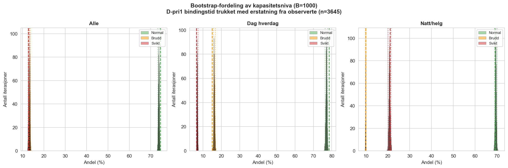

# 8. Resultat

Dette kapitlet presenterer resultatene av kapasitetsanalysen for 110 Sør-Vest 2025 og den nasjonale benchmarkingen. Innholdet er strukturert etter forskningsspørsmålene: avsnitt 8.1 til 8.3 svarer på RQ3 (prosedyrbasert ankomstkonfliktmodell med variant A og B, scenarioanalyse, sensitivitets- og bootstrap-analyser); avsnitt 8.4 svarer på RQ4 (ROS-grunnlaget); avsnitt 8.5 svarer på RQ5 (nasjonal benchmarking). Avsnitt 8.6 vurderer prinsipiell overførbarhet, og 8.7 sammenstiller hovedfunnene. Vurderingen av funnene mot teori, problemstilling og praktiske implikasjoner gjøres i kap 9, og endelig svar på problemstillingen i kap 10.

## 8.1 Kapasitetsanalyse: variant A (beredskapsbelastning)

### Hva modellen måler i 8.1

Før resultatene presenteres er det viktig å være presis på *hva modellen kvantifiserer*. Erlang-C i Tabell 6.1 målte sannsynligheten for at et nytt anrop må stå i kø, altså en *ventetidsmetrikk*. Kapasitetsmodellen i 8.1 til 8.3 måler noe annet: sannsynligheten for at et nytt beredskapsanrop ankommer i en tilstand der den operative driftsstandarden (makkerpar) ikke kan opprettholdes. Det er en *prosedyrkonformitetsmetrikk*.

Forskjellen er substansiell. Erlang-C-ventetiden på 30 sek kan være 0 % selv når Svikt-andelen er 30 %, fordi anropet kan besvares momentant av VL eller en operatør som forlater makker-rollen, men i begge tilfellene er den prosedyrekrevde driftsstandarden brutt. Modellen kvantifiserer altså *brudd på driftsstandarden ved ankomst*, ikke *brudd på tjenesteleveransen*.

De tre nivåene i Normal/Brudd/Svikt-klassifiseringen er definert i kap 6.4 og oppsummert her:

- **Normal** (ledige ≥ 2): Makkerpar er mulig for det nye anropet, og full prosedyre kan følges.
- **Brudd på driftsstandard** (ledige = 1): Solo-håndtering er operativt mulig, men uten makker, med redusert kvalitetssikring (jf. Antagelse A7 i Tabell 6.3 og diskusjonen i kap 9.2).
- **Svikt** (ledige ≤ 0): Ingen ledig operatør for makkerpar-binding. Anropet håndteres av VL, ved overflyt til Agder, eller ved at en operatør forlater pågående hendelse for å besvare det nye.

I alle tre tilfellene besvares anropet i praksis. Modellen sier ikke at tjenesten kollapser ved 32,6 % Svikt; den sier at driftsstandarden ikke kan opprettholdes for hvert tredje beredskapsanrop på natt/helg. Den operative kostnaden av å bryte standarden bæres i dag av operatørene gjennom kvalitetsreduksjon (kap 3.8 og 9.2).

### Metode

For hvert beredskapsanrop måles hvor mange operatører som er bundet i pågående hendelser ved ankomsttidspunktet. Sweep-algoritmen akkumulerer *op-binder*, ikke bare antall aktive hendelser: D-pri1 bidrar med 2 op-binder gjennom bindingstiden, D-aba Fase 1 bidrar med 1 op-binder i 3 min, D-aba Fase 2 (med sannsynlighet p = 0,50) bidrar med 1 op-binder i 6 min, og skjulte anrop bidrar med 1 op-binder i 1 min. Kapasitetsnivå klassifiseres etter antall ledige operatører (avsnitt 6.4).

Skjulte anrop plasseres i tid via sekvensgap-metoden. Dersom oppdrag B06-250101-4 og B06-250101-6 er synlige, tildeles det manglende sekvensnummeret -5 tidspunkt fra nærmeste synlige oppdrag. Analysen fanger dermed den strukturelle effekten selv om eksakt ankomsttid for hvert skjult anrop er estimert.

Variant A omfatter:
- **D-pri1:** 4 499 oppdrag × 2 op-binder × median 14,1 min
- **D-aba Fase 1:** 3 056 × 1 op × 3 min (alltid)
- **D-aba Fase 2:** ~1 528 × 1 op × 6 min (sannsynlighet p = 0,50, offset + 1,5 min)
- **Skjulte anrop:** 18 901 × 1 op × 1 min

Totalt inngår 27 960 op-binder-events i sweep-en.

De sammenstilte tilleggsanropene er tildelt 1 minutts bindingstid, en konservativ antagelse som representerer at slike anrop er korte (operatøren kjenner allerede hendelsen), men likevel beslaglegger én operatør i et kritisk tidsvindu. Dersom reell gjennomsnittlig bindingstid er høyere, vil modellen undervurdere effekten.

### Hovedresultater

**Tabell 8.1: Kapasitetsnivå i variant A (beredskapsbelastning)**

| Skifttype | Normal | Brudd | Svikt | n |
|---|---:|---:|---:|---:|
| **Dag hverdag (c=3)** | 69,2 % | 15,9 % | 14,9 % | 15 944 |
| **Natt/helg (c=2)** | 46,9 % | 20,5 % | **32,6 %** | 12 016 |
| **Alle** | 59,6 % | 17,9 % | 22,5 % | 27 960 |

Tallene er punktestimater under hovedscenario-antagelsene i Tabell 8.3. Variant B-scenariospennet (lav/hoved/høy, jf. Tabell 8.5) brukes her som *robusthetssjekk for antagelsesfølsomhet*, ikke som et statistisk konfidensintervall for variant A: båndet viser at Svikt-andelen på natt/helg holder seg innenfor ca. 30 til 38 % over hele parameterspennet, slik at tallet 32,6 % skal leses som et midtestimat under rimelige bindingstidsantagelser. Det statistiske konfidensintervallet for variant A natt/helg er kvantifisert separat via bootstrap i 8.3.4 (95 % CI [32,1; 33,2] %).

Modellen avslører en markant asymmetri mellom dag og natt. På dag hverdag (c=3) er 69,2 % av beredskapsanrop i Normal og 14,9 % i Svikt. På natt/helg (c=2) er Normal-andelen under halvparten (46,9 %), og hvert tredje anrop ankommer i Svikt-tilstand (32,6 %, scenariobånd 30 til 38 %). Dette er en dobling av sviktraten fra dagskiftet, primært fordi c=2 gir null buffer når en pri-1-hendelse binder makkerparet.

**Hva tallet faktisk måler.** Svikt 32,6 % betyr at i 32,6 % av beredskapsanropene var det ingen ledig operatør for makkerpar-binding ved ankomsttidspunktet. Det betyr **ikke** at anropet ble ubesvart. Vaktleder (VL) kan tre inn, kvalitet reduseres ved solo-håndtering, eller anropet overføres til Agder etter 30-sek-regelen. Modellen måler brudd på driftsstandarden (makkerpar-tilgjengelighet), ikke brudd på tjenesteleveransen. Tolkningen av forskjellen mellom de to drøftes i kap 9.2.

### D-pri1 som primær svikt-driver

Den sterkeste enkeltdriveren for svikt er D-pri1-hendelser. På c=2 binder én aktiv D-pri1 hele operatørkapasiteten, ved at begge ops er i makkerpar-rollen, og et nytt beredskapsanrop i samme tidsvindu ankommer direkte i Svikt. D-aba derimot binder bare én op i Fase 1, slik at en D-aba-hendelse på natt/helg *tillater* et nytt beredskapsanrop i parallell drift (Brudd, ikke Svikt).

Dette forklarer hvorfor Brudd-andelen er relativt lav (20,5 % på natt/helg) mens Svikt-andelen er høy: modellen differensierer strukturelt mellom lette og tunge beredskapsoppgaver, og pri-1-hendelser går direkte til Svikt-terskelen når c=2.

### Tolkning av svikt

«Svikt» i modellen betyr at ingen operatør er tilgjengelig for makkerpar-binding ved ankomst av neste beredskapsanrop. Operativt kan situasjonen likevel håndteres ved at vaktleder (VL) trer inn, anropet overføres til Agder ved ubesvart innen 30 sek, eller operatørene jobber raskere med redusert kvalitet (jf. kap 9.2). Modellen måler brudd på operativ driftsstandard, ikke brudd på tjenesten.

Resultatene i variant A er et minimumsanslag fordi ikke-D-kategorier ikke er inkludert. Total belastning med alle kategorier analyseres i avsnitt 8.3.

### Alternative tolkninger og forbehold

Tallene i Tabell 8.1 forutsetter at modellen fanger den faktiske operative dynamikken. Tre alternative tolkninger bør vurderes før resultatene leses som dokumenterte funn:

1. **Registreringspraksis i BRIS:** Hvis sammenstilling av anrop er ufullstendig eller systematisk skjev (jf. avsnitt 5.3.4 og 7.2), kan både ankomstrate og bindingstid være feilestimert. Sekvensgap-metoden er validert lokalt, men ikke uavhengig revidert.
2. **VL-rollen i praksis:** Modellen forutsetter $c_{\text{eff}} = c_{\text{total}} - 1$. Hvis VL i praksis besvarer en større andel nødanrop enn antatt (særlig under press), er den reelle Svikt-andelen lavere enn modellen viser.
3. **Bindingstidsantagelser:** D-pri1-bindingstid er empirisk (median 14,1 min), men L-aba, S, F, V og L-hendelse hviler på operative anslag. Sensitivitetsspennet (Tabell 8.5) viser at hovedfunnet er robust, men forutsetter at båndet er bredt nok til å fange den reelle usikkerheten.

Disse forbeholdene reflekteres i scenariobåndene som følger hovedtallene.

---

## 8.2 Scenarioanalyse: effekt av +1 operatør per skift

Scenarioet med én ekstra operatør per skift er en strukturtest av robusthet: hvilken effekt har en ekstra bufferressurs på sannsynligheten for brudd og svikt? Scenarioet øker c_eff fra 3 til 4 på dag hverdag og fra 2 til 3 på natt/helg.

**Tabell 8.2: Effekt av +1 operatør (variant A, beredskapsbelastning)**

| Skifttype | | Dagens bemanning | | +1 operatør | | |
|---|---|---|---|---|---|---|
| | Normal | Brudd | Svikt | Normal | Brudd | Svikt |
| **Dag hverdag** (3 → 4) | 69,2 % | 15,9 % | 14,9 % | **85,1 %** | **6,3 %** | **8,5 %** |
| **Natt/helg** (2 → 3) | 46,9 % | 20,3 % | 32,8 % | **67,2 %** | **16,1 %** | **16,7 %** |
| **Alle** | 59,6 % | 17,8 % | 22,5 % | **77,5 %** | **10,5 %** | **12,0 %** |

Figur 8.1 visualiserer skiftet i kapasitetsnivå når en ekstra operatør legges til på hvert skift. Hovedpoenget å se etter er **Normal-økningen på natt/helg** (søylen på venstre side går fra 47 % til 67 %) og den tilhørende reduksjonen i Svikt fra ca. 33 % til ca. 17 %. Effekten er strukturelt drevet av at c=3 endrer hva som skjer når én D-pri1 er aktiv (jf. neste tre punkter).

  
  
<small><i>Figur 8.1: Kapasitetsnivå ved dagens bemanning (3/2) vs +1 operatør (4/3). Solid søyle = dagens; halvgjennomsiktig med sort kant = +1 operatør.</i></small>

Tallene i Tabell 8.2 er punktestimater under hovedscenarioets antagelser, men retningen, at +1 op reduserer Svikt vesentlig, er robust gjennom hele parameterspennet i Tabell 8.5. Reduksjonens *størrelse* er derimot mer usikker enn punkttallet antyder: med D-aba Fase 2 trukket fra en annen stokastisk realisasjon enn primærmodellen er baseline for scenarioet 32,8 % (mot primærmodellens 32,6 %; differansen er innenfor stokastisk støy).

Tre observasjoner:

**1. Natt/helg: sviktraten halveres under hovedantagelsene.** Med +1 operatør øker Normal fra 46,9 % til 67,2 % (+20,3 pp), og Svikt reduseres fra ca. 33 % til 16,7 % (begge under hovedscenario). Den ekstra operatøren gir den buffersonen som c=2 mangler: med c=3 kan én D-pri1 håndteres samtidig som det fortsatt gir én ledig op, slik at pri-1-hendelser ikke lenger automatisk medfører Svikt. Halveringen er en modellprediksjon, ikke en validert effekt av faktisk bemanningsendring.

**2. Dag hverdag: Normal opp til 85 %.** Normal øker fra 69,2 % til 85,1 %. Svikt halveres fra 14,9 % til 8,5 %. Effekten er mindre markant enn på natt/helg fordi c=3 allerede gir buffer, men en fjerde operatør fjerner nesten all Svikt-risiko fra kombinasjonen av samtidig D-pri1 og lett bakgrunnsbelastning.

**3. Selv med +1 er sviktraten ikke null.** 12 % samlet svikt viser at kapasitetsproblemer ikke elimineres med én ekstra operatør, men reduseres vesentlig. Residualen skyldes perioder med to samtidige D-pri1-hendelser eller kombinasjoner av D-pri1 med mange bakgrunnshenvendelser.

Scenarioanalysen viser den strukturelle effekten av økt bufferkapasitet, men sier ikke alene hvordan en eventuell bemanningsøkning bør organiseres i praksis. Det er for eksempel ikke gitt at alle timer trenger samme økning, eller at effekten er lik med ulik kompetansesammensetning. Modellen sammenlignes heller ikke direkte mot en historisk bemanningsendring som kunne validert effekten empirisk. Resultatene bør derfor forstås som et analytisk beslutningsgrunnlag, en hypotetisk strukturtest under modellens antagelser, og ikke som en ferdig ressurs- eller turnusløsning.

---

### Oppsummering av modellantagelser

Før variant B og sensitivitetsanalysen presenteres, samles modellantagelsene som ligger bak resultatene i 8.1 og 8.2, og som inngår uendret i variant B (8.3). Tabellen gjelder hele kapitlet, ikke bare scenarioanalysen over.

**Tabell 8.3: Modellantagelser og parametere**

| Parameter | Verdi | Kilde |
|---|---|---|
| Bindingstid D-pri1 | Observert fra BRIS + 3 min kvittering | Median 14,1 min |
| Op-binder D-pri1 | 2 (makkerpar) | Operativ prosedyre |
| Bindingstid D-aba Fase 1 | 3 min | Operativ prosedyre + BRIS (median 74 sek call-out) |
| Bindingstid D-aba Fase 2 | 6 min (hoved) | Operatørinformert, sensitivitet 3/6/10 min |
| Sannsynlighet D-aba Fase 2 (p) | 0,50 (hoved) | Operatørestimert, sensitivitet 0,30/0,50/0,70 |
| Bindingstid L-aba | 4,5 min | LABA-dybdeanalyse n=100 mean (Kilde=Alarm-subset) |
| Bindingstid skjulte anrop | 1 min | Operativ vurdering |
| Kapasitetsnivå: Normal | ledige ≥ 2 | Makkerpar mulig |
| Kapasitetsnivå: Brudd | ledige = 1 | Solo-håndtering |
| Kapasitetsnivå: Svikt | ledige ≤ 0 | VL/Agder |
| c_eff dag hverdag | 3 (4 tot. − 1 VL) | Prosedyre |
| c_eff natt/helg | 2 (3 tot. − 1 VL) | Prosedyre |
| Skjulte anrop identifisert via | Sekvensgap i 110_ID | 18 901 stk |

---

## 8.3 Total operativ belastning (variant B)

### 8.3.1 Bakgrunn

Primærmodellen (variant A) kvantifiserer kapasitetsnivå basert på beredskapsoppdrag (D-pri1, D-aba) og sammenstilte anrop. Dette gir et presist bilde av beredskapskapasiteten, men dekker kun 27 960 av estimert 80 865 anrop. Variant B utvider analysen til å inkludere alle hendelseskategorier (se avsnitt 6.5) for å kvantifisere den samlede operative belastningen.

### 8.3.2 Resultater: beredskapsbelastning versus total belastning

**Tabell 8.4: Variant A (beredskap) vs Variant B (total), hovedscenario**

| Skifttype | | Variant A (beredskap) | | | Variant B (total) | |
|---|---|---|---|---|---|---|
| | Normal | Brudd | Svikt | Normal | Brudd | Svikt |
| **Dag hverdag** (c=3) | 69,2 % | 15,9 % | 14,9 % | **59,5 %** | **19,0 %** | **21,6 %** |
| **Natt/helg** (c=2) | 46,9 % | 20,5 % | 32,6 % | **44,8 %** | **22,0 %** | **33,2 %** |
| **Alle** | 59,6 % | 17,9 % | 22,5 % | **53,9 %** | **20,1 %** | **25,9 %** |

Figur 8.2 sammenligner variant A (kun beredskap) med variant B (total belastning) for begge skifttyper. Det mest informative er **dag-søylene**, der utvidelsen til variant B trekker Normal-andelen ned fra 69 % til 59 % og dobler Svikt. Natt/helg-søylene endres lite, fordi bakgrunnsvolumet er begrenset om natten. Tolkningen er at dag- og natt-kapasiteten har ulik karakter: dagsproblemet er drevet av bakgrunnsbelastning, natt-problemet av beredskap alene.

  
  
<small><i>Figur 8.2: Variant A (beredskapsbelastning) vs Variant B (total operativ belastning), hovedscenario.</i></small>

Bakgrunnsbelastningen slår hardest på **dagtid**: Normal-andelen faller knapt 10 prosentpoeng (fra 69,2 % til 59,5 %) og svikt øker fra 14,9 % til 21,6 %. Dette er konsistent med at servicevolumet (22 542 overføringstester per år) er konsentrert på dagtid når servicevirksomhet pågår. Natt/helg påvirkes i mindre grad (Normal faller 2,1 pp, Svikt stiger 0,6 pp) fordi bakgrunnsvolumet er lavere, men utgangspunktet er allerede kritisk: Svikt-andelen på natt/helg er 33,2 % i variant B (scenariobånd 30 til 38 %), mot 32,6 % i variant A.

Funnet understreker at operatørene på dagtid ikke bare håndterer beredskap; de håndterer en kontinuerlig strøm av servicetester, avklaringer og feilringinger som binder kapasitet mellom beredskapsoppdragene. Med gjennomsnittlig ~10 bakgrunnshenvendelser per time på dagskift er operatørene sjelden reelt ledige selv i perioder uten beredskapsoppdrag.

### 8.3.3 Sensitivitetsanalyse: robusthet mot bindingstidsantagelser

Bindingstidene for ikke-D-kategorier og D-aba Fase 2-parametrene er operative estimater (D-aba Fase 2) og delvis empirisk kalibrerte (L-aba via dybdeanalyse). For å teste robustheten kjøres modellen med tre scenarioer (se avsnitt 6.5.3). Både (p, Y) for D-aba Fase 2 og bindingstider for L-aba/L-hendelse/L-ukjent/S/F/V varieres samtidig fra lav til høy. Analysen er derfor en samlet scenariosensitivitet, ikke en ceteris paribus-test av én parameter om gangen.

**Tabell 8.5: Sensitivitetsanalyse, variant B med tre scenarioer**

| Scenario | Dag hverdag (c=3) | | | Natt/helg (c=2) | | |
|---|---|---|---|---|---|---|
| | Normal | Brudd | Svikt | Normal | Brudd | Svikt |
| **A (beredskap)** | 69,2 % | 15,9 % | 14,9 % | 46,9 % | 20,5 % | 32,6 % |
| **B lav** | 68,8 % | 16,6 % | 14,6 % | 51,1 % | 18,8 % | 30,1 % |
| **B hoved** | 59,5 % | 19,0 % | 21,6 % | 44,8 % | 22,0 % | 33,2 % |
| **B høy** | 45,3 % | 21,0 % | 33,7 % | 38,1 % | 24,2 % | 37,7 % |

Figur 8.3 viser hvordan kapasitetsnivåene endrer seg når bindingstidsparametrene varieres fra lav til høy. Det avgjørende poenget er at natt/helg-søylen for Svikt **forblir over 30 % i alle tre scenarioer**, fra lav (30 %) til høy (38 %). Hovedfunnet om strukturell natt/helg-sårbarhet er dermed robust mot alle rimelige parameterantagelser. På dag hverdag er båndet bredere (15 til 34 %), noe som tilsier større usikkerhet for dagskonklusjonen.

  
  
<small><i>Figur 8.3: Sensitivitetsanalyse: effekt av bindingstidsantagelser på kapasitetsnivå.</i></small>

Tre observasjoner:

**1. Selv lavt scenario viser merkbar bakgrunnseffekt.** Med minimale bindingstider (Service 1 min, L-aba 3 min, feilringing 15 sek, D-aba Fase 2 kun for 30 % med Y = 3 min) er dag-hverdag-resultatet nesten uendret fra variant A (Normal 68,8 vs 69,2 %). På natt/helg gir lav-scenarioet faktisk litt bedre Normal (51 %) enn variant A (47 %), fordi D-aba Fase 2 slås mindre til når p = 0,30. Dette bekrefter at variant A-resultatet ikke er avhengig av optimistiske antagelser.

**2. Hovedscenario gir vesentlig kapasitetsforverring på dagtid.** Normal faller til 59,5 % og svikt øker til 21,6 %. Dagskiftet, som i variant A framstår som komfortabelt (69 % Normal), blir klart mer presset når hele arbeidsvolumet inkluderes.

**3. Høyt scenario illustrerer bristepunktet.** Med bindingstider i øvre sjikt (Service 4 min, L-aba 9 min, D-aba Fase 2 p = 0,70 og Y = 10 min) faller Normal under 50 % på dag, slik at operatørene er oftere i Brudd eller Svikt enn i normal drift. For natt/helg når Svikt 38 %. Dette representerer dager med tungt servicevolum, uerfarne operatører, eller stor andel ABA-hendelser med oppfølgende nødtelefon.

**Konklusjon:** Hovedfunnet, at natt/helg har 30 til 38 % Svikt uavhengig av bindingstidsantagelser, er robust over hele spennet. Dimensjoneringsproblemet på natt/helg kan ikke forklares bort gjennom alternative parametervalg.

### 8.3.4 Bootstrap-konfidensintervall for D-pri1-bindingstidsfordelingen

Sensitivitetsanalysen i 8.3.3 varierer parameterantagelser, men tester ikke statistisk usikkerhet i selve den observerte D-pri1-bindingstidsfordelingen. Av 4 499 D-pri1-hendelser i 2025 har 3 645 (81 %) observert tidsstempel for «første ressurs fremme», mens 854 (19 %) mangler eller har avvisende verdi (negativ varighet eller > 180 min) og er imputert med median. For å kvantifisere både *sampling-variabilitet* i den observerte fordelingen og *imputeringsusikkerhet* for de manglende verdiene, er det gjennomført en ikke-parametrisk bootstrap (B = 1 000 iterasjoner, persentilmetode, fast seed `SEED_BOOTSTRAP = 20260515`).

I hver iterasjon trekkes 4 499 bindingstider med erstatning fra de 3 645 observerte verdiene og tildeles D-pri1-hendelsene i deres faktiske ankomstrekkefølge. Variant A-modellen (D-pri1 + D-aba Fase 1+2 + sammenstilte) reberegnes med disse trukne bindingstidene; D-aba Fase 2-sampling og øvrige parametere holdes deterministiske (samme `SEED_DABA = 20260419` som hovedscript) slik at bootstrap-CI isolerer D-pri1-usikkerheten.

**Tabell 8.6: Bootstrap-CI (95 %, persentilmetode, B = 1 000) for variant A**

| Skifttype | Nivå | Punktestimat | Bootstrap-mean | 95 % CI | Bredde |
|---|---|---:|---:|---|---:|
| **Dag hverdag (c=3)** | Normal | 69,2 % | 67,9 % | [67,3; 68,5] | 1,2 pp |
| | Brudd | 15,9 % | 16,6 % | [16,3; 17,0] | 0,7 pp |
| | Svikt | 14,9 % | 15,5 % | [15,1; 15,9] | 0,8 pp |
| **Natt/helg (c=2)** | Normal | 46,9 % | 47,0 % | [46,7; 47,4] | 0,7 pp |
| | Brudd | 20,3 % | 20,3 % | [20,1; 20,6] | 0,4 pp |
| | **Svikt** | **32,8 %** | **32,6 %** | **[32,1; 33,2]** | **1,1 pp** |
| **Alle** | Normal | 59,6 % | 58,9 % | [58,6; 59,3] | 0,7 pp |
| | Brudd | 17,8 % | 18,2 % | [18,0; 18,4] | 0,4 pp |
| | Svikt | 22,5 % | 22,8 % | [22,5; 23,2] | 0,7 pp |

*Punktestimat = median-imputering for manglende, som i hovedscript. Bootstrap-mean = gjennomsnitt over 1 000 iterasjoner der manglende imputeres ved trekk fra observert empirisk fordeling. Resultater: `analyse/bootstrap_dpri1_resultater.csv`. Implementasjon: `analyse/scripts/bootstrap_dpri1.py`.*

Bootstrap-CI for Svikt natt/helg er **[32,1; 33,2] %** med bredde 1,1 pp. Punktestimatet (32,8 %) ligger sentralt i CI-en, og bootstrap-mean (32,6 %) er nær identisk. Hovedfunnet er dermed stabilt også når statistisk usikkerhet i den observerte D-pri1-bindingstidsfordelingen propageres gjennom modellen. På dag hverdag er punktestimatet (14,9 %) marginalt lavere enn bootstrap-CI nedre grense (15,1 %); differansen reflekterer at median-imputering for høyreskjeve fordelinger gir lavere estimat enn trekk fra full empirisk fordeling, og er en ytterligere indikasjon på at hovedmodellen er en konservativ estimator.

**Hva CI-en ikke fanger.** Bootstrap-CI kvantifiserer *parametrisk* usikkerhet i den observerte D-pri1-bindingstidsfordelingen, ikke *definisjonsmessig* usikkerhet i selve modellrammen. Den smale CI-bredden (1,1 pp) sier at *gitt* op-binder-semantikken, makkerpar-kravet og kategoriinndelingen i kap 6, så er Svikt-andelen statistisk presis. Den dominerende restusikkerheten gjelder valg av modellramme (Trussel 1 og 4 i kap 5.6.1) og er kvalitativt drøftet i kap 5.6.2 og 9.2.3, ikke kvantifisert her. Et smalere intervall enn ±0,5 pp må derfor ikke leses som total usikkerhet.

**MAR-sjekk og imputeringsantagelse.** To imputeringsregimer brukes parallelt og bør holdes adskilt: (i) *punktestimatet* i Tabell 8.1 imputerer manglende fremme-tidsstempel med observert median (14,1 min), mens (ii) *bootstrap-CI-en* trekker fra hele den observerte empiriske fordelingen (ikke kun medianen) i hver iterasjon. Begge regimer forutsetter at manglende «første ressurs fremme»-tidsstempel er tilfeldig fordelt (MAR) på tvers av Oppdragstype. Empirisk varierer missingness fra 5,6 % («Brann i bygning») til 73,4 % («Avbrutt utrykning samtale»), med koeffisientvariasjon 0,98 på tvers av Oppdragstype (n ≥ 30). MAR-antagelsen er dermed *ikke* strengt oppfylt. Klyngingen er imidlertid systematisk og operativt forklarlig: hendelser uten registrert fremme-tidspunkt er typisk avbrutte utrykninger (ressurs returnerte før den nådde frem) som har *kortere* faktisk binding enn medianen for vellykkede utrykninger. Median-imputeringen i punktestimatet kan derfor overestimere binding for avbrutte utrykninger, og trekkene fra observert fordeling i bootstrap-en arver samme retning. Bootstrap-CI rapportert over gir et bredere usikkerhetsbilde enn punktestimatet alene, men fanger ikke en full stratifisert missingness-modell; en stratifisert imputering per Oppdragstype ville gitt litt lavere Svikt-mean uten å endre konklusjonen om at intervallet er smalt og funnet stabilt. Detaljert MAR-rapport: `analyse/bootstrap_dpri1_mar_sjekk.csv`.

  
  
<small><i>Figur 8.4: Bootstrap-fordeling av kapasitetsnivå (B = 1 000). Stiplet linje: punktestimat (median-imputert). Punktert linje: 95 % CI-grenser.</i></small>

---

## 8.4 ROS- og beredskapsanalyse som dimensjoneringsgrunnlag (RQ4)

For å besvare RQ4 er beredskapsanalysen for 110 Sør-Vest (Beredskapsanalyse 110 Vest, 2022) og tilhørende ROS-dokument (Risiko- og sårbarhetsanalyse 110 Vest) gjennomgått systematisk. Analysen er rent observerende, og vurderingen mot funnene fra primærmodellen drøftes i kap 9.3.4.

**Tabell 8.7: Hva ROS-/beredskapsanalysen for 110 Sør-Vest dokumenterer kvantitativt**

| Element | Dokumentert i ROS/beredskapsanalyse | Form |
|---|---|---|
| Minimumsbemanning per skift | 2 operatører (ekskl. VL) | Forskriftsfestet (FOR-2021-09-15-2755) |
| Faktisk bemanning dag/natt | Dag: 3 + VL; natt/helg: 2 + VL | Numerisk angitt i beredskapsanalysen |
| Overløpsmekanisme til Agder | 30-sek-regel + 10. kø-anrop | Operativ regel, J03 s. 25 |
| Servicegrad (kvantifisert mål) | Ikke spesifisert | Ingen tallfestet servicenivåterskel |
| Andel anrop besvart innen X sek | Ikke spesifisert | Ingen mål satt |
| Andel hendelser med makkerpar | Ikke spesifisert | Ikke uttrykt som målbar metrikk |
| Modellbasert kapasitetsestimat | Ikke gjennomført | ROS bygger på kvalitativ vurdering |
| Sammenligningsgrunnlag andre sentraler | Ikke inkludert | Sentral-spesifikk analyse |

**Observasjon:** ROS-/beredskapsanalysen dokumenterer minimumskrav, faktisk bemanning og overløpsmekanismer, men inneholder ingen kvantitative servicenivåmål eller andre etterprøvbare terskler som kan måles direkte mot observerte hendelsesdata. Analysens grunnlag er kvalitative vurderinger av risiko og operativ erfaring. Interdepartemental arbeidsgruppe (2009) bemerket eksplisitt at det «ikke finnes vitenskapelig grunnlag for de valgte terskelverdiene» for svartid på nasjonalt nivå, en observasjon som er konsistent med funnet at lokal ROS heller ikke etablerer slike terskler. Meld. St. 16 (2023-2024) viderefører den kvalitative tilnærmingen uten å introdusere en nasjonal kvantitativ standard.

For sammenligning viser brann- og redningsvesenforskriften (FOR-2021-09-15-2755) at kvantitative og etterprøvbare krav er mulig på brann- og redningssiden gjennom krav til organisering, beredskap, bemanning og innsatstid. En tilsvarende operatørstandard for 110-sentralene mangler. Den analytiske tolkningen av dette gapet, og hvilke implikasjoner det har for dimensjoneringspraksis, drøftes i kap 9.3.4.

---

## 8.5 Nasjonal benchmarking: DSB 2025-data (RQ5)

For å belyse RQ5 er DSBs samlede 2025-datasett (508 228 registrerte oppdrag som proxy for henvendelser, med kjent undertelling pga. sammenstilling, jf. kap 6.2, fra alle 12 sentraler) klassifisert etter V3-regelen (avsnitt 5.3.2) og sammenlignet på sentralnivå. Avsnittet er rent beskrivende kontekstualisering, ettersom primærmodellen ikke er kjørt på data fra andre sentraler enn Sør-Vest. De normative implikasjonene drøftes som åpne forskningsspørsmål i kap 9.3.4 og 10.3, ikke som konklusjoner fra denne studien.

Med *benchmarking* menes her en strukturert sammenstilling av register- og årsrapportdata, ikke en evaluering av om de andre sentralene er korrekt bemannet, og heller ikke en validering av modellen mot andre datasett. DSB/LEO/BRIS- og MOB-tallene kan brukes som sekundærdata selv om ikke alle sentralene har besvart avklaringsspørsmål. Manglende svar gjør først og fremst at enkelte avvik må stå som datakvalitets- eller registreringsforbehold. Der slike avvik kan påvirke tolkningen vesentlig, omtales de som forbehold heller enn som lokale feil.

Tabellene i avsnitt 8.5 bruker det nasjonale DSB-uttrekket for sammenlignbarhet mellom sentraler. For Sør-Vest gir dette 61 934 registrerte oppdrag og 7 527 D-hendelser. Hovedanalysen for casen bruker den lokale Sør-Vest-eksporten med 61 964 registrerte oppdrag og 7 555 D-hendelser. Differansen er liten (30 oppdrag / 28 D-hendelser), men tallgrunnlagene holdes adskilt: lokal eksport brukes i primærmodellen, nasjonalt uttrekk brukes i benchmarking.

### 8.5.1 Volum og arbeidsmengde

**Tabell 8.8: Volum og operatørbelastning per sentral, DSB 2025**

| Sentral | Totalvolum | Beredskap (D) | D-andel | c_eff dag (MOB) | Oppdrag/c_eff (MOB) | Arbeidsmengde (timer/dag) |
|---|---:|---:|---:|---:|---:|---:|
| Oslo | 71 421 | 17 811 | 24,9 % | 4 | 17 855 | 19,4 |
| Sør-Øst | 68 654 | 14 174 | 20,6 % | 5 | 13 731 | 16,4 |
| Sør-Vest | 61 934 | 7 527 | 12,2 % | 3 | 20 645 | 11,5 |
| Øst | 58 138 | 12 478 | 21,5 % | 5 | 11 628 | 13,9 |
| Vest | 50 778 | 8 041 | 15,8 % | 3 | 16 926 | 10,5 |
| Innlandet | 44 001 | 6 600 | 15,0 % | 3 | 14 667 | 8,9 |
| Midt-Norge | 41 374 | 8 043 | 19,4 % | 3 | 13 791 | 9,3 |
| Nordland | 29 577 | 2 749 | 9,3 % | 2 | 14 789 | 4,9 |
| Møre og Romsdal | 29 384 | 3 492 | 11,9 % | 3 | 9 795 | 5,1 |
| Agder | 26 238 | 6 409 | 24,4 % | 3 | 8 746 | 6,6 |
| Tromsø | 19 327 | 3 927 | 20,3 % | 1 | 19 327 | 4,7 |
| Finnmark | 7 402 | 1 281 | 17,3 % | 2 | 3 701 | 1,6 |

*Kilde: `analyse/nasjonal_2025/storrelse_ranking.csv` og `benchmarkmatrise.csv`. c_eff dag (MOB) = rapportert c_total dag − 1 (VL-korreksjon). For andre sentraler enn Sør-Vest er dette en sammenligningsproxy, ikke lokalt validert faktisk bemanning. Arbeidsmengde = volum × kategori-spesifikk bindingstid summert over et år.*

Totalvolumet varierer 9,6× mellom Finnmark (7 402) og Oslo (71 421). Basert på rapportert MOB-bemanning ligger Sør-Vest (20 645) høyt på oppdrag per effektiv operatør foran Tromsø (19 327) og Oslo (17 855), mens Finnmark (3 701) ligger lavest. Dette er et strukturelt benchmarksignal, ikke en konklusjon om faktisk vaktbelastning ved hver enkelt sentral. Arbeidsmengde per dag spenner fra 1,6 timer (Finnmark) til 19,4 timer (Oslo).

### 8.5.2 Kategorifordeling og klassifiseringspraksis

**Tabell 8.9: Andel av totalvolum per V3-kategori, DSB 2025**

| Sentral | D-pri1 | D-aba | S | L-aba | L-hendelse | L-ukjent | F | V |
|---|---:|---:|---:|---:|---:|---:|---:|---:|
| Agder | 10,3 % | 14,1 % | 30,9 % | 3,8 % | 7,6 % | 13,8 % | 18,5 % | 1,0 % |
| Finnmark | 14,0 % | 3,3 % | 31,4 % | 5,3 % | 8,1 % | 28,1 % | 8,6 % | 1,2 % |
| Innlandet | 10,2 % | 4,8 % | 21,2 % | 5,2 % | 3,4 % | 39,6 % | 13,0 % | 2,6 % |
| Midt-Norge | 9,7 % | 9,7 % | 22,4 % | 0,6 % | 3,8 % | 35,9 % | 17,2 % | 0,7 % |
| Møre og Romsdal | 9,7 % | 2,2 % | 47,1 % | 3,8 % | 3,3 % | 18,8 % | 13,8 % | 1,3 % |
| Nordland | 7,0 % | 2,3 % | 38,0 % | 7,5 % | 4,5 % | 30,1 % | 9,1 % | 1,5 % |
| Oslo | 24,9 % | 0,0 % | 9,3 % | 0,0 % | 9,3 % | 40,4 % | 14,5 % | 1,5 % |
| Sør-Vest | 7,2 % | 4,9 % | 36,4 % | 5,5 % | 6,9 % | 27,1 % | 11,0 % | 0,9 % |
| Sør-Øst | 20,6 % | 0,0 % | 22,9 % | 0,0 % | 10,2 % | 28,7 % | 15,8 % | 1,6 % |
| Tromsø | 9,8 % | 10,5 % | 18,3 % | 6,1 % | 8,4 % | 35,9 % | 10,4 % | 0,6 % |
| Vest | 11,4 % | 4,4 % | 38,1 % | 0,6 % | 9,9 % | 20,6 % | 13,9 % | 1,1 % |
| Øst | 11,8 % | 9,6 % | 13,5 % | 2,3 % | 5,8 % | 34,8 % | 20,6 % | 1,5 % |

*Kilde: `analyse/nasjonal_2025/benchmarkmatrise.csv`. V3-klassifisering med Kilde=Alarm-krav for D-aba og L-aba.*

Tre observasjoner:

**1. L-aba-andel varierer fra 0,0 % til 7,5 %.** Sør-Øst og Oslo har tilnærmet null L-aba (3 oppdrag samlet), mens Nordland topper med 7,5 %. Dette er konsistent med ulik registreringspraksis: ABA-oppdrag uten utrykning kan klassifiseres under L-hendelse, L-ukjent eller F i sentraler uten L-aba-bruk.

**2. D-pri1-andel varierer fra 7,0 % til 24,9 %.** Oslo (24,9 %) og Sør-Øst (20,6 %) ligger 2 til 3× høyere enn Sør-Vest (7,2 %) og Nordland (7,0 %). Mønsteret er konsistent med at noen sentraler varsler tidlig, mens andre avklarer på telefon først.

**3. L-ukjent er gjennomgående høy (13,8 % til 40,4 %).** Feltet `Opprinnelig oppdragstype` lukkes ofte uten utfylling. Dette gir høy datausikkerhet for kategorifordelingen og er en strukturell begrensning på tvers av alle sentraler.

### 8.5.3 Skjulte 110-ID-sekvenser

**Tabell 8.10: Andel skjulte sekvensnumre i 110-ID per sentral, DSB 2025**

| Sentral | Registrerte oppdrag | Skjulte sekvensnr | Estimert totalt | Skjult-rate |
|---|---:|---:|---:|---:|
| Finnmark | 7 402 | 13 780 | 21 182 | 65,1 % |
| Agder | 26 238 | 31 339 | 57 577 | 54,4 % |
| Øst | 58 138 | 47 577 | 105 715 | 45,0 % |
| Tromsø | 19 327 | 13 447 | 32 774 | 41,0 % |
| Innlandet | 44 001 | 28 761 | 72 762 | 39,5 % |
| Sør-Øst | 68 652 | 35 323 | 103 975 | 34,0 % |
| Nordland | 29 577 | 12 837 | 42 414 | 30,3 % |
| Vest | 50 778 | 20 723 | 71 501 | 29,0 % |
| Møre og Romsdal | 29 384 | 10 791 | 40 175 | 26,9 % |
| Oslo | 71 421 | 26 140 | 97 561 | 26,8 % |
| Sør-Vest | 61 934 | 18 930 | 80 864 | 23,4 % |
| Midt-Norge | 41 374 | 12 223 | 53 597 | 22,8 % |

*Skjulte sekvensnumre dekker tre fenomener: (i) sammenstilte anrop til samme hendelse, (ii) overføringer til nabosentral via 10-kø-regelen eller 30-sekunders-regelen, og (iii) avbrutte anrop som aldri ble registrert som oppdrag. Validering i 7.2 indikerer at sammenstillinger dominerer for 110 Sør-Vest. Ved høyere skjult-rate (Finnmark 65 %, Agder 54 %) bør tolkningen kalibreres lokalt.*

**Tre observasjoner:**

**1. Skjult-raten varierer fra 23 % til 65 %.** Finnmark, Agder og Øst har høyest rate. Dette kan skyldes (a) faktisk høyere andel sammenstilte anrop, (b) ulik registreringspraksis, eller (c) mer hyppig overflyt mellom nabosentraler. Datagrunnlaget tillater ikke å skille årsakene uten sentralvise valideringssamtaler.

**2. Felles korreksjonsfaktor er ikke meningsfull.** Fordi skjult-raten varierer mye mellom sentraler, gir det ikke mening å benytte én felles korreksjonsfaktor (f.eks. 1,305× fra Sør-Vest) på nasjonal benchmarking. Lokale faktorer må etableres for hver sentral.

**3. Strukturelt forskningsspørsmål.** Skjult-raten indikerer at synlig oppdragsvolum systematisk undervurderer faktisk anropsvolum, særlig i de små sentralene. Dette har konsekvenser for både kapasitetsplanlegging og benchmarking, og bør være tema i framtidig nasjonal analyse.

---

## 8.6 Generaliserbarhet og prinsipiell overførbarhet

Den konkrete primærmodellen er gjennomført på data fra 110 Sør-Vest. Modellrammeverket er utviklet for å kunne anvendes sentralsvis på alle norske 110-sentraler under forutsetning av tilstrekkelig datatilgang. Det sentrale er ikke de eksakte prosentverdiene i denne studien, men metoden for å identifisere hvor ofte en ny hendelse ankommer i en tilstand der tilgjengelig operatørkapasitet allerede er bundet.

Andre sentraler kan bruke samme analyseopplegg dersom de har tilgang til:

- Ankomsttidspunkt for hendelser
- Tidspunkt for ressursvarsling (identifiserer kategori D)
- En proxy for akuttfasens varighet (første ressurs fremme eller tilsvarende)
- Eventuelt indikatorer på sammenstilte tilleggsanrop for korreksjon av ankomstrate

Forutsatt felles klassifiseringsregler (V3-regelen, jf. avsnitt 5.3.2) og tilstrekkelig datatilgang er metoden teknisk overførbar til alle 12 sentraler. De normative implikasjonene, om dette bør utgjøre grunnlag for en nasjonal dimensjoneringsstandard, drøftes i kap 9.3 og 10.3.

Resultatene fra 110 Sør-Vest kan **ikke** uten videre antas å gjelde andre sentraler. Lokale forskjeller i hendelsesmiks, registreringspraksis, geografi og bemanningsdimensjonering kan gi vesentlig andre kapasitetsbilder. Generalisering fra ett case til nasjonalt nivå er derfor formulert som hypotese for videre forskning, ikke som dokumentert resultat.

---

## 8.7 Sammenstilling og tolkning

Analysen dokumenterer fem hovedfunn. Funnene er punktestimater under modellens antagelsesgrunnlag (Tabell 6.3); scenariobånd er angitt der relevant.

**Funn 1: Erlang-C alene er utilstrekkelig for 110-dimensjonering.**
Den tradisjonelle køteoretiske modellen gir svært lav systemutnyttelse (høyeste observerte verdi 5,9 %) og P(W > 30s) < 0,5 % for alle skifttyper. Modellen behandler operatører som uavhengige servere, fanger ikke kapasitetstapet ved makkerpar-kravet for pri-1-hendelser, differensierer ikke mellom ulike hendelsesdynamikker, og baserer seg på en ankomstrate fra synlige oppdrag som undervurderer faktisk innkommende volum med anslagsvis 23 %.

**Funn 2: D-pri1 og D-aba har fundamentalt ulik operativ dynamikk.**
Pri-1-hendelser binder makkerparet (RØD og GUL) parallelt i median 14,1 min. ABA-utrykninger håndteres serielt av én operatør i 3 min for oppdragsopprettelse og call-out, med valgfri oppfølgingsfase. For 110 Sør-Vest 2025 utgjør D-pri1 59 % (4 499) og D-aba 41 % (3 056) av utrykningshendelsene. Differensieringen er avgjørende for korrekt kapasitetsmodellering.

**Funn 3: Natt/helg er strukturelt sårbar, med Svikt ved hvert tredje beredskapsanrop.**
På natt/helg (c=2) er **32,6 % av beredskapsanropene i Svikt-tilstand** (variant A; scenariobånd variant B: 30 til 38 %; bootstrap-CI for parametrisk usikkerhet: [32,1; 33,2] %) og kun 46,9 % i Normal. Svikt-raten skyldes primært at én aktiv D-pri1-hendelse binder hele makkerparet. D-aba bidrar relativt mindre til Svikt fordi serial-håndteringen etterlater 1 op ledig. Hovedfunnet er robust over hele sensitivitetsspennet.

**Funn 4: +1 operatør på natt/helg halverer sviktraten der; tilsvarende heving på dag gir mindre, men reell forbedring.**
Én ekstra operatør på natt/helg (c_eff 2 → 3) øker Normal fra 46,9 % til 67,2 % (+20,3 pp) og reduserer Svikt fra 32,8 % til 16,7 %. På dag hverdag gir en tilsvarende heving (c_eff 3 → 4) en mindre, men reell forbedring: Normal øker fra 69,2 % til 85,1 % og Svikt fra 14,9 % til 8,5 %. Effekten er størst på natt/helg fordi c=2 i dag gir null buffer ved aktiv D-pri1. Effektene er modellprediksjoner, robuste mot parametervariasjon, men ikke validert mot historisk bemanningsendring.

**Funn 5: Total operativ belastning forverrer dagkapasiteten merkbart.**
Når alle hendelseskategorier inkluderes (variant B), faller Normal-andelen på dag hverdag fra 69,2 % til 59,5 % (−9,7 pp) og Svikt øker fra 14,9 % til 21,6 %. Effekten skyldes primært servicevolumet (22 542 overføringstester) konsentrert på dagtid. Natt/helg påvirkes i mindre grad fordi bakgrunnsvolumet er lavere; Svikt øker fra 32,6 % til 33,2 %. Sensitivitetsanalysen viser at denne forverringen er robust.

Sammenstillingen presenterer fem hovedfunn som rene resultater. Tolkningen av funnene mot dimensjoneringspraksis, parallellen til dimensjoneringsforskriften for brannvesen, og de praktiske implikasjonene drøftes i kap 9 (særlig 9.3) og kap 10.

---

*Skript for analyser og figurer: `analyse/scripts/konflikt_total_belastning.py` (variant A og B), `analyse/scripts/scenario_pluss1.py` (scenario +1 op), `analyse/scripts/bindingstid_analyse.py`, `analyse/scripts/uttrekk_laba_sorvest.py` (LABA-dybdeanalyse), `analyse/scripts/bootstrap_dpri1.py` (bootstrap-CI + MAR-sjekk).*

*Metodedokumentasjon: `analyse/notat_V3_modellutvikling.md` (parameterkalibrering, beslutningslogikk).*

*Data: BRIS 2025 fullrapport (61 964 synlige oppdrag, 7 555 beredskapsoppdrag fordelt på 4 499 D-pri1 og 3 056 D-aba). Prosedyreferanse: Rogaland brann og redning IKS (2024).*

*Kap 8 | Versjon 1.3 | Sist oppdatert: 2026-05-17 (Funn 4 reformulert: natt/helg som primær effekt, dag som sekundær med eksplisitte tall)*
