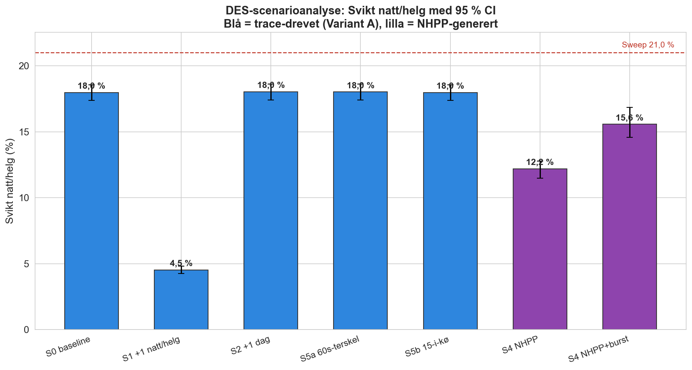

# DES-utvidelse — resultater (Fase 5, v1)

**Status:** Videre arbeid etter innlevert rapport (jf. kap 9.5). Endrer ikke den
leverte rapporten. Diskret hendelsessimulering (SimPy) som dynamisk kryss-sjekk og
what-if-verktøy over primærmodellen.

**Reproduserbarhet:** Alle tall produseres av skriptene i `015 fase 5 - DES/` med
faste seed. Kjør i rekkefølge: `des_validate.py` (D1), `des_d2.py` (D2),
`des_d3.py` (D3), `des_d4.py` (D4), `des_scenarioer.py` (D5), `des_figurer.py`.

---

## 1. Validering: DES-broen reproduserer primærmodellen (D1)

Før DES brukes til noe nytt, er den verifisert mot primærmodellens sweep på
identisk hendelsesgrunnlag. Resultat (`des_validate.py`):

| Variant | Skift | Sweep N/B/S | DES-bro N/B/S | Avvik |
|---|---|---|---|---|
| A (beredskap) | Dag hverdag | 78,6 / 14,9 / 6,4 | 78,6 / 14,9 / 6,4 | 0 av 27 960 |
| A (beredskap) | Natt/helg | 69,2 / 9,8 / 21,0 | 69,2 / 9,8 / 21,0 | 0 |
| B (total) | Natt/helg | 59,6 / 15,7 / 24,6 | 59,6 / 15,7 / 24,6 | 0 av 82 369 |

**100 % identisk klassifisering for hver event.** DES er dermed en verifisert
utvidelse av primærmodellen, ikke en ny, ukontrollert modell.

---

## 2. Dynamisk drift: hva skjer når VL og overløp modelleres eksplisitt (D2)

Sweepen klassifiserer 21,0 % av natt/helg-anropene som «Svikt» (ingen ledig operatør
for makkerpar). DES gjør det neste laget synlig: hva som *faktisk skjer* med disse
anropene, når vaktleder kan tre inn og overløp til Agder er en reell hendelse.

| Utfall natt/helg (Variant A) | Andel |
|---|---|
| Makkerpar oppnådd (D-pri1) | 16,3 % |
| Ordinær (1 operatør) | 64,4 % |
| D-pri1 solo (Brudd) | 0,8 % |
| **VL trer inn (ved Svikt)** | **14,1 %** |
| **Overløp til Agder** | **4,1 %** |

**Tolkning:** Sweepens 21 % «Svikt» løses i praksis i hovedsak ved at vaktleder trer
inn (om lag 14 % av anropene), mens om lag **4 % faktisk overløper til Agder**. Dette
er reservekapasiteten rapporten eksplisitt lot stå åpen (kap 9.4.2), nå kvantifisert:
VL er den bufferen som bærer det meste av natt/helg-presset, og når VL også er
opptatt, går anropet til nabosentralen.

---

## 3. Usikkerhet: stokastisk service og konfidensintervall (D3)

Ankomstene holdes faste (2025-trace), men service-tiden trekkes stokastisk
(D-pri1 bootstrap fra empirisk fordeling, øvrige lognormal, CV = 0,6), 400
replikasjoner (`des_d3.py`). 95 % persentil-CI:

| Mål (natt/helg) | Mean | 95 % CI |
|---|---|---|
| Normal | 71,8 % | [71,3; 72,4] |
| Brudd | 10,2 % | [9,8; 10,6] |
| Svikt (ved ankomst) | 17,9 % | [17,3; 18,5] |
| Overløp Agder | 3,9 % | [3,6; 4,2] |
| VL-inntreden | 13,8 % | [13,3; 14,3] |
| D-pri1 makkerpar oppnådd | 78,9 % | [78,0; 79,9] |

Dag hverdag: Svikt 5,2 % [4,9; 5,6], overløp 1,1 %. **Den dynamiske Svikt-raten
(17,9 %) er lavere enn sweepens 21,0 %**, fordi VL og overløp avlaster. CI-ene er
smale: funnet er statistisk robust gitt modellrammen.

---

## 4. Generativ kryss-sjekk: NHPP og Poisson-antagelsen (D4)

`des_d4.py` estimerer en ikke-homogen Poisson-intensitet λ(t) per
(hverdag/helg × time) og genererer syntetiske år.

- **Volumkontroll:** syntetisk år = 27 872 anrop mot 27 960 observert (0,3 % avvik).
  Den temporale intensiteten er godt fanget.
- **Men:** NHPP gir natt/helg Svikt **12,3 %** mot trace-drevet 17,9 %.

**Dette er et funn, ikke en feil.** Poisson antar uavhengige ankomster og glatter ut
klyngingen *innenfor* timen. De faktiske ankomstene (særlig sammenstilte anrop rundt
en hendelse) er mer klyngete enn Poisson. At Svikt faller når man påtvinger Poisson,
viser empirisk at **uavhengighetsantagelsen undervurderer kapasitetspresset** — nettopp
det rapporten og Gustavsson (2018) advarer mot, og motivasjonen for burst-scenarioet (S4).

---

## 5. Scenarioanalyse (D5)

Hvert scenario er kjørt med stokastisk service og 95 % CI (120 replikasjoner for
trace-scenarioer, 60 syntetiske år for NHPP). Tabellen viser Svikt ved ankomst.

| Scenario | Dag hverdag Svikt | Natt/helg Svikt | Overløp natt/helg |
|---|---|---|---|
| S0 baseline | 5,2 % [4,9; 5,5] | 18,0 % [17,4; 18,6] | 3,89 % |
| S1 +1 operatør natt/helg | 5,2 % (uendret) | **4,5 % [4,2; 4,8]** | 1,10 % |
| S2 +1 operatør dag hverdag | **2,9 % [2,7; 3,2]** | 18,0 % (uendret) | 3,90 % |
| S4 NHPP (Poisson) | 2,7 % | 12,2 % | 1,43 % |
| S4 NHPP + burst | 5,7 % | **15,6 % [14,6; 16,8]** | 3,91 % |
| S5a overløpsterskel 60 sek | ≈ S0 | 18,0 % | 3,72 % |
| S5b kø-grense 15 | ≈ S0 | 18,0 % | 3,89 % |

**Tolkning:**

- **S1 (+1 natt/helg) er det klart sterkeste tiltaket:** natt/helg-Svikt faller fra
  18,0 % til 4,5 %, en dynamisk bekreftelse av rapportens scenariofunn (sweepens
  21 % → 5,6 %). Dag er uendret.
- **S2 (+1 dag) hjelper bare dagen** (5,2 % → 2,9 %) og rører ikke natt/helg. Sammen
  viser S1 og S2 den strukturelle asymmetrien: bindingsskranken ligger på natt/helg
  (c = 2), ikke på dag.
- **S5 (overløpsterskel) endrer nesten ingenting:** å heve ventetålmodigheten til
  60 sek eller kø-grensen til 15 gir bare marginalt mindre overløp. Køen når sjelden
  10, så overløpet drives av *kapasitet*, ikke av terskelvalget. Agder-koblingen kan
  ikke «tunes» bort.
- **S4 (burst) bekrefter Poisson-svakheten:** å legge ring-flom-klynger på NHPP-året
  løfter natt/helg-Svikt fra 12,2 % til 15,6 % og overløp fra 1,4 % til 3,9 %, altså
  tilbake mot det trace-drevne nivået. Klynging er en reell driver av kapasitetspress.

**Utelatt:** S3 (funksjonsdifferensiering, S skilt ut) ga et tolkningsproblem. Når
serviceanropene fjernes fra hendelsessettet, endres nevneren, og Svikt-*andelen* blir
misvisende (serviceanrop ankommer ofte i Normal-tilstand og fortynner Svikt-raten). En
korrekt vurdering krever Svikt målt for beredskaps-delmengden isolert, og er flagget
som forfining.

  

---

## 6. Hovedbudskap

1. **DES er en verifisert utvidelse** (100 % bro mot primærmodellen), ikke en ny modell.
2. **Vaktleder er den avgjørende bufferen** natt/helg: VL absorberer storparten av
   sweepens «Svikt», og om lag 4 % overløper faktisk til Agder.
3. **Poisson undervurderer presset** (NHPP-Svikt < trace-Svikt) — ankomstene er
   klyngete, og burst må modelleres eksplisitt.
4. Resultatene er konsistente med rapportens hovedfunn og legger til dynamikk
   (ventetid, overløp, VL-bruk) og konfidensintervall som den statiske modellen ikke gir.

---

## 7. Forbehold

- VL-inntreden og overløp er **ikke direkte logget i BRIS**; de er modellantagelser
  med eksplisitt regel (VL kun ved Svikt; overløp ved 30 sek / 10-i-kø) og
  sensitivitetstestes i S5. De er ikke målte fakta.
- NHPP forutsetter tilnærmet Poisson-ankomster, som ikke er formelt testet (R2/R3).
  NHPP-året er en modell, ikke en validert prediksjon; burst-caset er det eksplisitte
  bruddet på antagelsen.
- CV for ikke-D-pri1 service er en antagelse (0,6); D-pri1 bruker empirisk fordeling.
