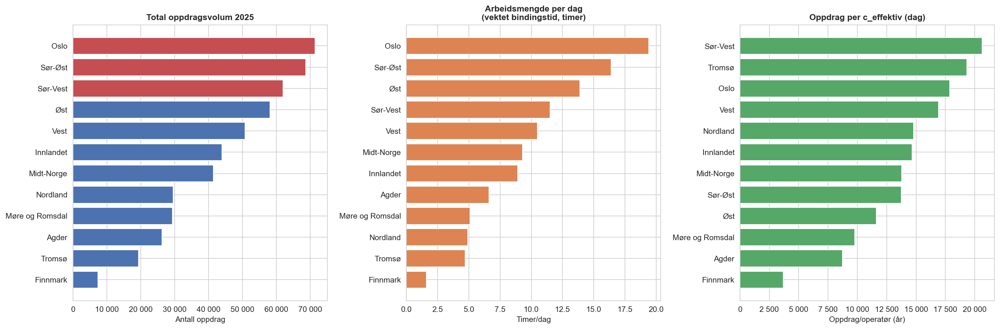
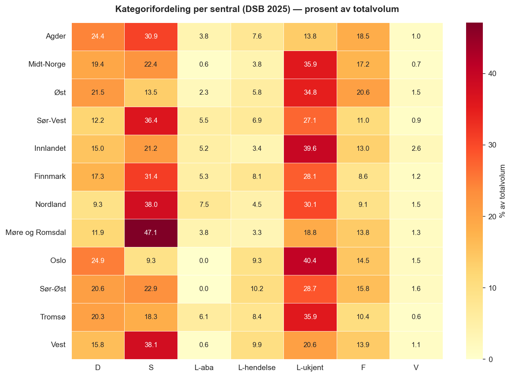
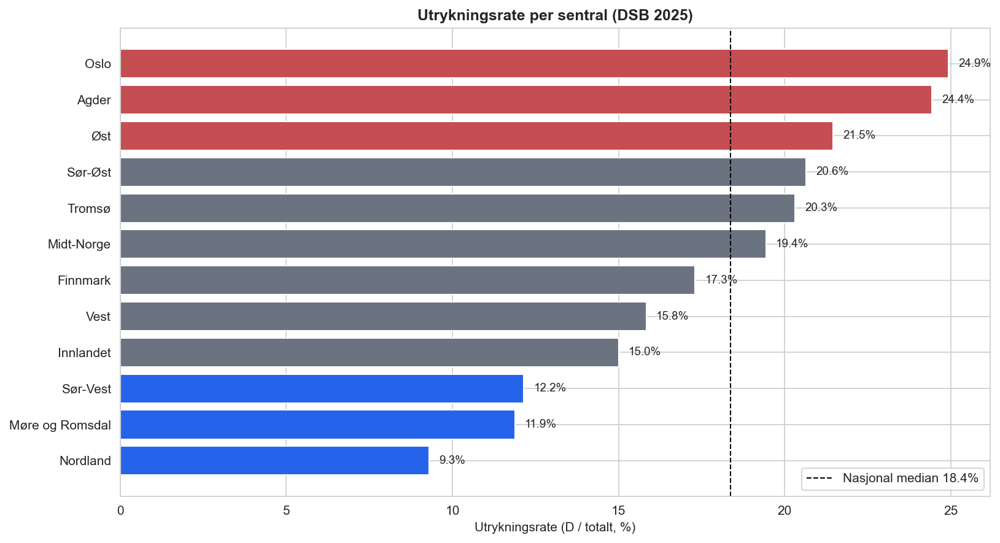
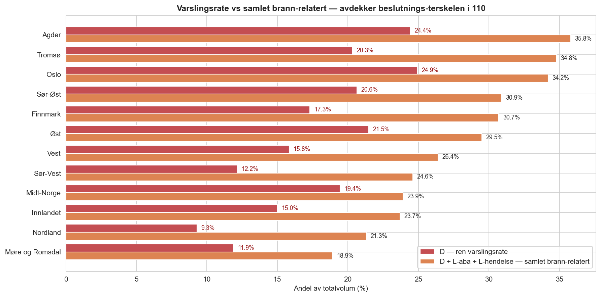
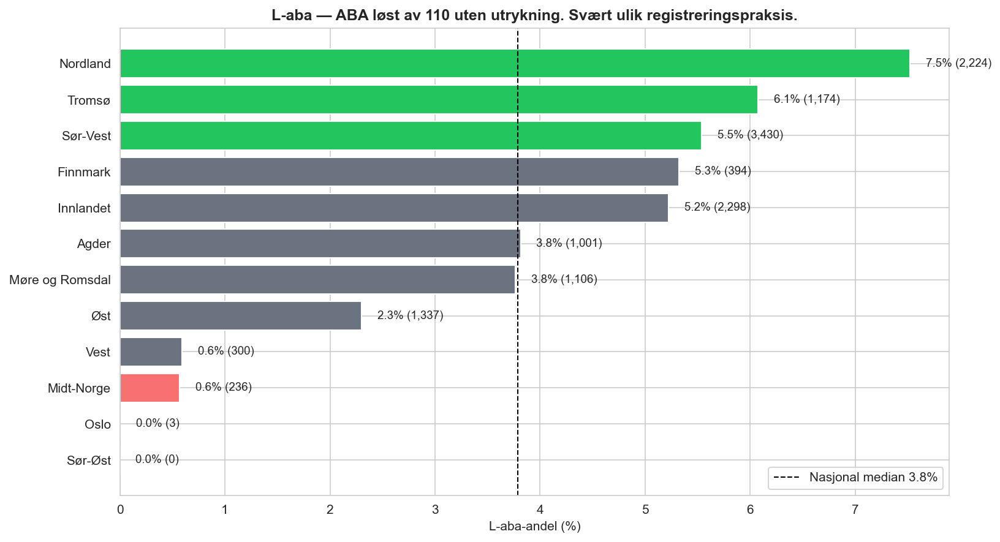
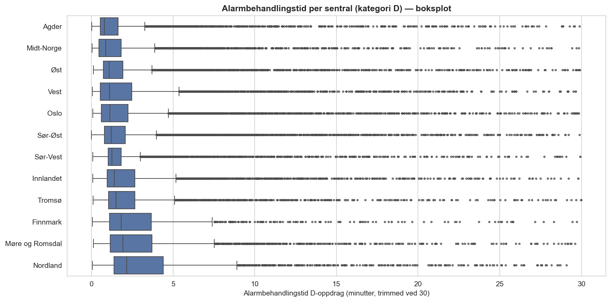
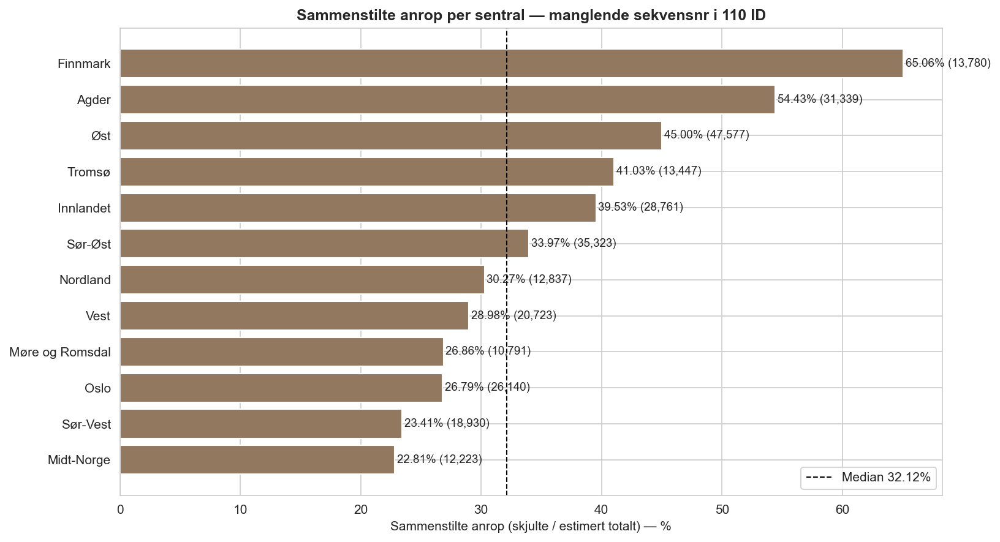

# Nasjonal oversikt — DSB 2025 for alle 12 110-sentraler

*Generert fra `2025_fullrapport_110_alle_sentraler_fra_dsb.xlsx` — 508,228 oppdrag.*

## Sammendrag

- **Total volum:** 508 228 oppdrag fordelt på 12 sentraler
- **Største vs minste:** Oslo (71 421) er **9.6× større** enn Finnmark (7 402)
- **Varslingsrate-spredning (D alene):** 9.3%–24.9% (forskjell 15.6 prosentpoeng — nesten 3× spredning). Reduseres til 16.9 pp når L-aba og L-hendelse inkluderes — mye av D-rate-forskjellen skyldes beslutningsterskel i 110.
- **L-aba-spredning:** 0.0%–7.5% — 1 sentral(er) har 0 registrerte L-aba (Sør-Øst)
- **Skjulte 110 ID-sekvenser:** 22.81%–65.06%. Dekker sammenstilte anrop + overføringer til nabo + avbrutte anrop — må dekomponeres per sentral.

---

## 1. Størrelse på sentralene

Størrelse kan måles på tre måter som gir ulik ranking:
- **Totalvolum:** antall registrerte oppdrag i DSB 2025.
- **Arbeidsmengde:** volum × typisk bindingstid per kategori (timer per år).
- **Oppdrag per c_effektiv:** volum per effektiv operatørkapasitet (= `c_total_dag − 1` for VL-korreksjon).

  
  
<small><i>Figur 1: Sentraler rangert etter tre størrelses-metrikker.</i></small>

### 1.1 Kombinert størrelses-tabell

| Sentral | Totalvolum | Rang | Arbmengde timer/dag | Rang | Oppdrag/c_eff | Rang |
|---|---:|---:|---:|---:|---:|---:|
| Oslo | 71 421 | 1 | 19.4 | 1 | 17 855 | 3 |
| Sør-Øst | 68 654 | 2 | 16.4 | 2 | 13 730 | 8 |
| Sør-Vest | 61 934 | 3 | 11.5 | 4 | 20 644 | 1 |
| Øst | 58 138 | 4 | 13.9 | 3 | 11 627 | 9 |
| Vest | 50 778 | 5 | 10.5 | 5 | 16 926 | 4 |
| Innlandet | 44 001 | 6 | 8.9 | 7 | 14 667 | 6 |
| Midt-Norge | 41 374 | 7 | 9.3 | 6 | 13 791 | 7 |
| Nordland | 29 577 | 8 | 4.9 | 10 | 14 788 | 5 |
| Møre og Romsdal | 29 384 | 9 | 5.1 | 9 | 9 794 | 10 |
| Agder | 26 238 | 10 | 6.6 | 8 | 8 746 | 11 |
| Tromsø | 19 327 | 11 | 4.7 | 11 | 19 327 | 2 |
| Finnmark | 7 402 | 12 | 1.6 | 12 | 3 701 | 12 |

**Observasjoner:**
- Arbeidsmengde per dag spenner 1.6–19.4 timer. Oslo har mest med 19 timer/dag.
- Mest belastet per operatør: Sør-Vest (20 644 oppdrag/c_eff), Tromsø (19 327 oppdrag/c_eff), Oslo (17 855 oppdrag/c_eff)

---

## 2. Kategorifordeling (heatmap)

  
  
<small><i>Figur 2: Andel av totalvolumet per kategori. Mørkere rødt = høyere andel.</i></small>

**Mønster:**
- **S (Service)** er den mest varierende — fra 9 % (Oslo) til 47 % (Møre og Romsdal). Reflekterer ulikt antall ABA-tilknyttede bygg eller ulik registreringspraksis for overføringstester.
- **L-ukjent** er gjennomgående høy — indikerer at «Opprinnelig oppdragstype» ofte lukkes uten utfylling.
- **D + S + L-ukjent** utgjør typisk 70–80 % av volumet på hver sentral.

---

## 3. Varslingsrate og samlet brann-relatert aktivitet

### 3.1 Ren varslingsrate (D) — hva kategorien egentlig måler

D-kategorien defineres som rader der **«Ressurs varslet» er fylt ut** — altså oppdrag der 110 har varslet brannvesen. Dette er ikke det samme som «reelle hendelser» eller «utrykning gjennomført». Det er en **beslutning** i 110-sentralen om å sette tiltaket i gang.

  
  
<small><i>Figur 3: Ren varslingsrate per sentral (andel av totalvolum). Rød = topp 20 %, blå = bunn 20 %.</i></small>

**Spredning:** 9.3%–24.9%, median 18.4%. Nesten 3× spredning — krever forklaring.

### 3.2 Varsles det «på alt»? — Realiseringsgrad av varslinger

En hypotese er at noen sentraler varsler tidlig og ofte, mens andre avklarer på telefon først. Hvis det stemmer, burde lav-terskel-sentraler ha **lavere andel varslede som faktisk rykker ut** (fordi mange varslinger avbrytes). Data viser at dette **ikke** er hovedforklaringen:

| Sentral | Varslede (D) | % rykket ut | % kom fremme |
|---|---:|---:|---:|
| Oslo | 17 811 | 98.8% | 84.9% |
| Øst | 12 478 | 95.6% | 79.3% |
| Midt-Norge | 8 043 | 92.4% | 86.6% |
| Innlandet | 6 600 | 92.1% | 80.5% |
| Sør-Vest | 7 527 | 91.7% | 77.0% |
| Sør-Øst | 14 174 | 91.6% | 71.4% |
| Vest | 8 041 | 91.0% | 81.8% |
| Agder | 6 409 | 90.2% | 73.1% |
| Møre og Romsdal | 3 492 | 88.9% | 79.1% |
| Nordland | 2 749 | 77.6% | 67.2% |
| Tromsø | 3 927 | 75.0% | 61.4% |
| Finnmark | 1 281 | 73.8% | 63.9% |

Alle sentraler har 75–99 % realiseringsgrad — når varsling først er satt, rykker brannvesen som regel ut. Oslo topper med 98,8 %, Tromsø bunner på 75,0 %. Spredningen er reell men forklarer ikke hovedtyngden av D-rate-forskjellen.

### 3.3 Samlet brann-relatert aktivitet — ser forbi beslutningsterskelen

Forskjellen i D-rate skyldes i stor grad **hvor i 110-prosessen hendelsen klassifiseres**. Noen sentraler avklarer på telefon før varsling — disse havner i `L-aba` (automatisk brannalarm avklart) eller `L-hendelse` (reell hendelse avklart av 110). Andre varsler tidligere og unngår L-kategoriene.

Hvis vi legger sammen **D + L-aba + L-hendelse**, måler vi all brann-relatert aktivitet uavhengig av hvor beslutningen ble tatt. Dette gir et mer sammenlignbart mål på hendelsesmengde.

  
  
<small><i>Figur 3b: Ren varslingsrate (rød) vs samlet brann-relatert aktivitet (oransje). Differansen = L-aba + L-hendelse = hendelser avklart uten varsling.</i></small>

| Sentral | D (%) | L-aba (%) | L-hendelse (%) | **Brann-relatert (%)** | Differanse |
|---|---:|---:|---:|---:|---:|
| Agder | 24.4 | 3.8 | 7.6 | **35.8** | +11.4 |
| Tromsø | 20.3 | 6.1 | 8.4 | **34.8** | +14.5 |
| Oslo | 24.9 | 0.0 | 9.3 | **34.2** | +9.3 |
| Sør-Øst | 20.6 | 0.0 | 10.2 | **30.9** | +10.3 |
| Finnmark | 17.3 | 5.3 | 8.1 | **30.7** | +13.4 |
| Øst | 21.5 | 2.3 | 5.8 | **29.5** | +8.0 |
| Vest | 15.8 | 0.6 | 9.9 | **26.4** | +10.6 |
| Sør-Vest | 12.2 | 5.5 | 6.9 | **24.6** | +12.4 |
| Midt-Norge | 19.4 | 0.6 | 3.8 | **23.9** | +4.5 |
| Innlandet | 15.0 | 5.2 | 3.4 | **23.7** | +8.7 |
| Nordland | 9.3 | 7.5 | 4.5 | **21.3** | +12.0 |
| Møre og Romsdal | 11.9 | 3.8 | 3.3 | **18.9** | +7.0 |

**Spredning etter justering:** 18.9%–35.8%, median 27.9%. Den rene varslingsratens spredning (15.6 pp) reduseres til 16.9 pp — konsistent med at mye av D-rate-forskjellen skyldes **ulik praksis for når i prosessen 110 varsler brannvesen**, snarere enn reell forskjell i hendelsesmengde.

**Konkrete eksempler:**
- **Sør-Vest** (D: 12,2 %) har høyest L-aba (8,9 %) og 3,6 % L-hendelse. Samlet brann-relatert: **24.6 %**. Dette er konsistent med en mer restriktiv utvarslingspraksis der mye avklares på telefon først.
- **Oslo** (D: 24,9 %) har bare 0,1 % L-aba og 9,2 % L-hendelse. Samlet: **34.2 %**. Varsler tidlig — nesten ingen ABA avklares uten utrykning.
- **Sør-Øst** (D: 20,6 %, L-aba: 0,0 %, L-hendelse: 10,2 %): **30.9 %**. Tilsynelatende samme praksis som Oslo — varsler på alle ABA, men har svært høy L-hendelse (reelle hendelser avklart uten utrykning).

> **Konklusjon:** D-rate alene er et misvisende sammenligningsmål på hendelsesbelastning. Samlet brann-relatert aktivitet (D + L-aba + L-hendelse) er mer robust fordi det fanger hendelser uavhengig av om de ble avklart eller utalarmert.

---

## 4. L-aba — dyp-fokus (ABA løst av 110)

L-aba er den mest ekstreme avviks-kategorien på tvers av sentraler.

  
  
<small><i>Figur 4: L-aba-andel per sentral. Mørkerød = 0 (ekstrem). Rød = bunn-kvartil, grønn = topp-kvartil.</i></small>

| Sentral | L-aba andel | Antall |
|---|---:|---:|
| Sør-Vest | 5.5% | 3 430 |
| Innlandet | 5.2% | 2 298 |
| Nordland | 7.5% | 2 224 |
| Øst | 2.3% | 1 337 |
| Tromsø | 6.1% | 1 174 |
| Møre og Romsdal | 3.8% | 1 106 |
| Agder | 3.8% | 1 001 |
| Finnmark | 5.3% | 394 |
| Vest | 0.6% | 300 |
| Midt-Norge | 0.6% | 236 |
| Oslo | 0.0% | 3 |
| Sør-Øst | 0.0% | 0 |

**Hypoteser om årsak til spredningen:**
1. **Ulike registreringspraksis:** Sør-Øst (0) og Oslo (100) registrerer sannsynligvis ABA som avklares uten utrykning under en annen kategori (L-hendelse, L-ukjent, eller F).
2. **Ulike terskler:** Sentraler med høy L-aba-andel (Sør-Vest 8,9 %, Nordland 8,7 %) kan ha lengre venteperiode før utkalling, eller annen prosedyre for bekreftelse.
3. **Ulik bygningsmasse:** Sentraler med mange ABA-tilknyttede bygg vil ha både flere S og flere L-aba — dette henger sammen med S-andelen i tabellen ovenfor.

> Dette er grunnlaget for L-aba-dybdeanalysen som pågår ved Sør-Vest (se `analyse/uttrekk/laba_sorvest_2025_dybdeanalyse.xlsx` — 50 hendelser som valideres manuelt i LEO).

---

## 5. Alarmbehandlingstid — kategori D

  
  
<small><i>Figur 5: Boksplot alarmbehandlingstid per sentral (D-oppdrag). Outliers > 30 min trimmet.</i></small>

| Sentral | n (D) | Median (min) | p90 (min) |
|---|---:|---:|---:|
| Agder | 6 355 | 0.83 | 5.77 |
| Midt-Norge | 8 012 | 0.90 | 4.28 |
| Øst | 12 368 | 1.11 | 4.25 |
| Oslo | 17 691 | 1.15 | 4.61 |
| Vest | 7 928 | 1.16 | 6.86 |
| Sør-Øst | 13 969 | 1.23 | 5.14 |
| Sør-Vest | 7 450 | 1.26 | 4.69 |
| Innlandet | 6 493 | 1.43 | 6.45 |
| Tromsø | 3 886 | 1.54 | 7.29 |
| Finnmark | 1 242 | 1.93 | 13.49 |
| Møre og Romsdal | 3 465 | 2.01 | 9.50 |
| Nordland | 2 709 | 2.43 | 33.98 |

---

## 6. Skjulte 110 ID-sekvenser (sammenstilte, overførte, avbrutte)

110 ID er strukturert som `BNN-YYMMDD-N` der `BNN` er sentral-prefiks (B01–B12) og `N` er løpenummer per dag per sentral. Manglende løpenumre i DSB-datasettet indikerer oppdrag som **ikke er registrert som egen rad**. Dette kan skyldes flere ting:

1. **Sammenstilte anrop** — flere innkomne anrop slått sammen til ett registrert oppdrag. For 110 Sør-Vest er dette validert mot faktiske loggdata i V4-modellen.
2. **Overførte anrop (30-sek-regel)** — ubesvart anrop etter 30 sek overføres automatisk til nabosentral. Anropet får et 110 ID, men registreres i en annen sentrals oppdragsliste. Dette kan særlig forklare de høye ratene i Finnmark og Agder.
3. **Avbrutte/test-anrop** — anrop som ikke resulterer i registrert oppdrag.

  
  
<small><i>Figur 6: Skjulte 110 ID-sekvenser per sentral. Sammensatt mål — ikke rene sammenstilte anrop.</i></small>

| Sentral | Registrerte oppdrag | Skjulte sekvensnr | Estimert totalt tildelt | Skjult-rate |
|---|---:|---:|---:|---:|
| Finnmark | 7 402 | 13 780 | 21 182 | 65.06% |
| Agder | 26 238 | 31 339 | 57 577 | 54.43% |
| Øst | 58 138 | 47 577 | 105 715 | 45.00% |
| Tromsø | 19 327 | 13 447 | 32 774 | 41.03% |
| Innlandet | 44 001 | 28 761 | 72 762 | 39.53% |
| Sør-Øst | 68 652 | 35 323 | 103 975 | 33.97% |
| Nordland | 29 577 | 12 837 | 42 414 | 30.27% |
| Vest | 50 778 | 20 723 | 71 501 | 28.98% |
| Møre og Romsdal | 29 384 | 10 791 | 40 175 | 26.86% |
| Oslo | 71 421 | 26 140 | 97 561 | 26.79% |
| Sør-Vest | 61 934 | 18 930 | 80 864 | 23.41% |
| Midt-Norge | 41 374 | 12 223 | 53 597 | 22.81% |

**Observasjoner:**
- **Finnmark** har høyest skjult-rate (65.06%) — trolig dominert av overføringer til nabosentral snarere enn ekte sammenstilte anrop.
- **Midt-Norge** har lavest (22.81%) — enten mindre samtidighet, færre overføringer, eller strengere rutine for opprettelse av oppdrag.
- **Sør-Vest** (23.41%): rate er konsistent med tidligere V4-analyse basert på faktisk logg — indikerer at Sør-Vests skjulte sekvenser primært er sammenstilte anrop.
- Totalt: 271 871 skjulte sekvenser av 780 097 estimert tildelt = 34.85% gjennomsnitt.

> **Implikasjon for kapasitetsmodellen:** For sentraler med dokumentert sammenstillings-rate (f.eks. Sør-Vest gjennom V4-modellen) kan `SKJULT_BIND_MIN = 1 minutt` brukes som korreksjon for den ekstra operatørbelastningen. For andre sentraler må raten dekomponeres i ekte sammenstilte vs overførte/avbrutte — dette krever tilgang til LEO-loggen eller en spørreskjema-bekreftelse.

> **Oppfølgingsspørsmål til sentralene:** Har dere oversikt over (a) hvor mange anrop overføres ut til nabosentral, og (b) hvor ofte flere anrop slås sammen til ett oppdrag?

---

## 7. Oppsummering — hvilke avvik krever forklaring fra sentralene

De tre viktigste avvikene å undersøke videre (allerede innarbeidet som sentralspesifikke oppfølgingsspørsmål i `analyse/sporreskjema/`):

1. **L-aba-registrering:** Spesielt Sør-Øst (0) og Oslo (100) må forklare hvordan ABA uten utrykning registreres lokalt — uten avklaring kan vi ikke sammenligne ABA-belastning på tvers.
2. **Utrykningsrate-spredning (9–25 %):** Må forstås som registreringspraksis vs. reell hendelsesmønster. Relevant for kapasitetsmodellering fordi D-hendelser har lengst bindingstid.
3. **Sammenstilte anrop-rate:** Variasjon mellom sentraler indikerer ulik lokal rutine — kan korrigeres med kategori-spesifikk bindingstid justert per sentral.

### Neste steg

- Få tilbake spørreskjemaer fra alle 12 sentraler — verifiser registreringspraksis for hver kategori.
- L-aba-dybdeanalyse Sør-Vest: bekreft eller juster 3-min-estimatet basert på 50 manuelt loggede hendelser.
- Når sentralspesifikke bindingstider er validert, regnes arbeidsmengden i tabell 1.1 om med lokale parametre.
